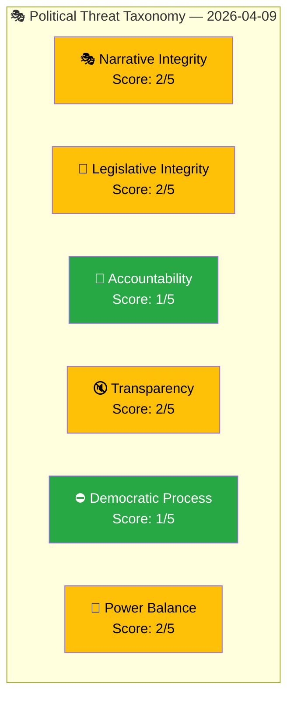

# 🎭 Threat Analysis — 2026-04-09 (realtime-1436)

**Date:** 2026-04-09
**Run ID:** realtime-1436
**Framework:** Political Threat Taxonomy (NOT STRIDE)

---

## 📊 Political Threat Taxonomy Overview

---

## 🎭 Narrative Integrity Threats

| # | Threat | Severity | Source Document | Assessment |
|:-:|--------|:--------:|----------------|------------|
| NI-1 | "Double penalties" framing oversimplifies complex sentencing reform; risk of populist discourse | 2/5 | HD03218 | Moderate — political communication may sacrifice nuance for voter appeal |
| NI-2 | NATO deployment narrative may be weaponised by anti-NATO voices (domestic and foreign) | 2/5 | HD03220 | Low-moderate — Russian disinformation risk exists |

---

## 📝 Legislative Integrity Threats

| # | Threat | Severity | Source Document | Assessment |
|:-:|--------|:--------:|----------------|------------|
| LI-1 | Proportionality of doubled penalties — V (HD024073) and MP (HD024074) raise substantive legal concerns | 2/5 | HD03218, HD024073, HD024074 | Moderate — Lagrådet review will be decisive |
| LI-2 | Defining scope of "criminal negligence" for public officials is legally complex | 2/5 | HD03217 | Moderate — implementation details crucial |

---

## 🚫 Accountability Threats

| # | Threat | Severity | Source Document | Assessment |
|:-:|--------|:--------:|----------------|------------|
| AC-1 | No accountability threats detected — HD03217 actually IMPROVES accountability | 1/5 | HD03217 | Positive development |

---

## 🔇 Transparency Threats

| # | Threat | Severity | Source Document | Assessment |
|:-:|--------|:--------:|----------------|------------|
| TR-1 | NATO deployment operational details may be classified, limiting public scrutiny | 2/5 | HD03220 | Standard for military operations; parliamentary oversight maintained |

---

## ⛔ Democratic Process Threats

| # | Threat | Severity | Source Document | Assessment |
|:-:|--------|:--------:|----------------|------------|
| DP-1 | No threats — all three propositions follow standard legislative process; counter-motions filed | 1/5 | HD03220, HD03218, HD03217, HD024073, HD024074 | Proper democratic process observed |

---

## 👑 Power Balance Threats

| # | Threat | Severity | Source Document | Assessment |
|:-:|--------|:--------:|----------------|------------|
| PB-1 | Expanded public official criminal liability shifts power balance between political leadership and civil service | 2/5 | HD03217 | Low-moderate — design of safeguards will determine impact |
| PB-2 | Three-proposition offensive concentrates policy initiative with executive branch | 1/5 | HD03220, HD03218, HD03217 | Normal — opposition counter-motions provide check |

---

## 📊 Aggregate Threat Assessment

| Metric | Value |
|--------|-------|
| **Mean Threat Severity** | 1.7/5 |
| **Highest Category** | Narrative Integrity and Legislative Integrity (2.0/5 each) |
| **Overall Threat Level** | LOW-MEDIUM |
| **Confidence** | HIGH |
| **Key Monitor Points** | Lagrådet proportionality review; NATO deployment classification scope |
