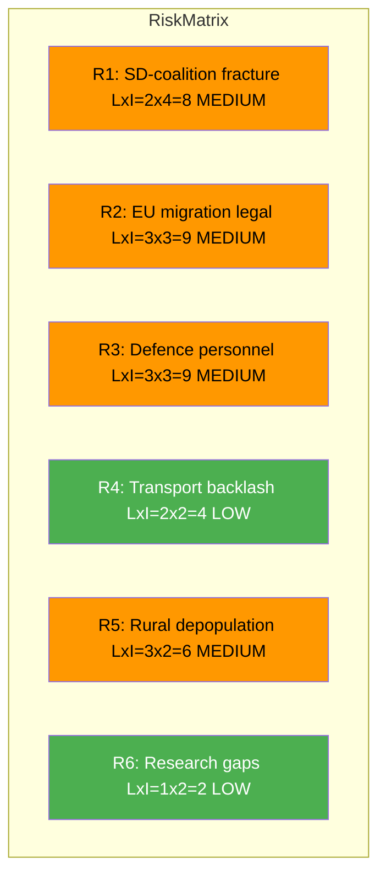

# Political Risk Assessment — 2026-04-10

**Generated**: 2026-04-10 04:36 UTC (AI-enriched: 2026-04-10 04:43 UTC)
**Data Sources**: get_betankanden (riksmote 2025/26)
**Documents Analyzed**: 6
**Confidence**: MEDIUM
**Produced By**: AI-enriched analysis (news-committee-reports workflow)

## Summary

Risk assessment of 6 committee reports using 5x5 Likelihood x Impact matrix. Six risks identified across security, migration, defence, transport, rural, and research domains. Coalition stability risk score: 4/100 (LOW).

## Risk Matrix

| # | Risk | Likelihood (1-5) | Impact (1-5) | Score (LxI) | Level | dok_id |
|---|------|-------------------|--------------|-------------|-------|--------|
| R1 | SD-coalition fracture on NATO operational commitments | 2 (Unlikely) | 4 (Major) | 8 | MEDIUM | HD01UU6 |
| R2 | EU legal challenge to migration policy tightening | 3 (Possible) | 3 (Moderate) | 9 | MEDIUM | HD01SfU16 |
| R3 | Defence personnel shortfall delays NATO force targets | 3 (Possible) | 3 (Moderate) | 9 | MEDIUM | HD01FoU8 |
| R4 | Northern transport underinvestment sparks regional backlash | 2 (Unlikely) | 2 (Minor) | 4 | LOW | HD01TU15 |
| R5 | Rural depopulation accelerates despite CU23 measures | 3 (Possible) | 2 (Minor) | 6 | MEDIUM | HD01CU23 |
| R6 | Research ethics reform creates regulatory gaps | 1 (Rare) | 2 (Minor) | 2 | LOW | HD01UbU31 |

## Cascading Risk Analysis

R1 (SD-coalition fracture) could cascade into R3 (defence personnel) if coalition instability causes defence budget delays. R2 (EU migration legal) is independent but politically linked to R1.

## Forward Indicators

| Indicator | Trigger | Timeline | Linked Risk |
|-----------|---------|----------|-------------|
| UU committee scheduling of UU6 for chamber debate | If scheduled before April 30 signals government urgency | 2-3 weeks | R1 |
| SfU16 reservation count exceeds 10 | High reservation count signals deep opposition mobilisation | At publication | R2 |
| FoU committee requests additional defence budget allocation | Budget amendment signals personnel crisis recognition | Spring 2026 | R3 |
| TU15 generates media coverage in northern regional press | Regional backlash indicator | 1-2 weeks post-publication | R4 |

## Key Findings

1. No single risk exceeds MEDIUM level — the committee report batch represents routine legislative activity [HIGH]
2. The highest-scoring risks (R2 and R3, both LxI=9) reflect structural challenges rather than acute crises [MEDIUM]
3. Coalition risk score remains LOW at 4/100 [HIGH]

## Data Quality Notes

Risk confidence: MEDIUM. Scores based on committee domains and political context.
