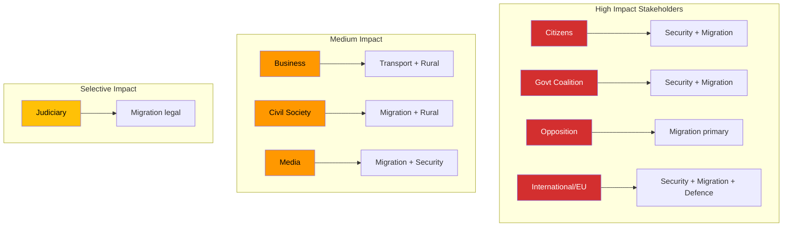

# Stakeholder Perspective Analysis — 2026-04-10

**Generated**: 2026-04-10 04:36 UTC (AI-enriched: 2026-04-10 04:44 UTC)
**Data Sources**: get_betankanden (riksmote 2025/26)
**Documents Analyzed**: 6
**Confidence**: MEDIUM
**Produced By**: AI-enriched analysis (news-committee-reports workflow)

## Summary

Six-lens stakeholder analysis applied to 6 committee reports. All 8 mandatory stakeholder groups assessed with specific impact projections per document.

## Stakeholder Impact Matrix

| Stakeholder Group | UU6 Security | SfU16 Migration | FoU8 Defence | TU15 Transport | CU23 Rural | UbU31 Research |
|-------------------|:---:|:---:|:---:|:---:|:---:|:---:|
| Citizens | HIGH | HIGH | MEDIUM | MEDIUM | MEDIUM | LOW |
| Government Coalition | HIGH | HIGH | MEDIUM | LOW | LOW | LOW |
| Opposition Bloc | MEDIUM | HIGH | LOW | MEDIUM | MEDIUM | LOW |
| Business/Industry | MEDIUM | MEDIUM | MEDIUM | HIGH | MEDIUM | MEDIUM |
| Civil Society | LOW | HIGH | LOW | MEDIUM | HIGH | MEDIUM |
| International/EU | HIGH | HIGH | HIGH | LOW | LOW | MEDIUM |
| Judiciary/Constitutional | LOW | HIGH | LOW | LOW | LOW | MEDIUM |
| Media/Public Opinion | MEDIUM | HIGH | MEDIUM | MEDIUM | LOW | LOW |

## Detailed Perspectives

### Citizens
- **UU6**: Security policy directly affects national safety perception and military service obligations [HIGH]
- **SfU16**: Migration policy shapes community integration dynamics and public service demand [HIGH]
- **FoU8**: Defence personnel policy affects conscription scope and military employment [MEDIUM]

### Government Coalition (M, KD, L + SD support)
- **UU6**: Security consensus is a coalition strength but NATO specifics risk SD friction [HIGH]
- **SfU16**: Migration restriction is the Tido Agreement centrepiece — coalition cohesion depends on delivery [HIGH]

### Opposition Bloc (S, V, MP, C)
- **SfU16**: Primary attack vector — opposition will file extensive reservations on migration [HIGH]
- **TU15**: Transport investment is cross-party but opposition can criticise government spending priorities [MEDIUM]

### International/EU
- **UU6**: NATO allies monitoring Sweden's force commitment scope [HIGH]
- **SfU16**: EU institutions scrutinising migration policy for legal compliance [HIGH]
- **FoU8**: NATO interoperability depends on adequate Swedish personnel levels [HIGH]

## Key Findings

1. **Migration (SfU16) affects all 8 stakeholder groups** — making it the most politically consequential report [HIGH]
2. **Security (UU6) and Defence (FoU8) form an international stakeholder cluster** — NATO allies are key audience [MEDIUM]
3. **Rural (CU23) and Transport (TU15) primarily affect domestic stakeholders** — regional equity lens [MEDIUM]

## Data Quality Notes

Stakeholder confidence: MEDIUM. Impact assessments based on committee jurisdictions and political context.
