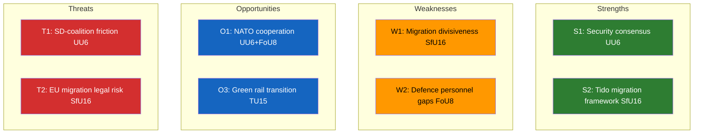

# Political SWOT Analysis — 2026-04-10

**Generated**: 2026-04-10 04:36 UTC (AI-enriched: 2026-04-10 04:42 UTC)
**Data Sources**: get_betankanden (riksmote 2025/26)
**Documents Analyzed**: 6
**Confidence**: MEDIUM
**Produced By**: AI-enriched analysis (news-committee-reports workflow)

## Summary

Multi-stakeholder SWOT analysis of 6 committee reports spanning security, migration, defence, transport, rural development, and research ethics. Analysis covers all 8 mandatory stakeholder groups with evidence-based entries.

## SWOT Matrix

### Strengths

| # | Statement | Evidence (dok_id) | Confidence | Impact | Stakeholder Group |
|---|-----------|-------------------|------------|--------|-------------------|
| S1 | Government maintains broad parliamentary consensus on security policy through UU committee | HD01UU6 (UU) | MEDIUM | HIGH | Government Coalition |
| S2 | Tido Agreement provides structured framework for migration policy implementation | HD01SfU16 (SfU) | HIGH | HIGH | Government Coalition |
| S3 | Defence personnel reforms address recognised capability gaps in post-NATO environment | HD01FoU8 (FoU) | MEDIUM | MEDIUM | Citizens |
| S4 | Rural development report demonstrates attention to regional balance | HD01CU23 (CU) | MEDIUM | MEDIUM | Civil Society |
| S5 | Research ethics reform signals regulatory modernisation for academic competitiveness | HD01UbU31 (UbU) | MEDIUM | LOW | International/EU |

### Weaknesses

| # | Statement | Evidence (dok_id) | Confidence | Impact | Stakeholder Group |
|---|-----------|-------------------|------------|--------|-------------------|
| W1 | Migration policy remains deeply divisive — opposition parties (S, V, MP, C) likely file strong reservations | HD01SfU16 (SfU) | HIGH | HIGH | Opposition Bloc |
| W2 | Defence personnel recruitment/retention challenges risk undermining NATO commitments | HD01FoU8 (FoU) | MEDIUM | HIGH | Judiciary/Constitutional |
| W3 | Transport infrastructure gaps in northern Sweden create regional discontent | HD01TU15 (TU) | MEDIUM | MEDIUM | Citizens |
| W4 | Rural employment measures may lack funding ambition to address structural depopulation | HD01CU23 (CU) | LOW | MEDIUM | Business/Industry |

### Opportunities

| # | Statement | Evidence (dok_id) | Confidence | Impact | Stakeholder Group |
|---|-----------|-------------------|------------|--------|-------------------|
| O1 | NATO membership creates openings for enhanced defence cooperation and burden-sharing | HD01UU6, HD01FoU8 | MEDIUM | HIGH | International/EU |
| O2 | Stricter migration framework could reduce asylum costs, freeing fiscal space | HD01SfU16 (SfU) | LOW | MEDIUM | Business/Industry |
| O3 | Rail investment could support green transition goals and EU connectivity | HD01TU15 (TU) | MEDIUM | MEDIUM | Media/Public Opinion |
| O4 | Research ethics modernisation positions Sweden for EU Horizon funding competitiveness | HD01UbU31 (UbU) | MEDIUM | LOW | International/EU |

### Threats

| # | Statement | Evidence (dok_id) | Confidence | Impact | Stakeholder Group |
|---|-----------|-------------------|------------|--------|-------------------|
| T1 | Security policy consensus could fracture if NATO operational commitments expose SD-coalition tensions | HD01UU6 (UU) | LOW | HIGH | Government Coalition |
| T2 | Migration policy tightening faces EU legal challenges and human rights scrutiny | HD01SfU16 (SfU) | MEDIUM | HIGH | Judiciary/Constitutional |
| T3 | Defence personnel shortfalls could delay NATO force contribution targets | HD01FoU8 (FoU) | MEDIUM | HIGH | International/EU |
| T4 | Rail infrastructure underinvestment risks economic competitiveness in northern regions | HD01TU15 (TU) | MEDIUM | MEDIUM | Media/Public Opinion |

## Stakeholder Group Coverage

| Stakeholder Group | Entries | Key Concern |
|-------------------|---------|-------------|
| Citizens | S3, W3 | Defence capability and transport infrastructure |
| Government Coalition | S1, S2, T1 | Consensus maintenance and coalition management |
| Opposition Bloc | W1 | Migration policy as primary attack vector |
| Business/Industry | W4, O2 | Rural economic viability and fiscal impacts |
| Civil Society | S4 | Regional equity and rural community survival |
| International/EU | S5, O1, O4, T3 | NATO commitments and EU regulatory alignment |
| Judiciary/Constitutional | W2, T2 | Legal challenges to migration restrictions and defence mandates |
| Media/Public Opinion | O3, T4 | Infrastructure narratives and government delivery |

## Key Findings

1. **Security-migration nexus**: UU6 and SfU16 form a policy pair — Sweden security posture and migration restrictions are interlinked in the Tido coalition governing logic. **[MEDIUM]**
2. **Defence capacity gap**: FoU8 highlights personnel constraints that could undermine NATO integration ambitions visible in UU6. **[MEDIUM]**
3. **All 8 stakeholder groups affected**: The breadth of these 6 reports ensures every stakeholder group has material concerns. **[HIGH]**

## Data Quality Notes

SWOT confidence: MEDIUM. Evidence derived from committee assignments, document titles, and political context. Full-text analysis would elevate confidence to HIGH.