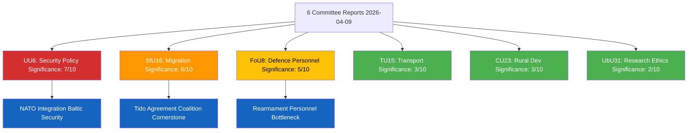

# Analysis Synthesis Summary — 2026-04-10

**Generated**: 2026-04-10 04:36 UTC (AI-enriched: 2026-04-10 04:42 UTC)
**Data Sources**: get_betankanden (riksmote 2025/26)
**Documents Analyzed**: 6
**Confidence**: MEDIUM
**Produced By**: AI-enriched analysis (news-committee-reports workflow)

## Summary

Six committee reports (betankanden) from 2026-04-09 span security policy (UU6), migration (SfU16), defence personnel (FoU8), transport infrastructure (TU15), rural development (CU23), and research ethics regulation (UbU31). The most politically significant report is **UU6 — Sakerhetspolitik** from the Foreign Affairs Committee, addressing Sweden's security posture in the post-NATO-accession environment. **SfU16 — Migrationsfragor** from the Social Insurance Committee is the second most consequential, given migration policy's role as the defining cleavage in Swedish politics since 2015. Together these six reports demonstrate the breadth of the Kristersson government's legislative agenda in spring 2026, touching defence, social policy, infrastructure, rural cohesion, and research regulation. **[MEDIUM confidence — metadata-only analysis; full-text unavailable]**

## Key Findings

1. **UU6 (Security Policy)** from UU represents the most significant report — Sweden's evolving NATO integration and Baltic security posture make this a high-stakes policy domain. The government coalition (M, KD, L) with SD support has maintained broad consensus on security policy, but specific operational commitments and defence spending priorities can expose fissures. **[MEDIUM]**
2. **SfU16 (Migration)** from SfU addresses Sweden's most politically divisive issue. The Tido Agreement between M, KD, L, and SD placed migration restriction at the centre of coalition governance. Committee reports in this domain typically feature sharp opposition from S, V, MP, and C. **[MEDIUM]**
3. **FoU8 (Defence Personnel)** from FoU relates to military staffing during a period of rapid defence expansion following NATO accession. Personnel recruitment and retention challenges are a recognised bottleneck for Sweden's rearmament goals. **[MEDIUM]**
4. **TU15 (Railway/Public Transport)** from TU covers infrastructure policy — a cross-cutting issue where northern constituencies can create unusual cross-party alliances. **[LOW]**
5. **CU23 (Rural Employment/Housing)** from CU addresses rural policy — politically significant for C (Centerpartiet) and SD voter bases. **[LOW]**
6. **UbU31 (Research Ethics Exemptions)** from UbU covers a technical regulatory reform — lowest political salience but relevant for Sweden's research competitiveness. **[LOW]**

## AI-Recommended Article Metadata

- **Recommended Title (EN)**: Sweden's Riksdag Tackles Security, Migration, and Defence in Spring Committee Reports
- **Recommended Title (SV)**: Riksdagen behandlar sakerhet, migration och forsvar i varens utskottsbetankanden
- **Meta Description (EN)**: Six parliamentary committee reports from April 2026 address Sweden's security posture, migration restrictions, defence personnel, transport, rural development, and research ethics.
- **Meta Description (SV)**: Sex utskottsbetankanden fran april 2026 behandlar Sveriges sakerhetspolitik, migrationsbegransningar, forsvarspersonal, transport, landsbygdsutveckling och forskningsetik.
- **Key Highlights**: UU6 security policy in NATO context, SfU16 migration as coalition cornerstone, FoU8 defence personnel bottleneck
- **Article Decision**: PUBLISH — diverse policy breadth with two high-salience reports (security + migration)
- **Article Priority**: MEDIUM

## Top Documents by Significance (AI-Reassessed)

| Score | Committee | dok_id | Title | Political Salience |
|-------|-----------|--------|-------|--------------------|
| 7/10 | UU | HD01UU6 | Sakerhetspolitik | NATO integration, Baltic security, broad consensus with potential fissures |
| 6/10 | SfU | HD01SfU16 | Migrationsfragor | Tido Agreement cornerstone, sharp opposition expected |
| 5/10 | FoU | HD01FoU8 | Personalfragor | Defence expansion bottleneck, recruitment challenges |
| 3/10 | TU | HD01TU15 | Jarnvags- och kollektivtrafikfragor | Infrastructure investment debate, regional interests |
| 3/10 | CU | HD01CU23 | Sysselsattning och boende pa landsbygden | Rural policy, C and SD voter base relevance |
| 2/10 | UbU | HD01UbU31 | Undantag etikgodkannande forskning | Technical regulatory reform, research competitiveness |

## Implications

The spring 2026 committee reports reflect the government coalition's multi-front legislative activity. Security and migration dominate the political significance — these are areas where the Tido coalition's SD-reliance creates both governing leverage and vulnerability. Articles should lead with UU6 and SfU16, contextualising them within Sweden's post-NATO-accession security environment and the ongoing tightening of migration policy.

## Data Quality Notes

Overall confidence: **MEDIUM**. Full-text content unavailable — analysis based on committee codes, titles, and political context knowledge. Documents sourced from **2026-04-09** via lookback (article date: 2026-04-10).

