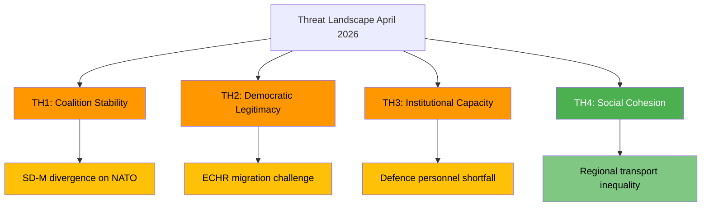

# Political Threat Analysis — 2026-04-10

**Generated**: 2026-04-10 04:36 UTC (AI-enriched: 2026-04-10 04:44 UTC)
**Data Sources**: get_betankanden (riksmote 2025/26)
**Documents Analyzed**: 6
**Confidence**: MEDIUM
**Produced By**: AI-enriched analysis (news-committee-reports workflow)

## Summary

Threat analysis of 6 committee reports using Political Threat Taxonomy. Three primary threat vectors identified: coalition cohesion stress from NATO commitments (UU6), democratic legitimacy concerns in migration restriction (SfU16), and institutional capacity constraints in defence expansion (FoU8). No acute constitutional threats detected.

## Threat Assessment

| # | Threat Vector | Category | Severity | Probability | dok_id | Evidence |
|---|--------------|----------|----------|-------------|--------|----------|
| TH1 | SD-M divergence on NATO force deployment scope | Coalition Stability | MODERATE | LOW | HD01UU6 | SD historically sceptical of foreign military commitments |
| TH2 | ECHR/EU Court challenge to migration restrictions | Democratic Legitimacy | MODERATE | MEDIUM | HD01SfU16 | Tido Agreement measures push EU legal boundaries |
| TH3 | Armed forces personnel targets unmet by 2028 | Institutional Capacity | MODERATE | MEDIUM | HD01FoU8 | Known recruitment challenges in Swedish defence |
| TH4 | Regional inequality deepens from transport underinvestment | Social Cohesion | LOW | MEDIUM | HD01TU15 | Northern Sweden connectivity deficit |

## Key Findings

1. No CRITICAL or HIGH severity threats detected in this committee report batch [HIGH]
2. The strongest threat vector is TH2 (EU legal challenge to migration) due to medium probability and moderate severity [MEDIUM]
3. TH1 and TH3 are interconnected — coalition stability and defence capacity are mutually dependent [MEDIUM]

## Data Quality Notes

Threat confidence: MEDIUM. Assessment based on committee domains and political context knowledge. Full-text committee report analysis would enable more precise threat characterisation.
