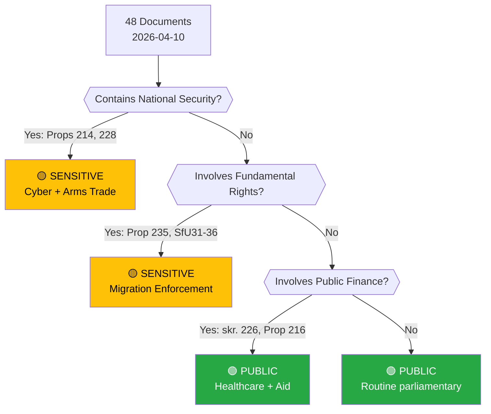

# 🏷️ Political Classification — Evening Analysis 2026-04-10

| Field | Value |
|-------|-------|
| **Classification ID** | CLS-2026-04-10-EVE-001 |
| **Analysis Date** | 2026-04-10 18:15 UTC |
| **Documents Classified** | 48 |
| **Produced By** | news-evening-analysis (AI-enriched) |
| **Overall Sensitivity** | 🟡 SENSITIVE |

---

## Sensitivity Decision Tree

## Per-Document Classification

| dok_id | Title | Sensitivity | Domain | Urgency | Significance |
|--------|-------|:-----------:|--------|:-------:|:------------:|
| HD03235 | Skärpta utvisningsregler | 🟡 SENSITIVE | Migration/Justice | 🔴 CRITICAL | 9/10 |
| HD03214 | Cybersäkerhetscenter | 🟡 SENSITIVE | Defence/Cyber | 🟠 URGENT | 8/10 |
| HD03228 | Krigsmaterielregler | 🟡 SENSITIVE | Defence/Trade | 🟠 URGENT | 8/10 |
| HD01UU6 | Säkerhetspolitik | 🟡 SENSITIVE | Foreign/Security | 🟡 ELEVATED | 7/10 |
| HD01SfU16 | Migrationsfrågor | 🟡 SENSITIVE | Migration | 🟡 ELEVATED | 6/10 |
| HD03216 | Kommunal sjukvård | 🟢 PUBLIC | Healthcare | 🟡 ELEVATED | 6/10 |
| HD03114 | Exportkontroll | 🟢 PUBLIC | Foreign Trade | 🟡 ELEVATED | 6/10 |
| HD01FoU8 | Personalfrågor | 🟢 PUBLIC | Defence | 🟢 ROUTINE | 5/10 |
| HD01SfU31 | Tillsyn och förvar | 🟡 SENSITIVE | Migration | 🟡 ELEVATED | 5/10 |
| HD01SfU32 | Återvändande | 🟡 SENSITIVE | Migration | 🟡 ELEVATED | 5/10 |
| HD01SfU36 | Vandelkrav | 🟡 SENSITIVE | Migration | 🟡 ELEVATED | 5/10 |
| HD024070-72 | Sida audit motions | 🟢 PUBLIC | Foreign Aid | 🟡 ELEVATED | 7/10 |
| HD024073-74 | Youth crime motions | 🟡 SENSITIVE | Justice | 🟡 ELEVATED | 6/10 |

---

**Document Control:**
- **Template:** analysis/templates/political-classification.md v2.2
- **Methodology:** analysis/methodologies/political-classification-guide.md
