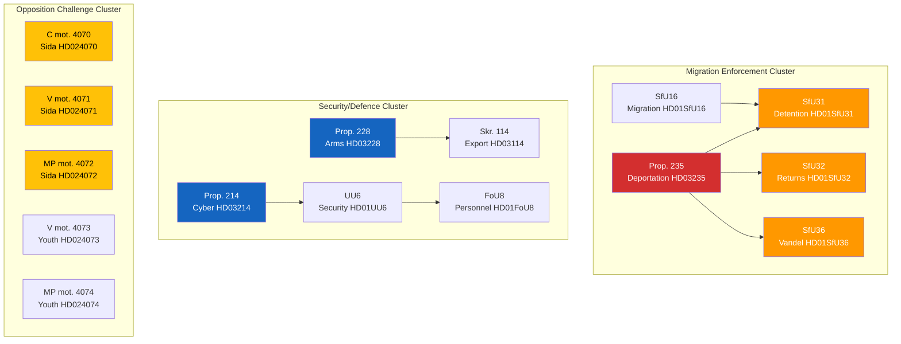

# 🔗 Cross-Reference Map — Evening Analysis 2026-04-10

| Field | Value |
|-------|-------|
| **Map ID** | XREF-2026-04-10-EVE-001 |
| **Analysis Date** | 2026-04-10 18:15 UTC |
| **Cross-References** | 12 clusters identified |
| **Produced By** | news-evening-analysis (AI-enriched) |

---

## Cross-Reference Network

## Cross-Reference Clusters

| Cluster | Documents | Pattern | Significance |
|---------|-----------|---------|:------------:|
| Migration Enforcement | HD03235, SfU31, SfU32, SfU36, SfU16 | 4-layer enforcement chain | 🔴 HIGH |
| Security/Defence | HD03214, HD03228, HD03114, UU6, FoU8 | Post-NATO capability build | 🟠 HIGH |
| Sida Accountability | HD024070, HD024071, HD024072 | Cross-party opposition (C+V+MP) | 🟡 MEDIUM |
| Youth Crime | HD024073, HD024074 | V+MP civil liberties challenge | 🟡 MEDIUM |
| Housing Policy | HD024012, HD024064, HD024067 | S+MP dual challenge | 🟡 MEDIUM |
| Welfare Reform | HD024016, HD024032 | Rare S-C alignment | 🟡 MEDIUM |

---

**Document Control:**
- **Template:** Cross-reference analysis
- **Methodology:** analysis/methodologies/ai-driven-analysis-guide.md v5.0
