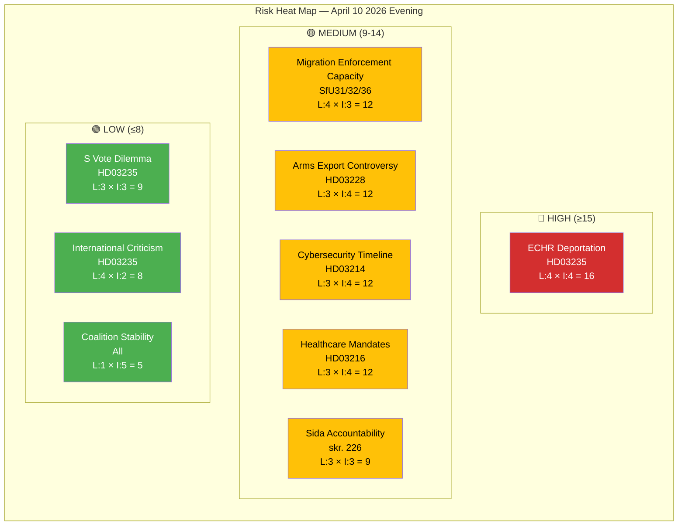

# ⚖️ Political Risk Assessment — Evening Analysis 2026-04-10

| Field | Value |
|-------|-------|
| **Assessment ID** | RSK-2026-04-10-EVE-001 |
| **Analysis Date** | 2026-04-10 18:15 UTC |
| **Documents Assessed** | 48 (cross-workflow synthesis) |
| **Produced By** | news-evening-analysis (AI-enriched) |
| **Overall Risk Level** | 🟡 MEDIUM |
| **Overall Confidence** | MEDIUM-HIGH |

---

## Risk Heat Map

## Consolidated Risk Matrix

| # | Risk Factor | Source | L (1-5) | I (1-5) | Score | Priority |
|---|-------------|--------|:-------:|:-------:|:-----:|:--------:|
| 1 | ECHR adverse ruling on deportation thresholds | HD03235 | 4 | 4 | **16** | 🔴 HIGH |
| 2 | Migrationsverket/Polisen enforcement capacity gap | SfU31/32/36 | 4 | 3 | **12** | 🟡 MEDIUM |
| 3 | Arms export human rights controversy | HD03228 | 3 | 4 | **12** | 🟡 MEDIUM |
| 4 | Cybersecurity centre rushed implementation | HD03214 | 3 | 4 | **12** | 🟡 MEDIUM |
| 5 | Healthcare reform unfunded mandates | HD03216 | 3 | 4 | **12** | 🟡 MEDIUM |
| 6 | Sida 4.7B SEK audit accountability gap | skr. 226 | 3 | 3 | **9** | 🟡 MEDIUM |
| 7 | Socialdemokraterna vote dilemma on deportation | HD03235 | 3 | 3 | **9** | 🟡 MEDIUM |
| 8 | UNHCR/CoE international criticism | HD03235 | 4 | 2 | **8** | 🟢 LOW |
| 9 | Climate policy delay exposure | HD11702/11699 | 2 | 3 | **6** | 🟢 LOW |
| 10 | Coalition stability | All | 1 | 5 | **5** | 🟢 LOW |

## Risk Category Analysis

### Coalition Stability Risk: LOW (L:1 × I:5 = 5/25)
The Tidöblocket coalition (M, KD, L + SD) faces no immediate stability threat. All five propositions advance agreed Tidö priorities. SD's copyright motion (HD024007) represents a minor independence signal but does not threaten the cooperation agreement. **[HIGH confidence]**

### Policy Implementation Risk: MEDIUM (Aggregate 12/25)
Multiple propositions face implementation challenges — deportation enforcement depends on bilateral return agreements, cybersecurity centre requires inter-agency coordination, and healthcare reform creates new municipal obligations. The government has sufficient legislative votes but operational delivery is uncertain. **[MEDIUM confidence]**

### Electoral Risk: MEDIUM (Aggregate 12/25)
The deportation proposition is a double-edged sword: it delivers on SD's flagship demand but creates ECHR vulnerability that the opposition will exploit. The KU hearings next week add exposure. However, the security cluster (cybersecurity + arms trade) provides positive narrative balance. **[MEDIUM confidence]**

### External/International Risk: LOW-MEDIUM (8/25)
ECHR challenges, UNHCR criticism, and arms export scrutiny represent reputational risks but are unlikely to derail the legislative agenda. NATO-era reforms enjoy broad international support. **[MEDIUM confidence]**

## Forward Risk Indicators

| Trigger | Risk Escalation | Timeline | Watch |
|---------|----------------|----------|:-----:|
| Lagrådet issues critical opinion on Prop. 235 | ECHR risk escalates to CRITICAL | 1-3 weeks | 🔴 |
| Migrationsverket signals capacity constraints | Implementation risk escalates | 1-2 months | 🟡 |
| KU hearing reveals new ministerial accountability issue | Coalition risk increases | Next week | 🟡 |
| S announces position on deportation vote | Electoral risk clarifies | 2-4 weeks | 🟡 |
| Arms export case attracts media attention | HD03228 risk escalates | Ongoing | 🟢 |

---

**Document Control:**
- **Template:** analysis/templates/risk-assessment.md v2.2
- **Methodology:** analysis/methodologies/political-risk-methodology.md (5×5 L×I matrix)
