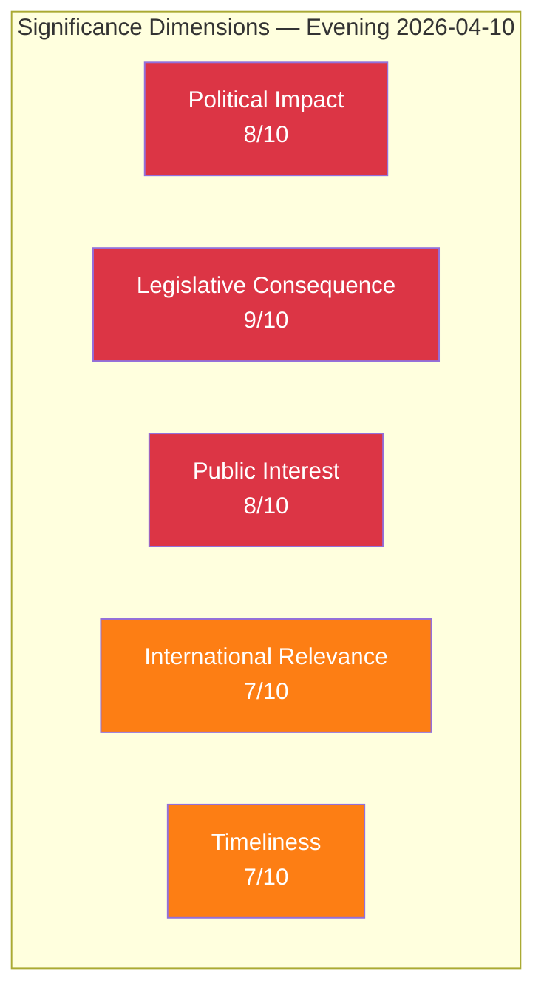

# 📈 Significance Scoring — Evening Analysis 2026-04-10

| Field | Value |
|-------|-------|
| **Scoring ID** | SIG-2026-04-10-EVE-001 |
| **Analysis Date** | 2026-04-10 18:15 UTC |
| **Documents Scored** | 48 |
| **Produced By** | news-evening-analysis (AI-enriched) |
| **Composite Score** | 7.8/10 |
| **Publication Decision** | ✅ PUBLISH |

---

## 5-Dimension Scoring

| Dimension | Score | Rationale |
|-----------|:-----:|-----------|
| **Political Impact** | 8/10 | Pre-election legislative blitz with flagship deportation reform; opposition broad-spectrum offensive |
| **Legislative Consequence** | 9/10 | 5 propositions + 6 committee reports + SfU migration triple lock = highest legislative volume day |
| **Public Interest** | 8/10 | Migration, crime, cybersecurity, healthcare all high-salience public issues |
| **International Relevance** | 7/10 | NATO-era reforms + ECHR implications + arms trade modernisation |
| **Timeliness** | 7/10 | Pre-election delivery urgency; week-ahead features vårpropositionen + KU hearings |

### Composite Score: **7.8/10** — PUBLISH tier

### Publication Decision: ✅ **PUBLISH as Evening Analysis Article**

**Rationale**: The combination of government legislative offensive (5 propositions), migration enforcement triple lock (SfU cluster), opposition broad-spectrum challenge (19 motions), and critical week-ahead outlook (vårpropositionen + KU) creates a day of exceptional political significance requiring comprehensive evening analysis.

## Top Documents by Aggregate Significance

| Rank | dok_id | Title | Score | Category |
|:----:|--------|-------|:-----:|----------|
| 1 | HD03235 | Skärpta utvisningsregler | 9/10 | Proposition |
| 2 | HD03214 | Cybersäkerhetscenter | 8/10 | Proposition |
| 3 | HD03228 | Krigsmaterielregler | 8/10 | Proposition |
| 4 | HD01UU6 | Säkerhetspolitik | 7/10 | Committee Report |
| 5 | HD024070-72 | Sida audit (C+V+MP) | 7/10 | Motions (cluster) |
| 6 | HD01SfU16 | Migrationsfrågor | 6/10 | Committee Report |
| 7 | HD024073-74 | Youth crime (V+MP) | 6/10 | Motions (cluster) |
| 8 | HD03216 | Kommunal sjukvård | 6/10 | Proposition |
| 9 | HD03114 | Exportkontroll | 6/10 | Skrivelse |
| 10 | HD01SfU31-36 | Migration triple lock | 5/10 | Committee Reports |

---

**Document Control:**
- **Template:** analysis/templates/significance-scoring.md v2.2
- **Methodology:** analysis/methodologies/ai-driven-analysis-guide.md v5.0
