# 👥 Stakeholder Impact Analysis — Evening Analysis 2026-04-10

| Field | Value |
|-------|-------|
| **Stakeholder ID** | STA-2026-04-10-EVE-001 |
| **Analysis Date** | 2026-04-10 18:15 UTC |
| **Stakeholder Groups** | 8 (all mandatory groups) |
| **Produced By** | news-evening-analysis (AI-enriched) |
| **Confidence** | MEDIUM-HIGH |

---

## Impact Radar

```mermaid
graph TD
    subgraph "Stakeholder Impact Radar — 2026-04-10"
        direction TB
        CIT["👤 Citizens<br/>Impact: MEDIUM-HIGH<br/>Migration + healthcare + security"]
        GOV["🏛️ Government Coalition<br/>Impact: HIGH<br/>Legislative delivery mode"]
        OPP["⚔️ Opposition Bloc<br/>Impact: HIGH<br/>Broad offensive + KU prep"]
        BIZ["💼 Business/Industry<br/>Impact: MEDIUM<br/>Arms + cyber + procurement"]
        CIV["🤝 Civil Society<br/>Impact: MEDIUM-HIGH<br/>Rights concerns on deportation"]
        INT["🌍 International/EU<br/>Impact: MEDIUM<br/>NATO alignment + ECHR tension"]
        JUD["⚖️ Judiciary/Constitutional<br/>Impact: HIGH<br/>Lagrådet + JO election"]
        MED["📰 Media/Public Opinion<br/>Impact: HIGH<br/>Migration + KU = high salience"]
    end

    style CIT fill:#ffc107,color:#000
    style GOV fill:#dc3545,color:#fff
    style OPP fill:#dc3545,color:#fff
    style BIZ fill:#ffc107,color:#000
    style CIV fill:#fd7e14,color:#fff
    style INT fill:#ffc107,color:#000
    style JUD fill:#dc3545,color:#fff
    style MED fill:#dc3545,color:#fff
```

## Impact Summary Matrix

| Stakeholder | Impact Level | Key Driver | Primary dok_ids | Sentiment |
|------------|:------------:|-----------|----------------|:---------:|
| Citizens | 🟡 MEDIUM-HIGH | Migration enforcement affects residents; healthcare improves | HD03235, HD03216 | Mixed |
| Government Coalition | 🔴 HIGH | Legislative momentum validates Tidö delivery | All propositions | Positive |
| Opposition Bloc | 🔴 HIGH | Broad-spectrum challenge + KU hearing preparation | HD024063-75, week-ahead | Active |
| Business/Industry | 🟡 MEDIUM | Arms modernisation + cybersecurity benefit sectors | HD03228, HD03214 | Positive |
| Civil Society | 🟠 MEDIUM-HIGH | Deportation + detention expansion raises rights concerns | HD03235, SfU31/32/36 | Negative |
| International/EU | 🟡 MEDIUM | NATO alignment positive; ECHR tension negative | HD03214, HD03235 | Mixed |
| Judiciary/Constitutional | 🔴 HIGH | Lagrådet review of deportation + JO election | HD03235, week-ahead | Critical |
| Media/Public Opinion | 🔴 HIGH | Migration + KU hearings = maximum news salience | HD03235, week-ahead | Engaged |

## Per-Group Detailed Assessment

### Citizens
- **Positive**: Cybersecurity centre (HD03214) protects critical infrastructure; healthcare reform (HD03216) improves municipal care quality
- **Negative**: Stricter deportation rules (HD03235) may affect families; expanded detention (SfU31) raises liberty concerns
- **Net impact**: Mixed — security benefits counterbalanced by rights restrictions [MEDIUM confidence]

### Government Coalition
- **Positive**: 5 propositions demonstrate governing capacity; Tidö Agreement delivery strengthens SD cooperation; election positioning on security + migration
- **Negative**: ECHR vulnerability creates potential backfire; climate policy delay exposed by MP
- **Net impact**: Strongly positive for electoral positioning [HIGH confidence]

### Opposition Bloc
- **Positive**: MP's 7-motion offensive shows energy; Sida audit creates cross-party accountability narrative; KU hearings next week provide platform
- **Negative**: S caught in deportation dilemma; fragmented opposition across multiple policy areas
- **Net impact**: Active but strategically divided [HIGH confidence]

### Business/Industry
- **Positive**: Arms trade modernisation (HD03228) enables post-NATO defence exports; cybersecurity framework (HD03214) strengthens digital resilience
- **Negative**: Minor concerns about procurement oversight reduction (HD024014 S motion)
- **Net impact**: Positive — security-industrial sector benefits [MEDIUM confidence]

### Civil Society
- **Positive**: Suicide prevention function (prop. 190, HD024045); research ethics review (UbU31)
- **Negative**: Four-layer migration enforcement (Prop. 235 + SfU triple) represents most extensive restriction since 2015
- **Net impact**: Predominantly negative for rights organisations [HIGH confidence]

### International/EU
- **Positive**: NATO-aligned cyber and arms reforms demonstrate reliable alliance partner posture
- **Negative**: ECHR/UNHCR scrutiny of deportation reforms; Sida accountability gap undermines aid donor reputation
- **Net impact**: Mixed — alliance credibility vs. rights reputation [MEDIUM confidence]

### Judiciary/Constitutional
- **Key event**: Justitieombudsman election next week (April 15)
- **Key risk**: Lagrådet review of Prop. 235 deportation proportionality
- **Net impact**: Constitutional oversight mechanisms under pressure [HIGH confidence]

### Media/Public Opinion
- **Positive**: Migration enforcement polls well; security narrative resonates
- **Negative**: Individual deportation cases generate sympathetic coverage; KU hearings create accountability demand
- **Net impact**: High engagement — migration remains dominant issue [HIGH confidence]

---

**Document Control:**
- **Template:** analysis/templates/stakeholder-impact.md v2.2
- **Methodology:** analysis/methodologies/ai-driven-analysis-guide.md v5.0
