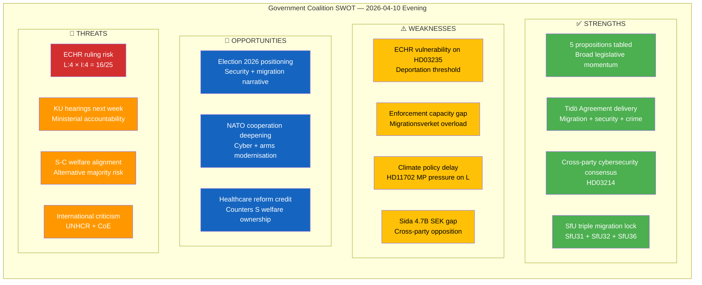

# 💪 SWOT Analysis — Evening Analysis 2026-04-10

| Field | Value |
|-------|-------|
| **SWOT ID** | SWT-2026-04-10-EVE-001 |
| **Analysis Date** | 2026-04-10 18:15 UTC |
| **Documents Analyzed** | 48 (cross-workflow synthesis) |
| **Produced By** | news-evening-analysis (AI-enriched) |
| **Confidence** | MEDIUM-HIGH |

---

## SWOT Quadrant Overview

---

## Detailed SWOT by Stakeholder Group

### 1. Citizens

| Quadrant | Assessment | Evidence | dok_id | Confidence |
|----------|-----------|----------|--------|:----------:|
| ✅ Strength | Cybersecurity centre protects critical infrastructure | Prop. 2025/26:214 | HD03214 | HIGH |
| ✅ Strength | Healthcare competence improvement in municipalities | Prop. 2025/26:216 | HD03216 | MEDIUM |
| ⚠️ Weakness | Deportation rules may affect residents with family ties | Prop. 2025/26:235 | HD03235 | HIGH |
| 🔴 Threat | Reduced civil liberties in youth crime investigation | Prop. 2025/26:227 motions | HD024073/74 | MEDIUM |

### 2. Government Coalition (M, KD, L + SD)

| Quadrant | Assessment | Evidence | dok_id | Confidence |
|----------|-----------|----------|--------|:----------:|
| ✅ Strength | 5 propositions + 6 committee reports = legislative momentum | All propositions | Multiple | HIGH |
| ✅ Strength | Tidö Agreement delivery on migration core priority | Prop. 235 + SfU cluster | HD03235, SfU31-36 | HIGH |
| ⚠️ Weakness | ECHR compatibility risk exposes legal vulnerability | Prop. 235 legal analysis | HD03235 | HIGH |
| 🚀 Opportunity | Election 2026 security narrative: cyber + NATO + crime | Props 214, 228, 235 | Multiple | HIGH |

### 3. Opposition Bloc (S, V, MP, C)

| Quadrant | Assessment | Evidence | dok_id | Confidence |
|----------|-----------|----------|--------|:----------:|
| ✅ Strength | MP leads opposition activity with 7/19 motions (37%) | Motion filings | HD024063-75 | HIGH |
| ✅ Strength | Cross-party Sida audit challenge (C+V+MP) | skr. 226 motions | HD024070-72 | HIGH |
| ⚠️ Weakness | S faces dilemma on deportation vote — caught between bases | HD03235 positioning | HD03235 | MEDIUM |
| 🚀 Opportunity | KU hearings next week create accountability narrative | Strömmer, Forssell, Andersson | Week-ahead | HIGH |

### 4. Business/Industry

| Quadrant | Assessment | Evidence | dok_id | Confidence |
|----------|-----------|----------|--------|:----------:|
| ✅ Strength | Arms trade modernisation benefits defence industry | Prop. 2025/26:228 | HD03228 | HIGH |
| ✅ Strength | Cybersecurity framework strengthens digital economy | Prop. 2025/26:214 | HD03214 | HIGH |
| ⚠️ Weakness | Simplified supplier control may reduce procurement oversight | S motion on prop. 177 | HD024014 | LOW |

### 5. Civil Society

| Quadrant | Assessment | Evidence | dok_id | Confidence |
|----------|-----------|----------|--------|:----------:|
| ⚠️ Weakness | Deportation threshold lowering reduces judicial discretion | Prop. 2025/26:235 | HD03235 | HIGH |
| ⚠️ Weakness | Detention framework expansion raises liberty concerns | SfU31 | HD01SfU31 | MEDIUM |
| 🚀 Opportunity | Suicide prevention function (prop. 190) gains cross-party support | C motion | HD024045 | LOW |

### 6. International/EU

| Quadrant | Assessment | Evidence | dok_id | Confidence |
|----------|-----------|----------|--------|:----------:|
| ✅ Strength | NATO-aligned cybersecurity and arms trade reforms | Props 214, 228 | HD03214/228 | HIGH |
| 🔴 Threat | ECHR/UNHCR scrutiny of deportation reforms | Prop. 2025/26:235 | HD03235 | HIGH |
| ⚠️ Weakness | Sida humanitarian aid accountability gap undermines donor reputation | skr. 226 | Multiple | MEDIUM |

### 7. Judiciary/Constitutional

| Quadrant | Assessment | Evidence | dok_id | Confidence |
|----------|-----------|----------|--------|:----------:|
| 🔴 Threat | Deportation rules may face Lagrådet criticism on proportionality | Prop. 2025/26:235 | HD03235 | HIGH |
| 🚀 Opportunity | Justitieombudsman election next week strengthens oversight | Week-ahead | N/A | HIGH |

### 8. Media/Public Opinion

| Quadrant | Assessment | Evidence | dok_id | Confidence |
|----------|-----------|----------|--------|:----------:|
| ✅ Strength | Migration enforcement polls well with general public | Opinion data | N/A | HIGH |
| 🔴 Threat | Individual deportation cases generate sympathetic coverage | Media dynamics | HD03235 | MEDIUM |
| 🚀 Opportunity | KU hearings provide transparency and accountability narratives | Week-ahead | N/A | HIGH |

---

**Document Control:**
- **Template:** analysis/templates/swot-analysis.md v2.2
- **Methodology:** analysis/methodologies/political-swot-framework.md
