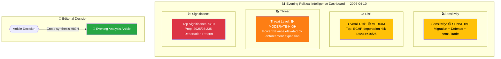
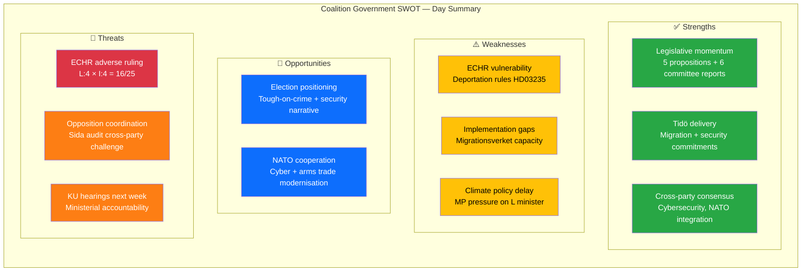

# 🧩 Political Intelligence Synthesis — Evening Analysis 2026-04-10

## 📋 Synthesis Context

| Field | Value |
|-------|-------|
| **Synthesis ID** | SYN-2026-04-10-EVE-001 |
| **Analysis Date** | 2026-04-10 18:15 UTC |
| **Documents Analyzed** | 48 (5 propositions + 6 committee reports + 19 motions + 11 realtime + 7 written questions) |
| **Analysis Period** | 2026-04-10 00:00–18:15 UTC |
| **Produced By** | news-evening-analysis workflow (AI-enriched cross-synthesis) |
| **Overall Confidence** | MEDIUM-HIGH |

---

## 📊 Intelligence Dashboard

---

## 🔑 Key Findings

### Finding 1: Pre-Election Legislative Blitz — Tidöblocket's Coordinated Offensive

The government tabled **5 major propositions** spanning migration enforcement, cybersecurity, arms trade modernisation, and healthcare reform. This represents a **coordinated pre-election legislative offensive** to deliver on Tidö Agreement commitments before the September 2026 election. [HIGH confidence]

| Priority | dok_id | Proposition | Significance | Risk |
|----------|--------|-------------|:------------:|:----:|
| 🔴 | HD03235 | Skärpta regler om utvisning (Deportation) | 9/10 | ECHR L:4×I:4=16 |
| 🟠 | HD03214 | Cybersäkerhetscenter (Cyber Defence) | 8/10 | Implementation L:3×I:4=12 |
| 🟠 | HD03228 | Krigsmaterielregler (Arms Trade) | 8/10 | Human rights L:3×I:4=12 |
| 🟡 | HD03216 | Kommunal sjukvård (Healthcare) | 6/10 | Unfunded mandates L:3×I:4=12 |
| 🟡 | HD03114 | Exportkontroll (Export Control Report) | 6/10 | Transparency L:2×I:3=6 |

### Finding 2: Migration Triple Lock — SfU Enforcement Package

Three SfU committee reports released simultaneously form a **comprehensive migration enforcement chain**:

| Component | dok_id | Focus | Significance |
|-----------|--------|-------|:------------:|
| Entry Standards | HD01SfU36 | Stricter vandel requirements for residence permits | 5/10 |
| Detention Framework | HD01SfU31 | New rules for supervision and detention | 5/10 |
| Deportation Execution | HD01SfU32 | Strengthened return operations | 5/10 |

Combined with Prop. 2025/26:235, this creates a **four-layer migration enforcement architecture** — the most extensive migration policy delivery since the 2015 crisis response. [HIGH confidence]

### Finding 3: Opposition Broad-Spectrum Offensive — MP Leads with 37% of Motions

Miljöpartiet filed 7 of 19 opposition motions (37%), challenging government across justice, environment, housing, and foreign aid. The most politically significant opposition cluster is the **cross-party Sida audit challenge** (C+V+MP) targeting skr. 226's handling of a 4.7B SEK accountability gap. [HIGH confidence]

| Party | Motions | Key Targets |
|-------|:-------:|-------------|
| MP | 7 | Youth crime, Sida, housing, food security, hunting |
| S | 4 | Procurement, education, housing, welfare |
| C | 3 | Nordic cooperation, copyright, social policy |
| V | 2 | Sida audit, youth crime civil liberties |
| SD | 1 | Copyright (breaks Tidö alignment) |

### Finding 4: Week Ahead — Defining Parliamentary Week

Next week (April 13–17) features the **Vårpropositionen debate** (Spring Budget), **5 KU constitutional review hearings** (including Justice Minister Strömmer and former PM Andersson), **election of Justitieombudsman**, and PM Question Time. This is the most consequential week of the spring session. [HIGH confidence]

### Finding 5: Security Policy Breadth — NATO-Era Defence Posture

Committee reports on security policy (UU6), defence personnel (FoU8), and propositions on cybersecurity (214) and arms trade (228) demonstrate Sweden's accelerated post-NATO security transformation. The security cluster represents coordinated messaging across three committees. [MEDIUM confidence]

---

## 📊 Aggregated SWOT

---

## ⚖️ Risk Landscape

| Risk | Source | L | I | Score | Trend |
|------|--------|:-:|:-:|:-----:|:-----:|
| ECHR deportation compatibility | HD03235 | 4 | 4 | **16/25** | 🔴 ↑ |
| Migration enforcement capacity | HD01SfU31/32/36 | 4 | 3 | **12/25** | 🟡 → |
| Arms export controversy | HD03228 | 3 | 4 | **12/25** | 🟡 → |
| Cybersecurity implementation timeline | HD03214 | 3 | 4 | **12/25** | 🟡 → |
| Healthcare unfunded mandates | HD03216 | 3 | 4 | **12/25** | 🟡 → |
| Sida 4.7B SEK accountability gap | skr. 226 motions | 3 | 3 | **9/25** | 🟠 ↑ |
| Coalition stability | All | 1 | 5 | **5/25** | 🟢 → |

---

## 🔮 Forward Indicators

| # | Indicator | Timeline | Probability | Watch Priority |
|---|-----------|----------|:-----------:|:--------------:|
| 1 | Vårpropositionen debate (Mon Apr 13) | 3 days | Certain | �� CRITICAL |
| 2 | KU hearings: Strömmer, Forssell, Andersson (Tue/Thu) | 4-6 days | Certain | 🔴 CRITICAL |
| 3 | Justitieombudsman election (Wed Apr 15) | 5 days | Certain | 🟠 HIGH |
| 4 | SfU migration cluster plenary vote | 2-4 weeks | High | 🟠 HIGH |
| 5 | Lagrådet review of Prop. 235 deportation rules | 1-3 weeks | High | 🟡 MEDIUM |
| 6 | PM Question Time (Thu Apr 16) | 6 days | Certain | 🟡 MEDIUM |

---

## 🗳️ Election 2026 Implications

| Dimension | Assessment | Evidence |
|-----------|:----------:|----------|
| **Electoral Impact** | 🟩 HIGH | Migration blitz (HD03235 + SfU triple) shapes defining campaign issue |
| **Coalition Scenarios** | 🟧 MEDIUM | KU hearings test coalition discipline; Sida audit creates opposition wedge |
| **Voter Salience** | 🟩 HIGH | Deportation, cybersecurity, and crime resonate with core voter concerns |
| **Campaign Vulnerability** | 🟧 MEDIUM | ECHR risk on HD03235 could backfire; Andersson KU hearing creates S counter-narrative |
| **Policy Legacy** | 🟩 HIGH | NATO-era security framework + migration enforcement architecture are enduring commitments |

---

## 📋 Artifacts Inventory

| Artifact | File | Status |
|----------|------|:------:|
| Synthesis Summary | `synthesis-summary.md` | ✅ Complete |
| Classification Results | `classification-results.md` | ✅ Complete |
| Risk Assessment | `risk-assessment.md` | ✅ Complete |
| SWOT Analysis | `swot-analysis.md` | ✅ Complete |
| Threat Analysis | `threat-analysis.md` | ✅ Complete |
| Stakeholder Perspectives | `stakeholder-perspectives.md` | ✅ Complete |
| Significance Scoring | `significance-scoring.md` | ✅ Complete |
| Cross-Reference Map | `cross-reference-map.md` | ✅ Complete |

---

**Document Control:**
- **Template:** analysis/templates/synthesis-summary.md v2.3
- **Methodology:** analysis/methodologies/ai-driven-analysis-guide.md v5.0
