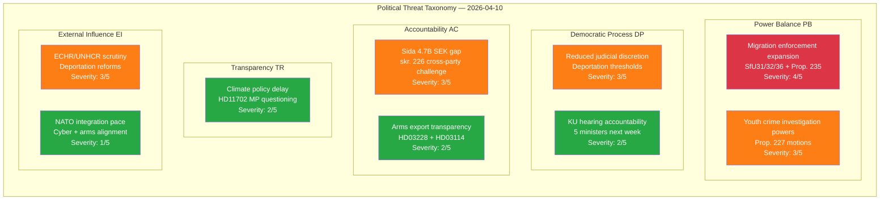
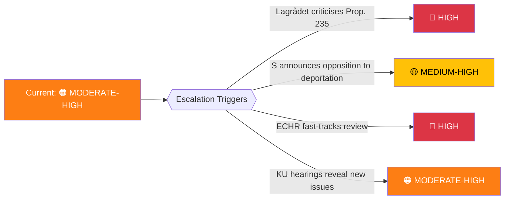

# 🎭 Political Threat Analysis — Evening Analysis 2026-04-10

| Field | Value |
|-------|-------|
| **Threat ID** | THR-2026-04-10-EVE-001 |
| **Analysis Date** | 2026-04-10 18:15 UTC |
| **Documents Assessed** | 48 |
| **Produced By** | news-evening-analysis (AI-enriched) |
| **Overall Threat Level** | 🟠 MODERATE-HIGH |
| **Confidence** | MEDIUM |

---

## Threat Taxonomy Network

## Threat Assessment by Category

| Category | Top Threat | Severity (1-5) | Evidence | Trend |
|----------|-----------|:--------------:|----------|:-----:|
| **Power Balance (PB)** | Migration enforcement expansion concentrates state power | **4/5** | SfU31/32/36 + HD03235 | ↑ |
| **Accountability (AC)** | Sida 4.7B SEK accountability gap | **3/5** | HD024070-72 (C+V+MP) | → |
| **Democratic Process (DP)** | Reduced judicial discretion in deportation | **3/5** | HD03235 | ↑ |
| **External Influence (EI)** | ECHR scrutiny of migration reforms | **3/5** | HD03235 international context | ↑ |
| **Transparency (TR)** | Climate policy instrument delay | **2/5** | HD11702 | → |
| **Norm Integrity (NI)** | No significant threat identified | **1/5** | N/A | → |

## Threat Actor Mapping

| Actor | Interest | Capability | Current Activity |
|-------|----------|:----------:|-----------------|
| V + MP | Block migration enforcement, protect civil liberties | Medium (opposition minority) | HD024073/74 motions on youth crime |
| C + V + MP | Sida accountability, foreign aid oversight | Medium-High (cross-party) | HD024070/71/72 coordinated challenge |
| ECHR | European human rights compliance | High (binding jurisdiction) | Potential future challenge to HD03235 |
| S | Strategic positioning on deportation dilemma | High (largest opposition party) | Position undeclared — maximum uncertainty |

## Escalation Decision

---

**Document Control:**
- **Template:** analysis/templates/threat-analysis.md v2.2
- **Methodology:** analysis/methodologies/political-threat-framework.md
