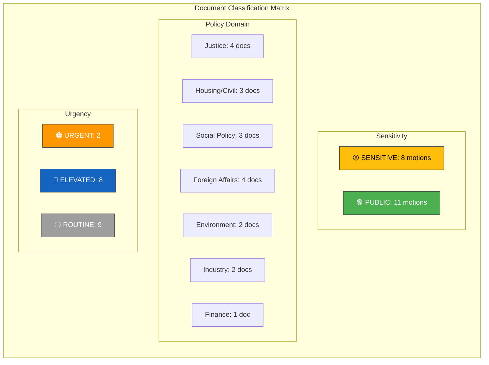

# Political Classification Results — 2026-04-10

**Generated**: 2026-04-10 17:44 UTC  
**Data Sources**: get_motioner (riksdag-regering-mcp)  
**Documents Analyzed**: 19  
**Analysis Period**: 2026-04-01 to 2026-04-09  
**Confidence**: HIGH  
**Produced By**: news-motions agentic workflow (AI-enriched)  
**Riksmöte**: 2025/26

---

## Classification Overview

## Detailed Classification

| dok_id | Motion | Committee | Party | Domain | Sensitivity | Urgency | Significance |
|--------|--------|-----------|-------|--------|-------------|---------|-------------|
| HD024070 | mot. 4070 | UU | C | Foreign aid | 🟡 SENSITIVE | 🟠 URGENT | 7/10 |
| HD024071 | mot. 4071 | UU | V | Foreign aid | 🟡 SENSITIVE | 🟠 URGENT | 7/10 |
| HD024072 | mot. 4072 | UU | MP | Foreign aid | 🟡 SENSITIVE | 🔵 ELEVATED | 7/10 |
| HD024073 | mot. 4073 | JuU | V | Justice/crime | 🟡 SENSITIVE | 🔵 ELEVATED | 6/10 |
| HD024074 | mot. 4074 | JuU | MP | Justice/crime | 🟡 SENSITIVE | 🔵 ELEVATED | 6/10 |
| HD024016 | mot. 4016 | SoU | S | Social policy | 🟡 SENSITIVE | 🔵 ELEVATED | 5/10 |
| HD024032 | mot. 4032 | SoU | C | Social policy | 🟡 SENSITIVE | 🔵 ELEVATED | 5/10 |
| HD024012 | mot. 4012 | CU | S | Housing | 🟡 SENSITIVE | 🔵 ELEVATED | 5/10 |
| HD024064 | mot. 4064 | CU | MP | Housing | 🟢 PUBLIC | 🔵 ELEVATED | 5/10 |
| HD024063 | mot. 4063 | JuU | MP | Justice/penal | 🟢 PUBLIC | 🔵 ELEVATED | 4/10 |
| HD024068 | mot. 4068 | MJU | MP | Environment | 🟢 PUBLIC | ⚪ ROUTINE | 4/10 |
| HD024069 | mot. 4069 | MJU | MP | Food security | 🟢 PUBLIC | ⚪ ROUTINE | 4/10 |
| HD024067 | mot. 4067 | CU | MP | Housing | 🟢 PUBLIC | ⚪ ROUTINE | 4/10 |
| HD024014 | mot. 4014 | FiU | S | Procurement | 🟢 PUBLIC | ⚪ ROUTINE | 4/10 |
| HD024023 | mot. 4023 | UbU | S | Education | 🟢 PUBLIC | ⚪ ROUTINE | 3/10 |
| HD024037 | mot. 4037 | NU | C | Copyright/IP | 🟢 PUBLIC | ⚪ ROUTINE | 3/10 |
| HD024007 | mot. 4007 | NU | SD | Copyright/IP | 🟢 PUBLIC | ⚪ ROUTINE | 3/10 |
| HD024045 | mot. 4045 | SoU | C | Health policy | 🟢 PUBLIC | ⚪ ROUTINE | 3/10 |
| HD024039 | mot. 4039 | UU | C | Nordic cooperation | 🟢 PUBLIC | ⚪ ROUTINE | 3/10 |

## Classification Rationale

- **SENSITIVE + URGENT**: Sida audit motions (C, V) flagged due to 4.7B SEK accountability gap and migration conditionality debate — immediate UU committee attention expected
- **SENSITIVE + ELEVATED**: Youth crime (V, MP), welfare (S, C), housing hire-purchase (S) — cross-party opposition clusters signal policy vulnerability
- **PUBLIC + ROUTINE**: Environment, copyright, Nordic cooperation, education — individual party motions without cross-party coordination

## Data Quality Notes

- Classification based on committee referral, cross-party coordination patterns, and policy domain sensitivity
- Full-text analysis limited to metadata and summaries from MCP
