# Cross-Reference Map — 2026-04-10

**Generated**: 2026-04-10 17:45 UTC  
**Data Sources**: get_motioner (riksdag-regering-mcp)  
**Documents Analyzed**: 19  
**Analysis Period**: 2026-04-01 to 2026-04-09  
**Confidence**: HIGH  
**Produced By**: news-motions agentic workflow (AI-enriched)  
**Riksmöte**: 2025/26

---

## Cross-Reference Network

```mermaid
graph TD
    subgraph "Proposition-Motion Cross-References"
        P227["prop. 227<br/>Youth Crime"]
        P207["prop. 207<br/>Welfare"]
        P188["prop. 188<br/>Housing"]
        P184["prop. 184<br/>Copyright"]
        S226["skr. 226<br/>Sida Audit"]
        P185["prop. 185<br/>Foreign Prisons"]
        P212["prop. 212<br/>Rental Guarantees"]
        P211["prop. 211<br/>Hunting"]
        P205["prop. 205<br/>Food Stockpiles"]
        P190["prop. 190<br/>Suicide Prevention"]
        P196["prop. 196<br/>Teaching Time"]
        P177["prop. 177<br/>Procurement"]
        S90["skr. 90<br/>Nordic Coop"]
    end

    HD024073["V: mot. 4073"] --> P227
    HD024074["MP: mot. 4074"] --> P227
    HD024016["S: mot. 4016"] --> P207
    HD024032["C: mot. 4032"] --> P207
    HD024012["S: mot. 4012"] --> P188
    HD024064["MP: mot. 4064"] --> P188
    HD024007["SD: mot. 4007"] --> P184
    HD024037["C: mot. 4037"] --> P184
    HD024070["C: mot. 4070"] --> S226
    HD024071["V: mot. 4071"] --> S226
    HD024072["MP: mot. 4072"] --> S226
    HD024063["MP: mot. 4063"] --> P185
    HD024067["MP: mot. 4067"] --> P212
    HD024068["MP: mot. 4068"] --> P211
    HD024069["MP: mot. 4069"] --> P205
    HD024045["C: mot. 4045"] --> P190
    HD024023["S: mot. 4023"] --> P196
    HD024014["S: mot. 4014"] --> P177
    HD024039["C: mot. 4039"] --> S90

    style P227 fill:#D32F2F,stroke:#424242,color:#FFFFFF
    style S226 fill:#FF9800,stroke:#424242,color:#FFFFFF
    style P207 fill:#FFC107,stroke:#424242,color:#000000
    style P188 fill:#4CAF50,stroke:#424242,color:#FFFFFF
    style P184 fill:#9E9E9E,stroke:#424242,color:#FFFFFF
```

## Cross-Party Clusters

| Government Text | Motions Filed | Parties | Cluster Type |
|----------------|---------------|---------|-------------|
| skr. 226 (Sida audit) | mot. 4070, 4071, 4072 | C, V, MP | **Trilateral** — strongest opposition cluster |
| prop. 227 (Youth crime) | mot. 4073, 4074 | V, MP | **Left-green** — civil liberties alliance |
| prop. 207 (Welfare) | mot. 4016, 4032 | S, C | **Centrist** — rare S-C welfare alignment |
| prop. 188 (Housing) | mot. 4012, 4064 | S, MP | **Left-green** — consumer protection |
| prop. 184 (Copyright) | mot. 4007, 4037 | SD, C | **Right-center** — anti-government coalition |

## Single-Party Motions

| Government Text | Motion | Party | Note |
|----------------|--------|-------|------|
| prop. 185 (Foreign prisons) | mot. 4063 | MP | Rights-based rejection |
| prop. 212 (Rental guarantees) | mot. 4067 | MP | Tenant protection |
| prop. 211 (Hunting) | mot. 4068 | MP | Environmental protection |
| prop. 205 (Food stockpiles) | mot. 4069 | MP | Preparedness expansion |
| prop. 190 (Suicide prevention) | mot. 4045 | C | Scope expansion |
| prop. 196 (Teaching time) | mot. 4023 | S | Funding demand |
| prop. 177 (Procurement) | mot. 4014 | S | Anti-corruption |
| skr. 90 (Nordic cooperation) | mot. 4039 | C | Helsinki Treaty |

## Thematic Cross-References

| Theme | Documents | Parties | Committees |
|-------|-----------|---------|-----------|
| Consumer protection | mot. 4012, 4064, 4067, 4014 | S, MP | CU, FiU |
| Civil liberties | mot. 4073, 4074, 4063 | V, MP | JuU |
| Foreign aid accountability | mot. 4070, 4071, 4072 | C, V, MP | UU |
| Social welfare | mot. 4016, 4032, 4045 | S, C | SoU |
| Government deregulation resistance | mot. 4007, 4037, 4068, 4012, 4064 | SD, C, MP, S | NU, MJU, CU |

## Data Quality Notes

- Cross-references based on shared proposition/report targets
- Thematic groupings based on committee assignments and policy domain analysis
