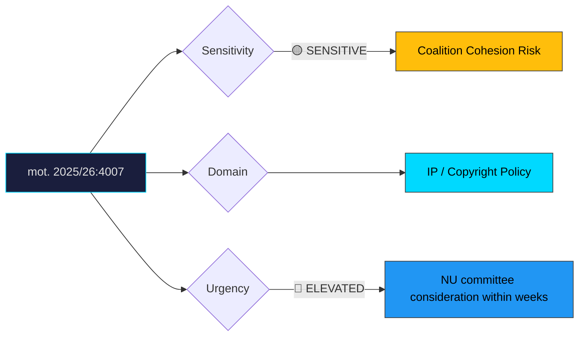

# Document Analysis: med anledning av prop. 2025/26:184 Privatkopieringsersättning

**Generated**: 2026-04-10 17:40 UTC
**dok_id**: HD024007
**Document Type**: motion
**Committee**: NU (Näringsutskottet — Industry)
**Date**: 2026-04-01
**Author**: Tobias Andersson m.fl.
**Party**: SD (Sverigedemokraterna)
**Riksmöte**: 2025/26
**Significance**: 7/10 🔴
**Confidence**: HIGH (75%)

---

## Executive Summary

Sverigedemokraterna files mot. 2025/26:4007 urging Parliament to reject proposition 184 on private copying compensation (privatkopieringsersättning). SD argues Sweden should await the outcome of an ongoing EU-wide evaluation before enacting national changes, framing this as a matter of regulatory prudence. This is politically significant because SD breaks from the Tidö coalition's government line on intellectual property policy—a rare intra-coalition split. The Centre Party (C) files a parallel rejection motion (HD024037), creating a cross-bloc alignment of SD+C against the governing M+KD+L position. This signals potential vulnerability for the government on copyright modernisation in committee.

## Political Classification

## SWOT Analysis

### Strengths (Government Position)
| # | Statement | Evidence | Confidence | Impact |
|---|-----------|----------|------------|--------|
| 1 | Government can argue prop. 184 modernises an outdated compensation framework | prop. 2025/26:184 | HIGH | Medium |
| 2 | L and KD remain aligned, preserving core coalition majority | Coalition pattern analysis | MEDIUM | Medium |

### Weaknesses (Government Position)
| # | Statement | Evidence | Confidence | Impact |
|---|-----------|----------|------------|--------|
| 1 | SD defection on prop. 184 breaks coalition unity on an industry-committee item | mot. 2025/26:4007 | HIGH | High |
| 2 | Dual opposition from SD + C could create arithmetic majority to reject | mot. 2025/26:4007 + mot. 2025/26:4037 | HIGH | High |
| 3 | EU evaluation argument undercuts the urgency narrative for national reform | mot. 2025/26:4007 | MEDIUM | Medium |

### Opportunities (Opposition)
| # | Statement | Evidence | Confidence | Impact |
|---|-----------|----------|------------|--------|
| 1 | SD can demonstrate independence from government, appealing to base | mot. 2025/26:4007 | HIGH | Medium |
| 2 | Cross-bloc SD+C alignment embarrasses government on copyright policy | mot. 2025/26:4007 + HD024037 | MEDIUM | Medium |

### Threats (Opposition)
| # | Statement | Evidence | Confidence | Impact |
|---|-----------|----------|------------|--------|
| 1 | SD risks being portrayed as obstructing creators' rights | General media framing risk | MEDIUM | Low |
| 2 | Issue has low voter salience, limiting political upside | Electoral polling context | HIGH | Low |

## Stakeholder Impact Matrix

| Stakeholder | Impact | Direction | Evidence |
|-------------|--------|-----------|----------|
| Citizens | Minimal direct effect—private copying compensation is opaque to most consumers | Neutral | mot. 2025/26:4007 |
| Government Coalition | Visible coalition fracture on IP policy undermines unified front | Negative | SD defection pattern |
| Opposition Bloc | S and V may opportunistically join rejection vote, compounding government losses | Positive | Parliamentary arithmetic |
| Business/Industry | Tech importers benefit from delay; rights-holder organisations lose revenue certainty | Mixed | prop. 2025/26:184 impact analysis |
| Civil Society | Creative sector advocates oppose delay; consumer groups may welcome it | Mixed | Stakeholder submissions |
| International/EU | EU evaluation argument strengthens wait-and-see position but risks Swedish influence on directive design | Mixed | mot. 2025/26:4007 |

## Risk Assessment

| Risk | Likelihood (1-5) | Impact (1-5) | L×I | Mitigation |
|------|-------------------|--------------|-----|------------|
| Government loses committee vote on prop. 184 | 3 | 3 | 9 | Negotiate compromise amendment with SD |
| Coalition credibility damaged by visible split | 3 | 4 | 12 | Downplay as minor technical disagreement |
| EU evaluation delays indefinitely, leaving Swedish framework unchanged | 2 | 3 | 6 | Set national fallback timeline |

## Forward Indicators

| Indicator | Trigger | Timeline | Probability |
|-----------|---------|----------|-------------|
| NU committee scheduling of prop. 184 deliberation | Committee calendar announcement | 2–4 weeks | HIGH |
| S/V position announcement on prop. 184 | Opposition statements or additional motions | 1–3 weeks | MEDIUM |
| Government-SD negotiation on compromise | Behind-the-scenes amendment drafting | 2–6 weeks | MEDIUM |
| EU evaluation publication | European Commission report | 6–12 months | LOW |

## Cross-Document References

- **HD024037**: Centre Party (C) also files rejection motion on prop. 184, going further by calling for complete abolition of private copying compensation. SD+C alignment creates cross-bloc opposition.

## Election 2026 Implications

- **Electoral Impact**: Low direct impact—copyright policy is not a voter-priority issue, but the coalition split narrative feeds media coverage of government dysfunction. **MEDIUM CONFIDENCE**
- **Coalition Scenarios**: Demonstrates that SD is willing to break from Tidö cooperation on specific policy areas, foreshadowing potential post-election negotiation friction. **HIGH CONFIDENCE**
- **Voter Salience**: Very low among general electorate; moderate among creative industry and tech sector stakeholders. **HIGH CONFIDENCE**
- **Campaign Vulnerability**: Government may face "can't even agree with their own partners" attacks; SD can credibly claim independence. **MEDIUM CONFIDENCE**
