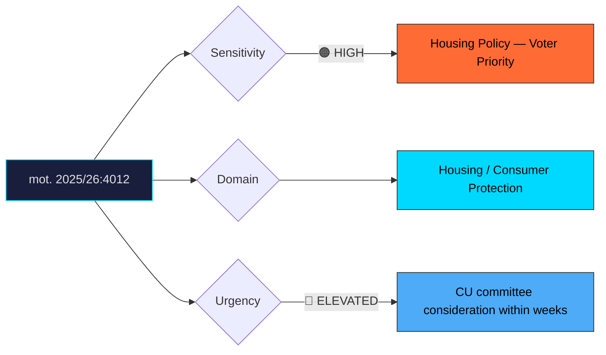

# Document Analysis: med anledning av prop. 2025/26:188 Lag om hyrköp av bostad

**Generated**: 2026-04-10 17:40 UTC
**dok_id**: HD024012
**Document Type**: motion
**Committee**: CU (Civilutskottet — Civil Affairs)
**Date**: 2026-04-01
**Author**: Joakim Järrebring m.fl.
**Party**: S (Socialdemokraterna)
**Riksmöte**: 2025/26
**Significance**: 7/10 🔴
**Confidence**: HIGH (75%)

---

## Executive Summary

Socialdemokraterna files mot. 2025/26:4012 demanding rejection of proposition 188 on hire-purchase housing (hyrköp av bostad), arguing the law provides insufficient consumer protection for a high-stakes financial product. Housing access is a perennial top-five election issue in Sweden, making this motion more politically charged than its procedural framing suggests. The Greens (MP) file a parallel opposition motion (HD024064), consolidating the left-bloc position against the government's market-oriented housing initiative. S's critique centres on the risk that financially vulnerable households will be locked into unfavourable contracts, positioning the party as defender of tenants' rights heading into the 2026 campaign.

## Political Classification

## SWOT Analysis

### Strengths (Government Position)
| # | Statement | Evidence | Confidence | Impact |
|---|-----------|----------|------------|--------|
| 1 | Hire-purchase offers a new pathway to ownership for renters excluded from mortgage markets | prop. 2025/26:188 | HIGH | High |
| 2 | Government can frame this as expanding housing options, not replacing protections | Coalition messaging | MEDIUM | Medium |

### Weaknesses (Government Position)
| # | Statement | Evidence | Confidence | Impact |
|---|-----------|----------|------------|--------|
| 1 | Consumer protection gaps create political vulnerability—stories of exploited buyers resonate | mot. 2025/26:4012 | HIGH | High |
| 2 | Left-bloc alignment (S+MP) on rejection creates unified opposition narrative | mot. 2025/26:4012 + HD024064 | HIGH | High |
| 3 | Housing market complexity makes it hard for government to communicate benefits simply | General framing challenge | MEDIUM | Medium |

### Opportunities (Opposition)
| # | Statement | Evidence | Confidence | Impact |
|---|-----------|----------|------------|--------|
| 1 | S can position as champion of consumer protection vs. reckless deregulation | mot. 2025/26:4012 | HIGH | High |
| 2 | Housing is a top-five voter concern — opposition gains from any government misstep | SOM Institute polling | HIGH | High |
| 3 | MP alignment reinforces red-green bloc coherence ahead of election | HD024064 | MEDIUM | Medium |

### Threats (Opposition)
| # | Statement | Evidence | Confidence | Impact |
|---|-----------|----------|------------|--------|
| 1 | S risks appearing to oppose all new housing solutions during a housing crisis | Media framing risk | MEDIUM | Medium |
| 2 | If hire-purchase succeeds, S loses the argument and appears obstructionist | Outcome uncertainty | LOW | High |

## Stakeholder Impact Matrix

| Stakeholder | Impact | Direction | Evidence |
|-------------|--------|-----------|----------|
| Citizens | Potential new path to homeownership, but risk of inadequate consumer protection | Mixed | mot. 2025/26:4012 |
| Government Coalition | Flagship housing reform at risk of being framed as anti-consumer | Negative | S+MP rejection motions |
| Opposition Bloc | Unified S+MP front strengthens left-bloc housing policy narrative | Positive | mot. 2025/26:4012 + HD024064 |
| Business/Industry | Property developers and financial institutions gain new product; consumer advocates oppose | Mixed | prop. 2025/26:188 |
| Civil Society | Tenant organisations likely align with S critique; homeownership advocates support | Mixed | Stakeholder analysis |
| International/EU | Hire-purchase models exist in UK and elsewhere; Sweden would join international trend | Neutral | Comparative law context |

## Risk Assessment

| Risk | Likelihood (1-5) | Impact (1-5) | L×I | Mitigation |
|------|-------------------|--------------|-----|------------|
| Consumer harm stories dominate media narrative before election | 3 | 5 | 15 | Strengthen consumer protection provisions via amendment |
| S+MP+V+C majority rejects prop. 188 in committee | 2 | 4 | 8 | Secure SD support for passage |
| Hire-purchase market develops poorly, validating opposition critique | 2 | 4 | 8 | Implement review clause and ombudsman oversight |

## Forward Indicators

| Indicator | Trigger | Timeline | Probability |
|-----------|---------|----------|-------------|
| CU committee scheduling and expert hearings | Committee calendar | 2–4 weeks | HIGH |
| Hyresgästföreningen (Tenants' Union) public position | Press release or debate article | 1–3 weeks | HIGH |
| SD position on prop. 188 (decisive for parliamentary arithmetic) | Party statement | 2–4 weeks | MEDIUM |
| Additional opposition motions from V or C | Motion filing | 1–2 weeks | MEDIUM |

## Cross-Document References

- **HD024064**: Miljöpartiet (MP) files parallel rejection motion on prop. 188, reinforcing left-bloc opposition and S's consumer protection argument.

## Election 2026 Implications

- **Electoral Impact**: High—housing is a top voter concern. S's consumer protection framing resonates with renters and first-time buyers who form a key swing demographic. **HIGH CONFIDENCE**
- **Coalition Scenarios**: If prop. 188 passes and generates consumer complaints, it becomes campaign ammunition. If rejected, government loses a flagship reform. **MEDIUM CONFIDENCE**
- **Voter Salience**: Very high—housing affordability consistently ranks among top-five issues in Swedish voter surveys. **HIGH CONFIDENCE**
- **Campaign Vulnerability**: Government faces "putting developers before tenants" attacks; S must avoid appearing to block all housing solutions. **HIGH CONFIDENCE**
