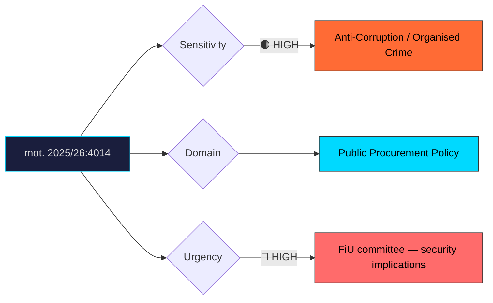

# Document Analysis: med anledning av prop. 2025/26:177 Förenklad leverantörskontroll vid upphandling

**Generated**: 2026-04-10 17:40 UTC
**dok_id**: HD024014
**Document Type**: motion
**Committee**: FiU (Finansutskottet — Finance)
**Date**: 2026-04-01
**Author**: Mikael Damberg m.fl.
**Party**: S (Socialdemokraterna)
**Riksmöte**: 2025/26
**Significance**: 8/10 🔴
**Confidence**: HIGH (75%)

---

## Executive Summary

Socialdemokraterna files mot. 2025/26:4014 demanding that simplified supplier checks in public procurement be extended to cover all exclusion grounds, not just a subset. The motion directly challenges proposition 177's deregulation approach, arguing it weakens anti-corruption and anti-organised-crime safeguards at a time when infiltration of public procurement is a growing security concern. This is a high-significance motion because S effectively positions itself as the anti-corruption party, forcing the government to defend a "softer" procurement regime. The organised crime angle gives the critique broad public appeal and cross-party resonance, making this a potent campaign narrative for S heading into 2026.

## Political Classification

## SWOT Analysis

### Strengths (Government Position)
| # | Statement | Evidence | Confidence | Impact |
|---|-----------|----------|------------|--------|
| 1 | Simplified procurement reduces administrative burden for SMEs | prop. 2025/26:177 | HIGH | Medium |
| 2 | Deregulation agenda aligns with coalition's business-friendly platform | Coalition agreement | HIGH | Medium |

### Weaknesses (Government Position)
| # | Statement | Evidence | Confidence | Impact |
|---|-----------|----------|------------|--------|
| 1 | "Simplified checks" is easily framed as "weaker checks" against corruption | mot. 2025/26:4014 | HIGH | High |
| 2 | Organised crime infiltration of public procurement is well-documented and politically toxic to appear soft on | BRÅ reports, media investigations | HIGH | High |
| 3 | Excluding some grounds from mandatory checks creates verifiable loopholes | mot. 2025/26:4014 legal analysis | MEDIUM | High |

### Opportunities (Opposition)
| # | Statement | Evidence | Confidence | Impact |
|---|-----------|----------|------------|--------|
| 1 | S's Damberg leads attack — a former Interior Minister with crime-fighting credibility | Author profile | HIGH | High |
| 2 | Anti-corruption framing appeals across political spectrum, including right-leaning voters | Polling on organised crime concern | HIGH | High |
| 3 | Links to broader S narrative on government being soft on crime | S campaign strategy | MEDIUM | Medium |

### Threats (Opposition)
| # | Statement | Evidence | Confidence | Impact |
|---|-----------|----------|------------|--------|
| 1 | S risks being seen as defending bureaucratic burden on small businesses | Government counter-framing | MEDIUM | Medium |
| 2 | If procurement continues to function well, critique loses empirical basis | Outcome uncertainty | LOW | Medium |

## Stakeholder Impact Matrix

| Stakeholder | Impact | Direction | Evidence |
|-------------|--------|-----------|----------|
| Citizens | Public money protection — citizens benefit from robust anti-corruption checks | Positive (for S position) | mot. 2025/26:4014 |
| Government Coalition | Forced to defend deregulation against organised crime narrative | Negative | S framing strategy |
| Opposition Bloc | S gains ownership of anti-corruption procurement narrative | Positive | mot. 2025/26:4014 |
| Business/Industry | SMEs benefit from simplified checks; responsible businesses benefit from strict screening | Mixed | prop. 2025/26:177 |
| Civil Society | Transparency and anti-corruption NGOs likely support S position | Positive (for S) | Civil society pattern |
| International/EU | EU procurement directives set floor standards; Sweden risks falling to minimum | Mixed | EU directive framework |

## Risk Assessment

| Risk | Likelihood (1-5) | Impact (1-5) | L×I | Mitigation |
|------|-------------------|--------------|-----|------------|
| Procurement scandal involving excluded check category | 2 | 5 | 10 | Extend checks to all exclusion grounds proactively |
| S "soft on crime" reversal narrative gains traction | 4 | 4 | 16 | Government must develop compelling counter-narrative |
| EU infringement risk if Swedish checks fall below directive standards | 1 | 4 | 4 | Legal review against EU Procurement Directive 2014/24 |

## Forward Indicators

| Indicator | Trigger | Timeline | Probability |
|-----------|---------|----------|-------------|
| FiU expert hearing with BRÅ/Ekobrottsmyndigheten on procurement infiltration | Committee scheduling | 2–6 weeks | MEDIUM |
| Media investigations on organised crime in procurement | Investigative journalism cycle | Ongoing | HIGH |
| Additional opposition motions supporting S's position | Motion filing by V, MP, C | 1–3 weeks | MEDIUM |
| Government amendment to widen check scope (compromise) | Behind-the-scenes negotiation | 3–8 weeks | LOW |

## Cross-Document References

- **HD024016**: S's Lundh Sammeli also targets organised crime exploitation in welfare (prop. 207), suggesting a coordinated S strategy to frame the government as weak on organised crime across multiple policy domains.

## Election 2026 Implications

- **Electoral Impact**: High—Mikael Damberg's credibility as former Interior Minister gives this motion unusual weight. Anti-corruption resonates across all voter groups. **HIGH CONFIDENCE**
- **Coalition Scenarios**: Government vulnerability on procurement integrity could push SD to demand tougher checks, creating internal coalition tension. **MEDIUM CONFIDENCE**
- **Voter Salience**: Organised crime is a top-three voter concern. Linking it to procurement amplifies S's law-and-order credentials. **HIGH CONFIDENCE**
- **Campaign Vulnerability**: Government is exposed to "opening the door to corruption" attacks — extremely difficult to counter in campaign format. **HIGH CONFIDENCE**
