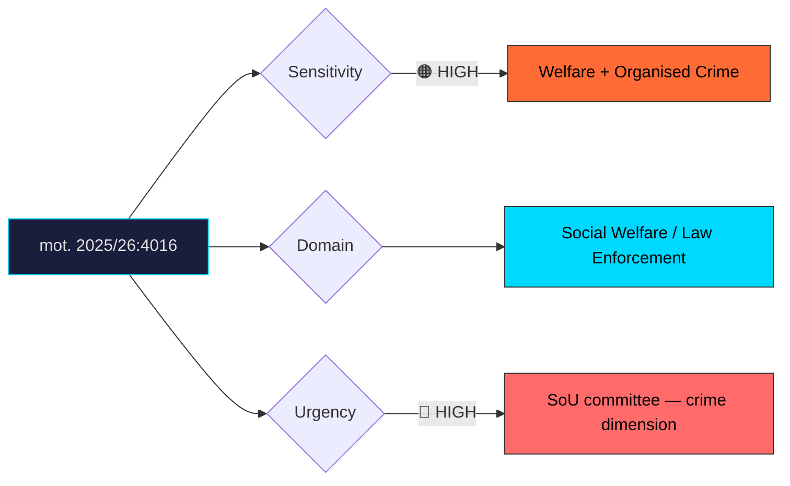

# Document Analysis: med anledning av prop. 2025/26:207 Aktivitetskrav för mottagare av försörjningsstöd

**Generated**: 2026-04-10 17:40 UTC
**dok_id**: HD024016
**Document Type**: motion
**Committee**: SoU (Socialutskottet — Social Affairs)
**Date**: 2026-04-01
**Author**: Fredrik Lundh Sammeli m.fl.
**Party**: S (Socialdemokraterna)
**Riksmöte**: 2025/26
**Significance**: 8/10 🔴
**Confidence**: HIGH (75%)

---

## Executive Summary

Socialdemokraterna files mot. 2025/26:4016 on proposition 207 concerning activity requirements for welfare recipients, demanding the government close loopholes that allow organised crime networks to exploit the welfare system. Rather than opposing the principle of activity requirements, S accepts the premise but attacks the implementation as inadequate—a sophisticated legislative tactic that denies the government a clean "tough vs. soft" narrative. The Centre Party files a parallel motion (HD024032) critiquing the same proposition from an evidence-based evaluation angle. This dual-front attack from S (organised crime focus) and C (effectiveness focus) signals that prop. 207 faces significant committee resistance from two distinct ideological directions.

## Political Classification

## SWOT Analysis

### Strengths (Government Position)
| # | Statement | Evidence | Confidence | Impact |
|---|-----------|----------|------------|--------|
| 1 | Activity requirements enjoy broad public support—voters favour conditions for welfare | Polling data on welfare conditionality | HIGH | High |
| 2 | Government can claim it is delivering on Tidö Agreement promise | Coalition agreement commitments | HIGH | Medium |

### Weaknesses (Government Position)
| # | Statement | Evidence | Confidence | Impact |
|---|-----------|----------|------------|--------|
| 1 | Loopholes exploitable by organised crime undercut the reform's credibility | mot. 2025/26:4016 | HIGH | High |
| 2 | Two-front critique (S on crime, C on evaluation) complicates government response | mot. 2025/26:4016 + HD024032 | HIGH | High |
| 3 | S accepts the principle but attacks implementation—harder to dismiss as ideological opposition | Legislative tactic analysis | HIGH | High |

### Opportunities (Opposition)
| # | Statement | Evidence | Confidence | Impact |
|---|-----------|----------|------------|--------|
| 1 | S steals the "tough on crime" narrative from the government on welfare exploitation | mot. 2025/26:4016 | HIGH | High |
| 2 | Cross-party S+C critique gives media a "government isolated" frame | Dual-motion analysis | MEDIUM | Medium |
| 3 | S builds coherent anti-organised-crime platform across procurement (HD024014) and welfare | S strategy pattern | MEDIUM | High |

### Threats (Opposition)
| # | Statement | Evidence | Confidence | Impact |
|---|-----------|----------|------------|--------|
| 1 | Government could adopt S's proposals, neutralising the critique | Amendment incorporation risk | MEDIUM | Medium |
| 2 | S's nuanced position (accept principle, attack implementation) may be simplified in media | Communication risk | MEDIUM | Low |

## Stakeholder Impact Matrix

| Stakeholder | Impact | Direction | Evidence |
|-------------|--------|-----------|----------|
| Citizens | Welfare recipients face new activity requirements; taxpayers benefit from reduced fraud | Mixed | prop. 2025/26:207 |
| Government Coalition | Dual-front S+C attack threatens flagship welfare reform narrative | Negative | mot. 2025/26:4016 + HD024032 |
| Opposition Bloc | S gains credibility on organised crime; C gains credibility on evidence-based policy | Positive | Cross-party critique pattern |
| Business/Industry | Limited direct impact; employers may benefit from activity-ready workforce | Neutral | Indirect labour market effects |
| Civil Society | Social welfare organisations concerned about vulnerable populations; anti-crime groups support stronger checks | Mixed | Stakeholder consultation pattern |
| International/EU | Activity requirements align with European workfare trends | Neutral | Comparative welfare policy |

## Risk Assessment

| Risk | Likelihood (1-5) | Impact (1-5) | L×I | Mitigation |
|------|-------------------|--------------|-----|------------|
| Organised crime exploitation case emerges post-implementation | 3 | 5 | 15 | Adopt S's loophole-closing amendments preemptively |
| SoU committee amends prop. 207 substantially, diluting government's reform | 3 | 3 | 9 | Negotiate S/C demands into compromise text |
| Media frames dual S+C critique as government incompetence | 3 | 4 | 12 | Proactive communication on anti-crime measures |

## Forward Indicators

| Indicator | Trigger | Timeline | Probability |
|-----------|---------|----------|-------------|
| SoU committee hearing on organised crime and welfare fraud | Committee scheduling | 2–6 weeks | MEDIUM |
| Police or BRÅ data on welfare fraud scale | Statistical release | 1–3 months | MEDIUM |
| Government willingness to negotiate amendments with S or C | Informal negotiation signals | 3–6 weeks | MEDIUM |
| V, MP position on prop. 207 | Party statements | 1–3 weeks | HIGH |

## Cross-Document References

- **HD024032**: Centre Party (C) files parallel motion on same prop. 207, demanding thorough evaluation of reform effects. C's approach is evidence-based, complementing S's organised-crime focus — together they create a pincer critique.
- **HD024014**: S's Damberg files anti-corruption motion on procurement (prop. 177), suggesting a coordinated S campaign strategy framing the government as weak on organised crime across policy domains.

## Election 2026 Implications

- **Electoral Impact**: High—S's ability to outflank the government on organised crime within welfare is a significant pre-election tactical win. Welfare conditionality is a cross-partisan voter issue. **HIGH CONFIDENCE**
- **Coalition Scenarios**: If S successfully owns the "tougher on welfare fraud" position, it undermines a core Tidö Agreement selling point for M+SD+KD+L. **HIGH CONFIDENCE**
- **Voter Salience**: Very high—welfare integrity and organised crime are both top-five voter concerns, and this motion links them directly. **HIGH CONFIDENCE**
- **Campaign Vulnerability**: Government must explain why its own welfare reform has loopholes for organised crime — an untenable position in a debate format. **HIGH CONFIDENCE**
