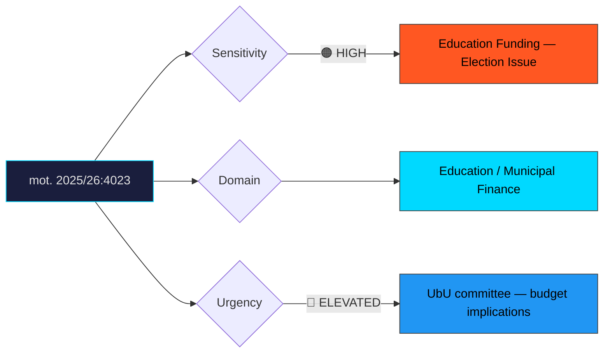

# Document Analysis: med anledning av prop. 2025/26:196 Tid för undervisningsuppdraget

**Generated**: 2026-04-10 17:40 UTC
**dok_id**: HD024023
**Document Type**: motion
**Committee**: UbU (Utbildningsutskottet — Education)
**Date**: 2026-04-01
**Author**: Anders Ygeman m.fl.
**Party**: S (Socialdemokraterna)
**Riksmöte**: 2025/26
**Significance**: 8/10 🔴
**Confidence**: HIGH (75%)

---

## Executive Summary

Socialdemokraterna files mot. 2025/26:4023 demanding responsible financing for the government's teaching time reform (proposition 196). S does not reject the principle of freeing up teacher time for instruction but attacks the government for creating an unfunded mandate that would burden municipalities. This is a classic S fiscal responsibility attack — accepting a popular reform goal while exposing the government's failure to provide adequate funding. Education and municipal finances are high-salience election issues, making this motion a powerful pre-campaign positioning tool. The unfunded mandate critique resonates particularly strongly with municipal politicians across party lines.

## Political Classification

## SWOT Analysis

### Strengths (Government Position)
| # | Statement | Evidence | Confidence | Impact |
|---|-----------|----------|------------|--------|
| 1 | Reform addresses chronic teacher workload complaints — universally popular goal | prop. 2025/26:196 | HIGH | High |
| 2 | Government can claim to be acting on education quality while S only critiques | Reform delivery narrative | MEDIUM | Medium |

### Weaknesses (Government Position)
| # | Statement | Evidence | Confidence | Impact |
|---|-----------|----------|------------|--------|
| 1 | Unfunded mandates are politically toxic — municipalities face cutbacks and teacher shortages | mot. 2025/26:4023 | HIGH | High |
| 2 | SKR (Swedish Association of Local Authorities) likely to echo S's funding concerns | Municipal interest pattern | HIGH | High |
| 3 | Teachers' unions may side with S if reform means more work without more resources | Union stakeholder analysis | MEDIUM | High |

### Opportunities (Opposition)
| # | Statement | Evidence | Confidence | Impact |
|---|-----------|----------|------------|--------|
| 1 | S frames itself as the fiscally responsible party that funds its promises | mot. 2025/26:4023 | HIGH | High |
| 2 | Municipal politicians across all parties share unfunded mandate frustration | Cross-party municipal concern | HIGH | Medium |
| 3 | Education is a top-three election issue — high voter engagement potential | SOM Institute data | HIGH | High |

### Threats (Opposition)
| # | Statement | Evidence | Confidence | Impact |
|---|-----------|----------|------------|--------|
| 1 | Government could announce additional funding, neutralising critique | Budget adjustment risk | MEDIUM | High |
| 2 | S risks being seen as opposing a reform that teachers want | Framing risk | MEDIUM | Medium |

## Stakeholder Impact Matrix

| Stakeholder | Impact | Direction | Evidence |
|-------------|--------|-----------|----------|
| Citizens | Parents and students affected by quality of teaching; taxpayers via municipal budgets | Mixed | mot. 2025/26:4023 |
| Government Coalition | Popular reform goal undermined by credible funding critique | Negative | S fiscal attack |
| Opposition Bloc | S gains strong "responsible governance" message on education | Positive | mot. 2025/26:4023 |
| Business/Industry | Education quality affects long-term workforce; limited direct impact | Neutral | Indirect effects |
| Civil Society | Teacher unions (Lärarförbundet, Lärarnas Riksförbund) and SKR are key stakeholders likely sympathetic to funding critique | Positive (for S) | Union/municipal analysis |
| International/EU | OECD education comparisons may contextualise Swedish teacher workload | Neutral | International benchmarking |

## Risk Assessment

| Risk | Likelihood (1-5) | Impact (1-5) | L×I | Mitigation |
|------|-------------------|--------------|-----|------------|
| Municipal budget crises attributed to unfunded teaching reform | 3 | 5 | 15 | Provide ring-fenced state funding for implementation |
| Teacher union endorsement of S's funding critique | 4 | 4 | 16 | Engage unions in implementation planning with guaranteed resources |
| Education becomes dominant campaign issue with government on defensive | 3 | 4 | 12 | Announce comprehensive education funding package |

## Forward Indicators

| Indicator | Trigger | Timeline | Probability |
|-----------|---------|----------|-------------|
| SKR formal response on funding adequacy of prop. 196 | SKR board statement | 2–4 weeks | HIGH |
| Teacher union position statements | Lärarförbundet / Lärarnas Riksförbund press releases | 1–4 weeks | HIGH |
| UbU committee expert hearings with municipal representatives | Committee scheduling | 3–6 weeks | MEDIUM |
| Government supplementary budget allocation for education | Budget process | 2–4 months | LOW |

## Cross-Document References

- **HD024014**: S's Damberg attacks government on procurement deregulation — part of a broader S strategy to frame the government as prioritising deregulation over responsible governance.
- **HD024016**: S's Lundh Sammeli attacks welfare reform implementation — S consistently applies the "good idea, bad execution" critique across multiple propositions.

## Election 2026 Implications

- **Electoral Impact**: Very high—education and municipal finances are perennial top-tier election issues. S's "fund your promises" attack has broad resonance. **HIGH CONFIDENCE**
- **Coalition Scenarios**: Unfunded education reform could erode municipal support for coalition parties, particularly L and KD whose local branches feel the squeeze. **MEDIUM CONFIDENCE**
- **Voter Salience**: Very high—education consistently ranks in the top three voter concerns. Parents, teachers, and municipal employees form a large affected constituency. **HIGH CONFIDENCE**
- **Campaign Vulnerability**: "The government promises reforms but doesn't pay for them" is a devastating campaign line that applies beyond education to the government's broader fiscal credibility. **HIGH CONFIDENCE**
