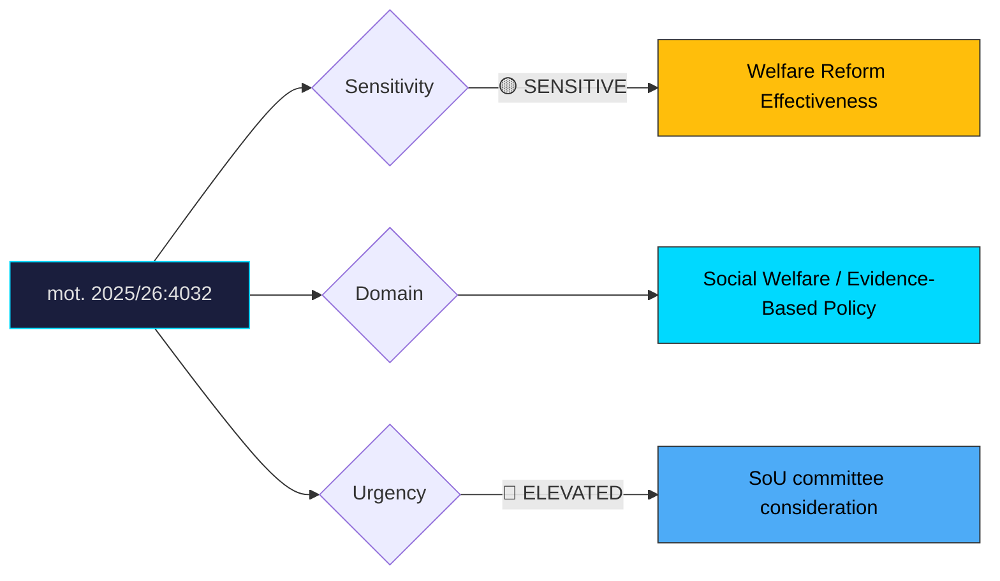

# Document Analysis: med anledning av prop. 2025/26:207 Aktivitetskrav för mottagare av försörjningsstöd

**Generated**: 2026-04-10 17:40 UTC
**dok_id**: HD024032
**Document Type**: motion
**Committee**: SoU (Socialutskottet — Social Affairs)
**Date**: 2026-04-01
**Author**: Christofer Bergenblock m.fl.
**Party**: C (Centerpartiet)
**Riksmöte**: 2025/26
**Significance**: 6/10 🟡
**Confidence**: HIGH (75%)

---

## Executive Summary

Centerpartiet files mot. 2025/26:4032 demanding thorough evaluation of the activity requirements in proposition 207, questioning whether mandated activities actually lead to meaningful outcomes for welfare recipients. Unlike S's parallel motion (HD024016), which frames the critique through an organised crime lens, C takes an evidence-based policy effectiveness approach. This ideological differentiation is important: C positions itself as the rational, data-driven reformer who supports conditionality in principle but demands proof it works. Combined with S's motion, prop. 207 faces a two-front committee challenge that could force substantial amendments or compromise.

## Political Classification

## SWOT Analysis

### Strengths (Government Position)
| # | Statement | Evidence | Confidence | Impact |
|---|-----------|----------|------------|--------|
| 1 | Activity requirements enjoy strong public support across political spectrum | Polling on welfare conditionality | HIGH | High |
| 2 | C's critique is moderate (evaluation demand, not rejection) — easier to accommodate | mot. 2025/26:4032 | HIGH | Medium |

### Weaknesses (Government Position)
| # | Statement | Evidence | Confidence | Impact |
|---|-----------|----------|------------|--------|
| 1 | Lack of evaluation framework suggests reform was rushed | mot. 2025/26:4032 | MEDIUM | Medium |
| 2 | Combined with S critique (HD024016), government faces multi-angle committee challenge | Dual-motion analysis | HIGH | High |
| 3 | C's evidence-based framing appeals to expert community and media commentators | Policy discourse pattern | MEDIUM | Medium |

### Opportunities (Opposition)
| # | Statement | Evidence | Confidence | Impact |
|---|-----------|----------|------------|--------|
| 1 | C establishes itself as the "evidence-based" party — differentiating from both S and government | mot. 2025/26:4032 | HIGH | Medium |
| 2 | Evaluation demand is hard to oppose — government must either agree or appear anti-evidence | Rhetorical positioning | HIGH | Medium |

### Threats (Opposition)
| # | Statement | Evidence | Confidence | Impact |
|---|-----------|----------|------------|--------|
| 1 | Government accepts evaluation clause, neutralising C's critique cheaply | Amendment incorporation risk | HIGH | Medium |
| 2 | C's moderate position may be overshadowed by S's more dramatic organised crime narrative | Media attention competition | MEDIUM | Low |

## Stakeholder Impact Matrix

| Stakeholder | Impact | Direction | Evidence |
|-------------|--------|-----------|----------|
| Citizens | Welfare recipients benefit from evaluation ensuring activities are meaningful | Positive | mot. 2025/26:4032 |
| Government Coalition | Moderate critique easier to address than S's, but still signals reform weakness | Mildly Negative | C's constructive approach |
| Opposition Bloc | C demonstrates independent centrist positioning distinct from left-bloc | Positive | mot. 2025/26:4032 |
| Business/Industry | Limited direct impact; better-designed programmes could improve labour market outcomes | Neutral | Indirect effects |
| Civil Society | Social work professionals and researchers likely support evaluation demand | Positive (for C) | Expert community pattern |
| International/EU | Evaluation clause aligns with international best practice on workfare programmes | Positive | OECD/EU evaluation standards |

## Risk Assessment

| Risk | Likelihood (1-5) | Impact (1-5) | L×I | Mitigation |
|------|-------------------|--------------|-----|------------|
| Activity programmes shown to be ineffective post-implementation | 3 | 4 | 12 | Build in mandatory evaluation from the start |
| SoU committee inserts strong evaluation amendments delaying full implementation | 3 | 3 | 9 | Accept evaluation clause as constructive compromise |
| C + S voting alignment forces government to negotiate | 3 | 3 | 9 | Engage C directly — their demands are more moderate |

## Forward Indicators

| Indicator | Trigger | Timeline | Probability |
|-----------|---------|----------|-------------|
| SoU committee negotiation between government and C on evaluation clause | Informal discussions | 2–6 weeks | HIGH |
| Research community input on activity requirement effectiveness | Academic/IFAU publications | 1–3 months | MEDIUM |
| Government willingness to accept evaluation amendment | Committee deliberation | 3–6 weeks | MEDIUM |
| V, MP positions on prop. 207 | Party statements | 1–3 weeks | HIGH |

## Cross-Document References

- **HD024016**: Socialdemokraterna files parallel motion on same prop. 207, focusing on organised crime loopholes. Together, S+C create a two-front critique — S from a security perspective, C from an evidence-based policy perspective.
- **HD024045**: C's Bergenblock also files on suicide prevention (prop. 190), demonstrating C's social policy engagement pattern in SoU committee.

## Election 2026 Implications

- **Electoral Impact**: Moderate—C's evidence-based positioning appeals to educated, centrist swing voters but lacks the emotional punch of S's organised crime framing. **MEDIUM CONFIDENCE**
- **Coalition Scenarios**: C's constructive criticism keeps the door open for post-election cooperation with either bloc — C avoids burning bridges with the government. **HIGH CONFIDENCE**
- **Voter Salience**: Moderate—welfare conditionality matters to voters, but the evaluation demand is procedural rather than emotionally resonant. **MEDIUM CONFIDENCE**
- **Campaign Vulnerability**: C can use this to demonstrate it demands evidence for policy decisions, reinforcing its centrist "responsible" brand. Government can accommodate the critique relatively cheaply. **MEDIUM CONFIDENCE**
