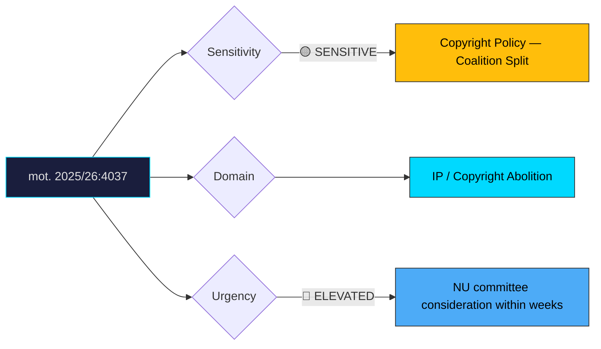

# Document Analysis: med anledning av prop. 2025/26:184 Privatkopieringsersättning

**Generated**: 2026-04-10 17:40 UTC
**dok_id**: HD024037
**Document Type**: motion
**Committee**: NU (Näringsutskottet — Industry)
**Date**: 2026-04-01
**Author**: Anders Ådahl m.fl.
**Party**: C (Centerpartiet)
**Riksmöte**: 2025/26
**Significance**: 7/10 🔴
**Confidence**: HIGH (75%)

---

## Executive Summary

Centerpartiet files mot. 2025/26:4037 calling for outright rejection of proposition 184 and complete abolition of private copying compensation — going significantly further than SD's parallel motion (HD024007), which merely advocated waiting for an EU evaluation. C frames private copying compensation as an outdated levy that no longer reflects how consumers access content in a streaming-dominated market. This creates an unusual SD+C alignment against the government on copyright policy, with C occupying the more radical position. The dual rejection motions from two parties that sit on opposite sides of Swedish politics (SD far right, C centrist) make this an awkward situation for the government, as the opposition cannot be dismissed as ideologically motivated.

## Political Classification

## SWOT Analysis

### Strengths (Government Position)
| # | Statement | Evidence | Confidence | Impact |
|---|-----------|----------|------------|--------|
| 1 | Private copying compensation has legal precedent and supports creative sector | prop. 2025/26:184 | HIGH | Medium |
| 2 | Complete abolition is a radical position that may alienate culture sector stakeholders | C's position analysis | MEDIUM | Medium |

### Weaknesses (Government Position)
| # | Statement | Evidence | Confidence | Impact |
|---|-----------|----------|------------|--------|
| 1 | SD+C cross-bloc alignment makes government position look isolated | mot. 2025/26:4037 + HD024007 | HIGH | High |
| 2 | Streaming-era argument against levies resonates with younger, tech-savvy voters | Market evolution analysis | HIGH | Medium |
| 3 | If S/V join opposition, government lacks majority to pass prop. 184 | Parliamentary arithmetic | MEDIUM | High |

### Opportunities (Opposition)
| # | Statement | Evidence | Confidence | Impact |
|---|-----------|----------|------------|--------|
| 1 | C positions itself as the modernising, deregulatory party on digital policy | mot. 2025/26:4037 | HIGH | Medium |
| 2 | Complete abolition stance differentiates C from SD's more cautious "wait and see" | Comparative analysis with HD024007 | HIGH | Medium |
| 3 | Cross-bloc SD+C cooperation on copyright signals pragmatic policy-making | Alliance pattern | MEDIUM | Low |

### Threats (Opposition)
| # | Statement | Evidence | Confidence | Impact |
|---|-----------|----------|------------|--------|
| 1 | C's abolition call may alienate cultural workers and artists — a traditional C-adjacent constituency in rural areas | Stakeholder risk | MEDIUM | Medium |
| 2 | "Abolish compensation for creators" is a politically risky headline | Media framing | MEDIUM | Medium |

## Stakeholder Impact Matrix

| Stakeholder | Impact | Direction | Evidence |
|-------------|--------|-----------|----------|
| Citizens | Consumers would benefit from removal of device levies; cultural offerings may suffer | Mixed | mot. 2025/26:4037 |
| Government Coalition | Cross-bloc opposition threatens passage of prop. 184 | Negative | SD+C alignment |
| Opposition Bloc | C gains digital modernisation credentials; creates unusual cross-aisle cooperation | Positive | mot. 2025/26:4037 |
| Business/Industry | Device importers strongly benefit from abolition; music/film industries lose revenue stream | Mixed | Industry impact analysis |
| Civil Society | Creator organisations oppose; consumer groups and tech advocates support | Mixed | Stakeholder mapping |
| International/EU | Abolition would make Sweden an outlier — most EU states maintain private copying levies | Negative | EU comparative law |

## Risk Assessment

| Risk | Likelihood (1-5) | Impact (1-5) | L×I | Mitigation |
|------|-------------------|--------------|-----|------------|
| Government loses NU committee vote on prop. 184 | 3 | 3 | 9 | Negotiate compromise with SD (easier to satisfy than C) |
| Sweden becomes EU outlier if levy abolished | 2 | 3 | 6 | Phase abolition with EU evaluation timeline |
| Creative sector backlash against C | 2 | 3 | 6 | C frames as modernisation, not anti-culture |

## Forward Indicators

| Indicator | Trigger | Timeline | Probability |
|-----------|---------|----------|-------------|
| NU committee scheduling of prop. 184 deliberation | Committee calendar | 2–4 weeks | HIGH |
| S position on prop. 184 (decisive for arithmetic) | Party statement or motion | 1–3 weeks | MEDIUM |
| Creative industry lobbying campaign | STIM/Copyswede public advocacy | 1–4 weeks | HIGH |
| Government-SD compromise negotiation | Behind-the-scenes | 2–6 weeks | MEDIUM |

## Cross-Document References

- **HD024007**: SD (Tobias Andersson) files parallel rejection of prop. 184 but with a more cautious "wait for EU evaluation" rationale. SD+C alignment creates cross-bloc opposition, but their ideological motivations differ: SD wants delay, C wants abolition.
- **HD024039**: C's Deremar/Liljeberg file on Nordic cooperation, showing C's broad committee activity pattern this session.

## Election 2026 Implications

- **Electoral Impact**: Low to moderate—copyright policy is niche but the SD+C alignment narrative and "outdated levy" framing have some media traction. **MEDIUM CONFIDENCE**
- **Coalition Scenarios**: C's willingness to align with SD on specific policy issues signals post-election pragmatism and potential for cross-bloc cooperation. **MEDIUM CONFIDENCE**
- **Voter Salience**: Low among general electorate; moderate among digital natives and cultural sector workers. **HIGH CONFIDENCE**
- **Campaign Vulnerability**: Government faces questions about why both SD and C oppose its position; C risks "anti-creator" label from cultural lobby. **MEDIUM CONFIDENCE**
