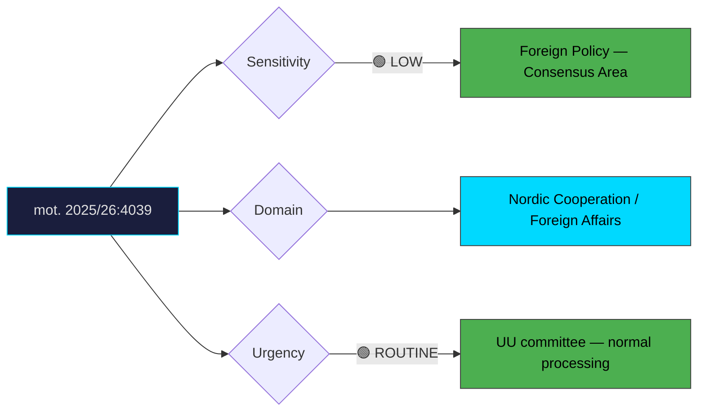

# Document Analysis: med anledning av skr. 2025/26:90 Nordiskt samarbete 2025

**Generated**: 2026-04-10 17:40 UTC
**dok_id**: HD024039
**Document Type**: motion
**Committee**: UU (Utrikesutskottet — Foreign Affairs)
**Date**: 2026-04-01
**Author**: Catarina Deremar, Ulrika Liljeberg
**Party**: C (Centerpartiet)
**Riksmöte**: 2025/26
**Significance**: 4/10 🟢
**Confidence**: HIGH (75%)

---

## Executive Summary

Centerpartiet files mot. 2025/26:4039 in response to the government's communication (skrivelse) on Nordic cooperation, calling for Sweden to drive a revision of the Helsinki Treaty to deepen Nordic integration. This is a relatively routine foreign affairs motion that aligns with long-standing C positions on Nordic cooperation and decentralisation. While the policy substance is important for Nordic relations, the domestic political significance is limited — Nordic cooperation enjoys broad cross-party consensus in Sweden. The motion serves primarily as a marker of C's continued engagement with Nordic affairs and its aspiration for Swedish leadership within the Nordic Council framework.

## Political Classification

## SWOT Analysis

### Strengths (Government Position)
| # | Statement | Evidence | Confidence | Impact |
|---|-----------|----------|------------|--------|
| 1 | Nordic cooperation enjoys broad cross-party support — low political risk | Consensus area | HIGH | Low |
| 2 | Government's skr. 2025/26:90 already demonstrates engagement with Nordic issues | Government communication | HIGH | Low |

### Weaknesses (Government Position)
| # | Statement | Evidence | Confidence | Impact |
|---|-----------|----------|------------|--------|
| 1 | Government may appear insufficiently ambitious on Nordic integration compared to C's call for treaty revision | mot. 2025/26:4039 | MEDIUM | Low |
| 2 | Helsinki Treaty has not been substantially updated — C can claim government passivity | Treaty history | MEDIUM | Low |

### Opportunities (Opposition)
| # | Statement | Evidence | Confidence | Impact |
|---|-----------|----------|------------|--------|
| 1 | C signals its commitment to Nordic identity and multilateral cooperation | mot. 2025/26:4039 | HIGH | Low |
| 2 | Nordic integration resonates with C's rural/regional base — Nordic neighbours share similar challenges | Constituency analysis | MEDIUM | Low |

### Threats (Opposition)
| # | Statement | Evidence | Confidence | Impact |
|---|-----------|----------|------------|--------|
| 1 | Helsinki Treaty revision depends on all five Nordic states — Sweden cannot drive it alone | Multilateral constraint | HIGH | Low |
| 2 | Motion may receive little media attention given low political controversy | Media interest assessment | HIGH | Low |

## Stakeholder Impact Matrix

| Stakeholder | Impact | Direction | Evidence |
|-------------|--------|-----------|----------|
| Citizens | Potential for enhanced Nordic freedom of movement and cooperation | Positive | mot. 2025/26:4039 |
| Government Coalition | Minor critique — easy to absorb or partially accommodate | Neutral | Low-stakes motion |
| Opposition Bloc | C demonstrates Nordic engagement; other parties unlikely to contest | Neutral | Consensus area |
| Business/Industry | Nordic market integration benefits trade; marginal impact from treaty revision | Mildly Positive | Economic cooperation aspect |
| Civil Society | Nordic civil society networks support deeper integration | Positive | NGO cooperation patterns |
| International/EU | Strengthened Nordic bloc could enhance collective weight in EU | Positive | Nordic-EU dynamics |

## Risk Assessment

| Risk | Likelihood (1-5) | Impact (1-5) | L×I | Mitigation |
|------|-------------------|--------------|-----|------------|
| Motion receives no committee traction | 3 | 1 | 3 | Accept as routine position-marking |
| Nordic partners uninterested in treaty revision | 3 | 2 | 6 | Frame as Swedish aspiration, not demand |
| Government co-opts Nordic integration narrative | 2 | 1 | 2 | C maintains ownership through continued advocacy |

## Forward Indicators

| Indicator | Trigger | Timeline | Probability |
|-----------|---------|----------|-------------|
| UU committee response to skr. 2025/26:90 | Committee deliberation | 4–8 weeks | HIGH |
| Nordic Council session discussions on Helsinki Treaty | Nordic Council calendar | 3–6 months | LOW |
| Government statements on Nordic integration ambitions | Foreign Minister communications | 1–3 months | MEDIUM |

## Cross-Document References

- **HD024037**: C's Ådahl files on copyright policy (prop. 184) — C maintains active multi-committee presence this session, filing on industry, social, and foreign affairs.

## Election 2026 Implications

- **Electoral Impact**: Minimal—Nordic cooperation is a consensus area with no significant electoral cleavage. **HIGH CONFIDENCE**
- **Coalition Scenarios**: No impact on coalition dynamics — all parties broadly support Nordic cooperation. **HIGH CONFIDENCE**
- **Voter Salience**: Very low—Nordic affairs rarely feature in domestic electoral campaigns. **HIGH CONFIDENCE**
- **Campaign Vulnerability**: None — this is a politically safe, uncontroversial motion that serves C's brand positioning rather than attack strategy. **HIGH CONFIDENCE**
