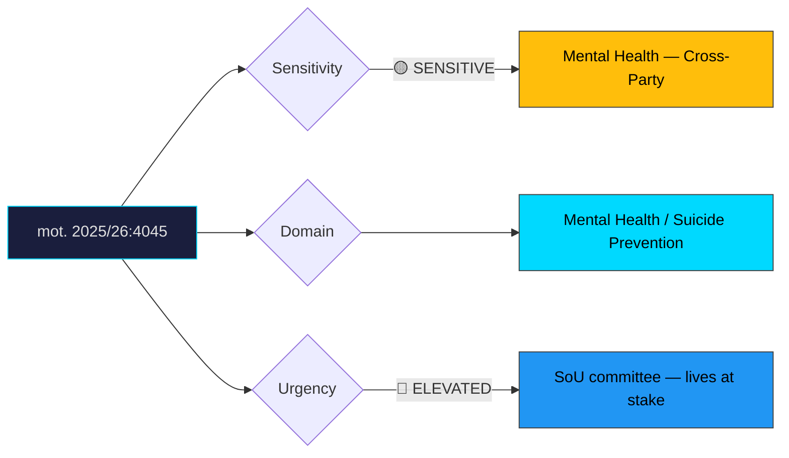

# Document Analysis: med anledning av prop. 2025/26:190 En nationell utredningsfunktion för att förebygga suicid

**Generated**: 2026-04-10 17:40 UTC
**dok_id**: HD024045
**Document Type**: motion
**Committee**: SoU (Socialutskottet — Social Affairs)
**Date**: 2026-04-01
**Author**: Christofer Bergenblock m.fl.
**Party**: C (Centerpartiet)
**Riksmöte**: 2025/26
**Significance**: 6/10 🟡
**Confidence**: HIGH (75%)

---

## Executive Summary

Centerpartiet files mot. 2025/26:4045 arguing that proposition 190's national suicide investigation function should be expanded to cover outpatient care settings, not just inpatient cases. C contends the government's proposal is too narrow — many suicides occur among patients in outpatient psychiatric care, and excluding these cases would create a significant blind spot in prevention efforts. This is a politically sensitive motion because suicide prevention enjoys cross-party support, making it difficult for the government to oppose the expansion without appearing to resist a stronger safety net. C's Bergenblock continues his active SoU engagement (also filing HD024032 on welfare), establishing C as a serious social policy actor.

## Political Classification

## SWOT Analysis

### Strengths (Government Position)
| # | Statement | Evidence | Confidence | Impact |
|---|-----------|----------|------------|--------|
| 1 | Prop. 190 establishes the national investigation function — government delivers on mental health commitment | prop. 2025/26:190 | HIGH | High |
| 2 | Phased approach (starting with inpatient) is defensible as practical first step | Implementation logic | MEDIUM | Medium |

### Weaknesses (Government Position)
| # | Statement | Evidence | Confidence | Impact |
|---|-----------|----------|------------|--------|
| 1 | Excluding outpatient care creates a visible gap in suicide prevention coverage | mot. 2025/26:4045 | HIGH | High |
| 2 | Opposing expanded scope appears to resist saving lives — politically untenable | Rhetorical positioning | HIGH | High |
| 3 | Many suicides occur in outpatient settings — empirical evidence supports C's expansion | Psychiatric care data | MEDIUM | High |

### Opportunities (Opposition)
| # | Statement | Evidence | Confidence | Impact |
|---|-----------|----------|------------|--------|
| 1 | C claims higher moral ground — "we want to go further to save lives" | mot. 2025/26:4045 | HIGH | High |
| 2 | Mental health advocacy organisations likely support broader scope | Stakeholder alignment | HIGH | Medium |
| 3 | Cross-party support possible — suicide prevention is consensus territory | Parliamentary culture on mental health | MEDIUM | Medium |

### Threats (Opposition)
| # | Statement | Evidence | Confidence | Impact |
|---|-----------|----------|------------|--------|
| 1 | Government accepts expansion, neutralising C's differentiation | Amendment incorporation | HIGH | Medium |
| 2 | Implementation complexity of outpatient coverage could be used to justify delay | Practical constraints | MEDIUM | Low |

## Stakeholder Impact Matrix

| Stakeholder | Impact | Direction | Evidence |
|-------------|--------|-----------|----------|
| Citizens | Expanded investigation scope could prevent suicides in outpatient care | Positive | mot. 2025/26:4045 |
| Government Coalition | Pressure to expand scope — politically difficult to resist on this topic | Mixed | Moral pressure dynamics |
| Opposition Bloc | C demonstrates compassionate social policy leadership | Positive | mot. 2025/26:4045 |
| Business/Industry | Limited direct impact; employer mental health programmes may benefit indirectly | Neutral | Indirect effects |
| Civil Society | Mental health organisations (MIND, Suicide Zero) strongly likely to support | Positive (for C) | Advocacy group alignment |
| International/EU | WHO suicide prevention guidelines support comprehensive investigation scope | Positive (for C) | International best practice |

## Risk Assessment

| Risk | Likelihood (1-5) | Impact (1-5) | L×I | Mitigation |
|------|-------------------|--------------|-----|------------|
| Outpatient suicides continue uninvestigated under narrow scope | 4 | 5 | 20 | Expand mandatory investigation to outpatient settings |
| Government appears to resist life-saving measure | 3 | 4 | 12 | Accept amendment proactively |
| Resource constraints delay implementation of expanded scope | 3 | 3 | 9 | Phased expansion with dedicated funding |

## Forward Indicators

| Indicator | Trigger | Timeline | Probability |
|-----------|---------|----------|-------------|
| SoU committee deliberation on prop. 190 | Committee scheduling | 2–6 weeks | HIGH |
| Mental health organisation advocacy for broader scope | MIND/Suicide Zero statements | 1–3 weeks | HIGH |
| Government openness to expansion amendment | Committee negotiation signals | 2–6 weeks | MEDIUM |
| Cross-party support declarations (S, V, MP on expansion) | Party positions | 1–4 weeks | MEDIUM |

## Cross-Document References

- **HD024032**: C's Bergenblock also files on welfare activity requirements (prop. 207), demonstrating his active role as C's lead social policy voice in SoU committee. C's social policy engagement pattern is consistent and substantive.

## Election 2026 Implications

- **Electoral Impact**: Moderate—mental health is increasingly salient among younger voters and urban professionals. C's position strengthens its social policy credentials. **MEDIUM CONFIDENCE**
- **Coalition Scenarios**: Suicide prevention is a consensus area — this motion does not significantly affect coalition dynamics but demonstrates C's constructive approach. **HIGH CONFIDENCE**
- **Voter Salience**: Growing—mental health awareness has increased substantially, particularly post-pandemic. Youth suicide prevention has high emotional resonance. **MEDIUM CONFIDENCE**
- **Campaign Vulnerability**: Government risks "they wouldn't even investigate all suicides" attack if it resists expansion — a headline no party wants to face. **HIGH CONFIDENCE**
