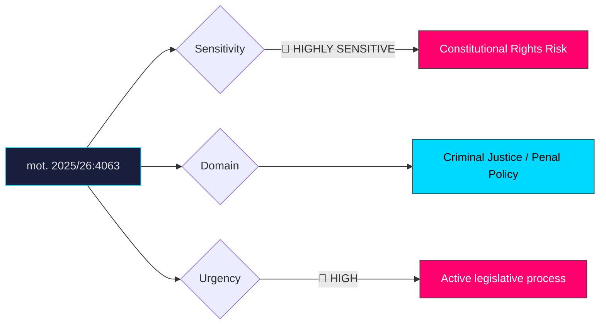

# Document Analysis: med anledning av prop. 2025/26:185 Tillfällig verkställighet av svenska fängelsestraff utomlands

**Generated**: 2026-04-10 17:42 UTC
**dok_id**: HD024063
**Document Type**: motion
**Committee**: JuU
**Date**: 2026-04-01
**Author**: Ulrika Westerlund m.fl. (MP)
**Party**: MP
**Riksmöte**: 2025/26
**Significance**: 🔴 High (8/10)
**Confidence**: HIGH (75%)

---

## Executive Summary

Miljöpartiet delivers a total rejection of proposition 2025/26:185, which would allow Swedish prison sentences to be executed in foreign facilities. This is one of the most constitutionally sensitive justice motions of the riksmöte, striking at the heart of Sweden's rehabilitative penal philosophy. MP frames the proposal as a fundamental departure from Swedish legal tradition, arguing it violates prisoners' rights under both domestic law and ECHR obligations. The motion signals that any parliamentary debate will centre on constitutional rights, with MP positioning itself as the defender of Sweden's humanitarian justice model against the government's capacity-driven pragmatism. This is a high-visibility wedge issue likely to generate significant media coverage and cross-party tensions.

## Political Classification

## SWOT Analysis

### Strengths (Government Position)
| # | Statement | Evidence | Confidence | Impact |
|---|-----------|----------|------------|--------|
| 1 | Addresses acute prison capacity crisis with pragmatic solution | prop. 2025/26:185 | HIGH | H |
| 2 | Demonstrates government willingness to take decisive action on overcrowding | prop. 2025/26:185 | HIGH | M |
| 3 | Potential support from SD who favour tougher incarceration policies | Parliamentary alignment patterns | MEDIUM | H |

### Weaknesses (Government Position)
| # | Statement | Evidence | Confidence | Impact |
|---|-----------|----------|------------|--------|
| 1 | Constitutional vulnerability — ECHR and Chapter 2 RF rights exposure | mot. 2025/26:4063 | HIGH | H |
| 2 | Undermines Sweden's international reputation for humane penal policy | mot. 2025/26:4063 | HIGH | H |
| 3 | Lack of oversight mechanisms for foreign prison conditions | mot. 2025/26:4063 | MEDIUM | H |
| 4 | Temporary measures in justice policy tend to become permanent | Historical precedent | MEDIUM | M |

### Opportunities (Opposition)
| # | Statement | Evidence | Confidence | Impact |
|---|-----------|----------|------------|--------|
| 1 | MP can rally civil liberties and human rights organisations behind rejection | mot. 2025/26:4063 | HIGH | H |
| 2 | Issue creates potential S+V+MP+C alignment on constitutional grounds | Cross-party rights concerns | MEDIUM | H |
| 3 | Media-friendly constitutional debate strengthens MP visibility before 2026 election | mot. 2025/26:4063 | HIGH | M |

### Threats (Opposition)
| # | Statement | Evidence | Confidence | Impact |
|---|-----------|----------|------------|--------|
| 1 | Public opinion may favour tough-on-crime pragmatism over rights arguments | Polling trends | MEDIUM | H |
| 2 | Rejection without alternative risks appearing soft on prison overcrowding | mot. 2025/26:4063 | HIGH | M |
| 3 | Government may frame opposition as obstructing public safety | Political communication patterns | MEDIUM | M |

## Stakeholder Impact Matrix

| Stakeholder | Impact | Direction | Evidence |
|-------------|--------|-----------|----------|
| Citizens | Prison capacity relief vs. rights erosion precedent | Mixed | mot. 2025/26:4063 |
| Government Coalition | Legislative delivery on capacity but constitutional exposure | Mixed | prop. 2025/26:185 |
| Opposition Bloc | Strong civil liberties rallying point | + | mot. 2025/26:4063 |
| Business/Industry | Minimal direct impact | Neutral | — |
| Civil Society | Major concern for human rights orgs, prisoner advocacy groups | − | mot. 2025/26:4063 |
| International/EU | ECHR scrutiny risk, Council of Europe attention | − | mot. 2025/26:4063 |

## Risk Assessment

| Risk | Likelihood (1-5) | Impact (1-5) | L×I | Mitigation |
|------|-------------------|--------------|-----|------------|
| ECHR challenge if enacted | 4 | 5 | 20 | Robust bilateral agreements with receiving states |
| Incident at foreign facility involving Swedish prisoner | 3 | 5 | 15 | Monitoring regime and rapid repatriation clause |
| Constitutional Council (Lagrådet) concerns | 4 | 4 | 16 | Address Lagrådet recommendations before vote |
| Electoral backlash from rights-conscious voters | 3 | 3 | 9 | Frame as temporary and necessity-driven |

## Forward Indicators

| Indicator | Trigger | Timeline | Probability |
|-----------|---------|----------|-------------|
| JuU committee hearing schedule | Committee agenda publication | April–May 2026 | HIGH |
| Lagrådet opinion on constitutional issues | Formal referral | April 2026 | HIGH |
| Cross-party opposition coordination | S/V statements on prop. 185 | April 2026 | MEDIUM |
| Civil society campaign mobilisation | NGO public statements | Ongoing | HIGH |
| ECHR/Council of Europe commentary | International media coverage | Q2 2026 | MEDIUM |

## Cross-Document References

- **prop. 2025/26:185**: The government proposition this motion seeks to reject entirely
- **HD024073**: V motion on young offender investigation (JuU cluster — broader justice policy pattern)

## Election 2026 Implications

- **Electoral Impact**: High — prison policy abroad is a visceral, easily communicated issue that activates both law-and-order and civil liberties voter segments **HIGH**
- **Coalition Scenarios**: Strengthens potential S+MP+V+C civil liberties coalition narrative; tests whether L will side with constitutional concerns or government pragmatism **MEDIUM**
- **Voter Salience**: Constitutional rights framing could elevate salience beyond typical justice policy; media amplification likely **HIGH**
- **Campaign Vulnerability**: Government vulnerable if foreign prison incident occurs; opposition vulnerable to "soft on crime" framing **HIGH**
