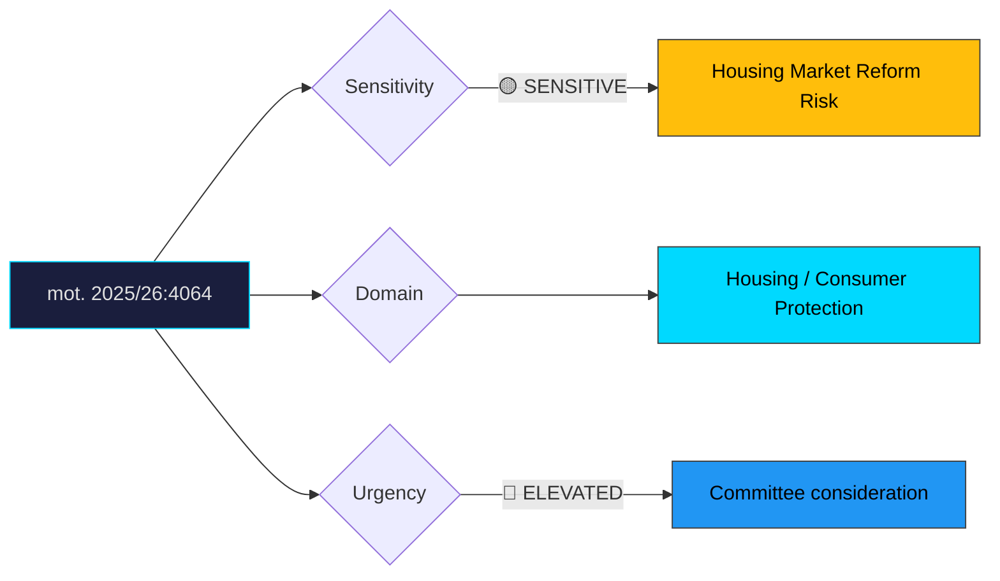

# Document Analysis: med anledning av prop. 2025/26:188 Lag om hyrköp av bostad

**Generated**: 2026-04-10 17:42 UTC
**dok_id**: HD024064
**Document Type**: motion
**Committee**: CU
**Date**: 2026-04-01
**Author**: Amanda Palmstierna m.fl. (MP)
**Party**: MP
**Riksmöte**: 2025/26
**Significance**: 🟠 Elevated (7/10)
**Confidence**: HIGH (75%)

---

## Executive Summary

Miljöpartiet demands stronger consumer protection provisions in the government's hire-purchase housing legislation (prop. 2025/26:188). This motion is strategically significant because it establishes a cross-party S+MP alignment on housing consumer protection — Socialdemokraterna filed a parallel motion (HD024012) also opposing the proposition's consumer safeguards as insufficient. The emerging pattern signals that the government's housing market deregulation agenda faces coordinated centre-left resistance. MP's motion specifically targets inadequate buyer protections in hire-purchase contracts, arguing the proposal disproportionately benefits property developers at the expense of first-time homebuyers and vulnerable households. This S+MP convergence on housing policy is an early indicator of potential red-green electoral cooperation framing for 2026.

## Political Classification

## SWOT Analysis

### Strengths (Government Position)
| # | Statement | Evidence | Confidence | Impact |
|---|-----------|----------|------------|--------|
| 1 | Hire-purchase model creates new homeownership pathway for young and lower-income buyers | prop. 2025/26:188 | HIGH | H |
| 2 | Supported by construction industry and developer interests | Industry alignment | MEDIUM | M |
| 3 | Parliamentary majority likely with M+KD+L+SD support | Coalition arithmetic | MEDIUM | H |

### Weaknesses (Government Position)
| # | Statement | Evidence | Confidence | Impact |
|---|-----------|----------|------------|--------|
| 1 | Cross-party opposition (S+MP) signals consumer protection narrative vulnerability | mot. 2025/26:4064, HD024012 | HIGH | H |
| 2 | Hire-purchase models internationally have mixed consumer outcomes | Comparative policy evidence | MEDIUM | M |
| 3 | Risk of predatory contract terms without stronger regulation | mot. 2025/26:4064 | HIGH | M |

### Opportunities (Opposition)
| # | Statement | Evidence | Confidence | Impact |
|---|-----------|----------|------------|--------|
| 1 | S+MP alignment creates unified housing consumer protection platform for 2026 | mot. 2025/26:4064, HD024012 | HIGH | H |
| 2 | Consumer protection framing resonates with swing voters concerned about housing costs | mot. 2025/26:4064 | HIGH | H |
| 3 | Can position government as serving developer interests over ordinary homebuyers | mot. 2025/26:4064 | MEDIUM | M |

### Threats (Opposition)
| # | Statement | Evidence | Confidence | Impact |
|---|-----------|----------|------------|--------|
| 1 | Blocking new homeownership pathways risks appearing anti-housing supply | Counter-narrative risk | MEDIUM | M |
| 2 | Government may amend to address worst consumer protection gaps, neutralising critique | Legislative tactics | MEDIUM | M |

## Stakeholder Impact Matrix

| Stakeholder | Impact | Direction | Evidence |
|-------------|--------|-----------|----------|
| Citizens | First-time buyers gain pathway but face contract risk | Mixed | mot. 2025/26:4064 |
| Government Coalition | Legislative delivery but consumer protection flank | Mixed | prop. 2025/26:188 |
| Opposition Bloc | S+MP convergence strengthens housing policy cooperation | + | mot. 2025/26:4064, HD024012 |
| Business/Industry | Developers and construction firms benefit from new demand model | + | prop. 2025/26:188 |
| Civil Society | Consumer organisations likely to support stronger protections | + for opposition | mot. 2025/26:4064 |
| International/EU | Limited direct impact; aligns with EU consumer protection trends | Neutral | — |

## Risk Assessment

| Risk | Likelihood (1-5) | Impact (1-5) | L×I | Mitigation |
|------|-------------------|--------------|-----|------------|
| Consumer harm from inadequate contract protections | 3 | 4 | 12 | Strengthen disclosure requirements |
| S+MP unified housing platform gaining electoral traction | 4 | 3 | 12 | Government amendments addressing key gaps |
| Media exposés of predatory hire-purchase practices | 2 | 4 | 8 | Industry self-regulation and FI oversight |
| Housing market distortion from new instrument | 2 | 3 | 6 | Pilot programme with evaluation clause |

## Forward Indicators

| Indicator | Trigger | Timeline | Probability |
|-----------|---------|----------|-------------|
| CU committee vote alignment | S+MP joint reservation | May 2026 | HIGH |
| Consumer ombudsman (KO) statement on prop. 188 | Public consultation response | April–May 2026 | MEDIUM |
| S housing policy platform alignment with MP | Party congress or statement | Spring 2026 | MEDIUM |
| Industry lobbying intensity | Developer association campaigns | Ongoing | HIGH |

## Cross-Document References

- **HD024012**: S motion on same prop. 2025/26:188 — parallel consumer protection critique establishing S+MP alignment
- **HD024067**: MP motion on municipal rental guarantees (CU cluster — broader housing policy pattern)

## Election 2026 Implications

- **Electoral Impact**: Moderate-high — housing affordability is a top voter concern and S+MP alignment creates a clear alternative narrative **HIGH**
- **Coalition Scenarios**: S+MP housing policy convergence is a building block for red-green cooperation signalling; watch for V joining the cluster **MEDIUM**
- **Voter Salience**: Housing costs and first-time buyer access consistently rank among top-3 voter concerns **HIGH**
- **Campaign Vulnerability**: Government vulnerable to "siding with developers" framing; opposition vulnerable to "blocking housing solutions" counter **MEDIUM**
