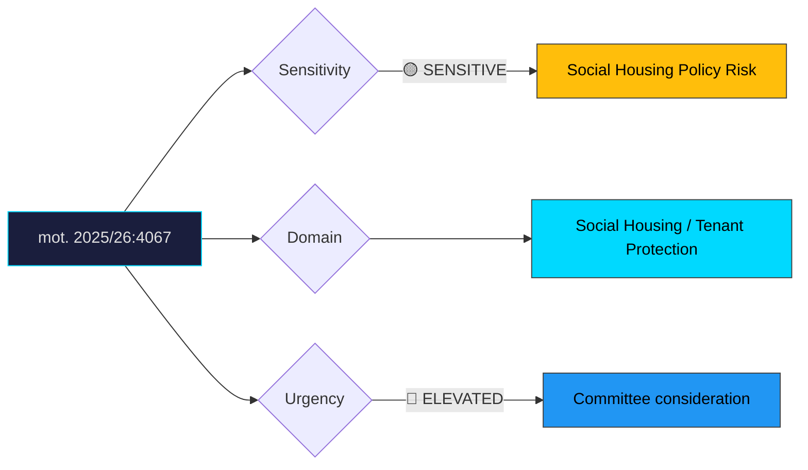

# Document Analysis: med anledning av prop. 2025/26:212 Kommunala hyresgarantier för en socialt hållbar bostadsförsörjning

**Generated**: 2026-04-10 17:42 UTC
**dok_id**: HD024067
**Document Type**: motion
**Committee**: CU
**Date**: 2026-04-07
**Author**: Amanda Palmstierna m.fl. (MP)
**Party**: MP
**Riksmöte**: 2025/26
**Significance**: 🟡 Moderate (6/10)
**Confidence**: HIGH (75%)

---

## Executive Summary

Miljöpartiet pushes for stronger regulation of landlord requirements when tenants hold municipal rental guarantees under prop. 2025/26:212. The motion exposes a critical gap in the government's social housing legislation: while the proposition creates a framework for municipal guarantees, it fails to prevent landlords from imposing additional screening criteria that effectively exclude the most vulnerable tenants the system is designed to help. MP's focus on regulating permissible landlord requirements is tactically precise — it targets the practical bottleneck where good-intentioned policy meets discriminatory housing market practices. This motion fits into MP's broader CU committee housing cluster alongside HD024064, building a coherent tenant-protection portfolio.

## Political Classification

## SWOT Analysis

### Strengths (Government Position)
| # | Statement | Evidence | Confidence | Impact |
|---|-----------|----------|------------|--------|
| 1 | Prop. 212 establishes municipal rental guarantee framework — positive structural reform | prop. 2025/26:212 | HIGH | H |
| 2 | Balances municipal autonomy with housing access goals | prop. 2025/26:212 | MEDIUM | M |
| 3 | Avoids over-regulation that could deter landlord participation | Legislative design choice | MEDIUM | M |

### Weaknesses (Government Position)
| # | Statement | Evidence | Confidence | Impact |
|---|-----------|----------|------------|--------|
| 1 | Failure to regulate landlord screening criteria undermines the guarantee's purpose | mot. 2025/26:4067 | HIGH | H |
| 2 | Vulnerable tenants remain excluded despite guarantee — policy-implementation gap | mot. 2025/26:4067 | HIGH | H |
| 3 | Risks creating a two-tier system where guarantees are honoured only for "acceptable" tenants | mot. 2025/26:4067 | MEDIUM | M |

### Opportunities (Opposition)
| # | Statement | Evidence | Confidence | Impact |
|---|-----------|----------|------------|--------|
| 1 | MP positions as champion of the most marginalised housing seekers | mot. 2025/26:4067 | HIGH | M |
| 2 | Clear narrative: government creates facade of social housing without real access | mot. 2025/26:4067 | HIGH | M |
| 3 | Potential alignment with S and V on strengthening tenant protections | Cross-party pattern | MEDIUM | M |

### Threats (Opposition)
| # | Statement | Evidence | Confidence | Impact |
|---|-----------|----------|------------|--------|
| 1 | Over-regulation of landlord criteria could reduce willingness to accept guarantee tenants | Counter-argument risk | MEDIUM | M |
| 2 | Municipal implementation variability may complicate unified national standards | Governance complexity | MEDIUM | L |

## Stakeholder Impact Matrix

| Stakeholder | Impact | Direction | Evidence |
|-------------|--------|-----------|----------|
| Citizens | Vulnerable tenants gain guarantee framework but may still face exclusion | Mixed | mot. 2025/26:4067 |
| Government Coalition | Social housing initiative delivered but with implementation gaps | Mixed | prop. 2025/26:212 |
| Opposition Bloc | Coherent tenant-protection narrative across CU motions | + | mot. 2025/26:4067 |
| Business/Industry | Landlords retain screening flexibility under government proposal | + for government | prop. 2025/26:212 |
| Civil Society | Housing rights organisations likely support MP's strengthening demands | + for opposition | mot. 2025/26:4067 |
| International/EU | Aligns with EU social pillar housing adequacy principles | Neutral/+ | — |

## Risk Assessment

| Risk | Likelihood (1-5) | Impact (1-5) | L×I | Mitigation |
|------|-------------------|--------------|-----|------------|
| Guarantees become ineffective due to landlord screening | 4 | 4 | 16 | Regulate permissible requirements as MP proposes |
| Municipal implementation inconsistency | 3 | 3 | 9 | National guidelines and oversight framework |
| Landlord withdrawal from guarantee programme | 2 | 4 | 8 | Incentive structures for participating landlords |
| Housing segregation perpetuation despite new law | 3 | 3 | 9 | Anti-discrimination enforcement strengthening |

## Forward Indicators

| Indicator | Trigger | Timeline | Probability |
|-----------|---------|----------|-------------|
| CU committee position on landlord regulation | Committee report | May–June 2026 | HIGH |
| Municipal pilot programme announcements | Kommun decisions | H2 2026 | MEDIUM |
| Discrimination ombudsman (DO) guidance | Policy implementation phase | Post-enactment | MEDIUM |
| Housing rights NGO campaign on guarantee effectiveness | Public advocacy | Spring 2026 | HIGH |

## Cross-Document References

- **HD024064**: MP motion on hire-purchase housing (CU cluster — MP's coherent housing policy portfolio)
- **HD024012**: S motion on prop. 188 housing consumer protection — broader centre-left housing alignment
- **prop. 2025/26:212**: The government proposition this motion seeks to strengthen

## Election 2026 Implications

- **Electoral Impact**: Moderate — social housing resonates with MP's core voters and urban renters but lower general salience than homeownership issues **MEDIUM**
- **Coalition Scenarios**: Reinforces MP's value proposition in a red-green coalition as the social housing specialist **MEDIUM**
- **Voter Salience**: Housing access for vulnerable groups is a concern primarily for urban progressive voters — MP's target demographic **MEDIUM**
- **Campaign Vulnerability**: Government vulnerable to "empty promise" framing if guarantees prove ineffective; MP risks niche positioning **LOW**
