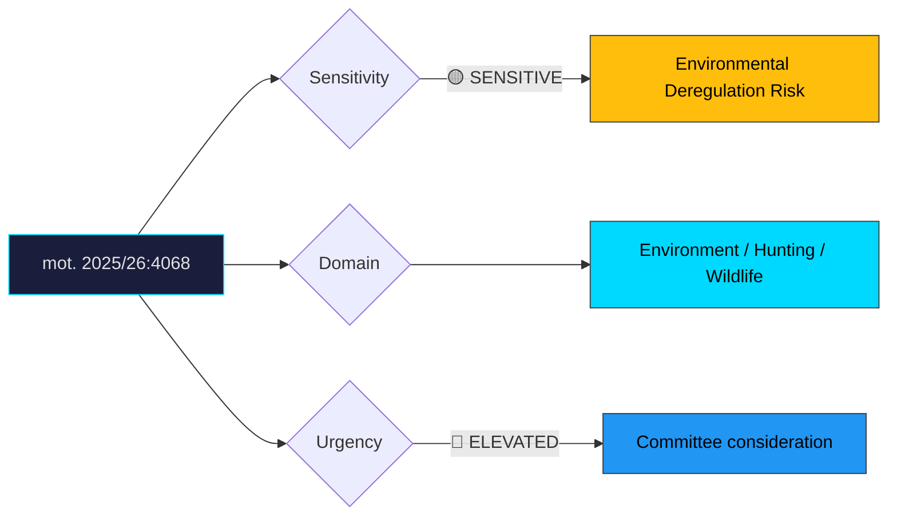

# Document Analysis: med anledning av prop. 2025/26:211 Förenklingar i jaktlagstiftningen

**Generated**: 2026-04-10 17:42 UTC
**dok_id**: HD024068
**Document Type**: motion
**Committee**: MJU
**Date**: 2026-04-07
**Author**: Emma Nohrén m.fl. (MP)
**Party**: MP
**Riksmöte**: 2025/26
**Significance**: 🟡 Moderate (6/10)
**Confidence**: HIGH (75%)

---

## Executive Summary

Miljöpartiet rejects specific elements of the government's hunting deregulation proposition, targeting simplified hunting on public waters and expanded seal hunting. MP demands that proper environmental impact assessments precede any loosening of hunting regulations, positioning the party as the procedural and ecological guardian against what it frames as reckless deregulation. This motion crystallises the urban-rural political divide: the government's hunting simplifications serve rural constituencies and hunting organisations (core SD+C voter segments), while MP defends environmental oversight valued by urban progressive voters. The demand for environmental impact assessments is tactically strong — it's procedurally defensible and difficult for the government to oppose without appearing to bypass scientific evidence.

## Political Classification

## SWOT Analysis

### Strengths (Government Position)
| # | Statement | Evidence | Confidence | Impact |
|---|-----------|----------|------------|--------|
| 1 | Hunting simplifications broadly popular in rural Sweden and with sporting organisations | prop. 2025/26:211 | HIGH | H |
| 2 | Seal population management addresses real fisheries damage concerns | Ecological data | HIGH | M |
| 3 | Strong SD+C support for rural deregulation agenda | Parliamentary alignment | HIGH | H |

### Weaknesses (Government Position)
| # | Statement | Evidence | Confidence | Impact |
|---|-----------|----------|------------|--------|
| 1 | Lack of environmental impact assessments creates legal vulnerability | mot. 2025/26:4068 | HIGH | H |
| 2 | Seal hunting expansion may conflict with EU Habitats Directive obligations | EU regulatory framework | MEDIUM | H |
| 3 | Deregulation without scientific basis undermines evidence-based policy credibility | mot. 2025/26:4068 | HIGH | M |

### Opportunities (Opposition)
| # | Statement | Evidence | Confidence | Impact |
|---|-----------|----------|------------|--------|
| 1 | MP reinforces core environmental guardian identity with urban progressive voters | mot. 2025/26:4068 | HIGH | H |
| 2 | Environmental impact assessment demand is procedurally unassailable | mot. 2025/26:4068 | HIGH | M |
| 3 | Potential EU Commission scrutiny could validate MP's concerns | EU legal framework | MEDIUM | M |

### Threats (Opposition)
| # | Statement | Evidence | Confidence | Impact |
|---|-----------|----------|------------|--------|
| 1 | Perceived as anti-rural and anti-hunting by rural voters | Political perception risk | HIGH | M |
| 2 | C party likely to criticise MP as obstructing necessary wildlife management | Cross-party dynamics | MEDIUM | M |
| 3 | Low general public salience may limit electoral payoff | Issue salience data | MEDIUM | L |

## Stakeholder Impact Matrix

| Stakeholder | Impact | Direction | Evidence |
|-------------|--------|-----------|----------|
| Citizens | Rural communities benefit from simplified hunting; coastal communities split on seal hunting | Mixed | mot. 2025/26:4068 |
| Government Coalition | Delivers on rural deregulation promise but environmental risk | + | prop. 2025/26:211 |
| Opposition Bloc | MP defends environmental oversight; S likely neutral | Mixed | mot. 2025/26:4068 |
| Business/Industry | Fishing industry supports seal management; tourism may be affected | Mixed | prop. 2025/26:211 |
| Civil Society | Environmental NGOs oppose; hunting organisations support | Split | mot. 2025/26:4068 |
| International/EU | EU Habitats Directive compliance risk | − | EU legal framework |

## Risk Assessment

| Risk | Likelihood (1-5) | Impact (1-5) | L×I | Mitigation |
|------|-------------------|--------------|-----|------------|
| EU infringement proceedings on seal hunting expansion | 2 | 5 | 10 | Commission consultation before implementation |
| Biodiversity loss from inadequate impact assessment | 3 | 4 | 12 | Conduct assessments as MP demands |
| Rural-urban political polarisation deepening | 4 | 3 | 12 | Frame as evidence-based, not anti-hunting |
| Wildlife management failure on public waters | 2 | 3 | 6 | Monitoring and adaptive management clauses |

## Forward Indicators

| Indicator | Trigger | Timeline | Probability |
|-----------|---------|----------|-------------|
| MJU committee hearing on environmental impact | Committee agenda | May 2026 | HIGH |
| Naturvårdsverket (EPA) position statement | Agency consultation | April–May 2026 | HIGH |
| EU Commission inquiry on seal hunting compliance | Formal query | Q2–Q3 2026 | LOW |
| Hunting organisation lobbying campaign | Public advocacy | Ongoing | HIGH |
| Environmental NGO coalition response | Joint statement | April 2026 | HIGH |

## Cross-Document References

- **HD024069**: MP motion on food emergency preparedness (MJU cluster — MP's environment committee portfolio)
- **prop. 2025/26:211**: The government proposition this motion partially rejects

## Election 2026 Implications

- **Electoral Impact**: Moderate — reinforces MP brand with core voters but limited swing-voter reach **MEDIUM**
- **Coalition Scenarios**: Clear green profile issue that distinguishes MP from S in potential coalition; non-threatening to red-green cooperation **LOW**
- **Voter Salience**: Hunting policy is niche but emotionally charged in affected rural and coastal communities **LOW**
- **Campaign Vulnerability**: MP vulnerable to "city elites vs. rural Sweden" framing; government vulnerable if EU compliance issues emerge **MEDIUM**
