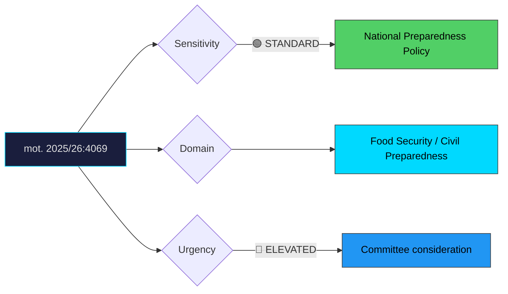

# Document Analysis: med anledning av prop. 2025/26:205 Beredskapslager i livsmedelskedjan

**Generated**: 2026-04-10 17:42 UTC
**dok_id**: HD024069
**Document Type**: motion
**Committee**: MJU
**Date**: 2026-04-07
**Author**: Emma Nohrén m.fl. (MP)
**Party**: MP
**Riksmöte**: 2025/26
**Significance**: 🟡 Moderate (6/10)
**Confidence**: HIGH (75%)

---

## Executive Summary

Miljöpartiet broadly supports the direction of proposition 2025/26:205 on food chain emergency stockpiling but demands complementary measures for a more comprehensive national preparedness framework. Unlike MP's outright rejections in justice and hunting policy, this motion takes a constructive-critical stance — endorsing the government's initiative while arguing it is insufficient on its own. MP positions itself as serious on national security preparedness, neutralising potential "soft on defence" attacks while demanding the holistic approach that distinguishes green policy. The motion is strategically important because it demonstrates MP's ability to engage with the post-2022 security paradigm shift while maintaining its distinctive policy voice. Food security preparedness enjoys broad cross-party support, making this a low-risk, high-credibility positioning play.

## Political Classification

## SWOT Analysis

### Strengths (Government Position)
| # | Statement | Evidence | Confidence | Impact |
|---|-----------|----------|------------|--------|
| 1 | Food chain stockpiling addresses genuine national security gap post-Ukraine | prop. 2025/26:205 | HIGH | H |
| 2 | Broad cross-party consensus on need for improved preparedness | Parliamentary mood | HIGH | H |
| 3 | Delivers on total defence (totalförsvar) modernisation commitments | Government programme | HIGH | M |

### Weaknesses (Government Position)
| # | Statement | Evidence | Confidence | Impact |
|---|-----------|----------|------------|--------|
| 1 | Narrow focus on food chain stockpiling without broader preparedness integration | mot. 2025/26:4069 | HIGH | M |
| 2 | May create false sense of security if complementary measures are neglected | mot. 2025/26:4069 | MEDIUM | M |
| 3 | Implementation challenges in dispersed food supply chain | Logistics complexity | MEDIUM | M |

### Opportunities (Opposition)
| # | Statement | Evidence | Confidence | Impact |
|---|-----------|----------|------------|--------|
| 1 | MP demonstrates national security credibility with constructive engagement | mot. 2025/26:4069 | HIGH | H |
| 2 | "More comprehensive" framing is electorally safe and substantively strong | mot. 2025/26:4069 | HIGH | M |
| 3 | Links food security to climate adaptation — MP's core competence | Green policy integration | MEDIUM | M |

### Threats (Opposition)
| # | Statement | Evidence | Confidence | Impact |
|---|-----------|----------|------------|--------|
| 1 | Constructive stance may be overshadowed by MP's more confrontational motions elsewhere | Portfolio dilution risk | MEDIUM | L |
| 2 | Government may adopt MP's complementary measures, removing the differentiation | Legislative absorption | LOW | M |

## Stakeholder Impact Matrix

| Stakeholder | Impact | Direction | Evidence |
|-------------|--------|-----------|----------|
| Citizens | Improved food security in crisis scenarios | + | prop. 2025/26:205, mot. 2025/26:4069 |
| Government Coalition | Cross-party support for core initiative | + | prop. 2025/26:205 |
| Opposition Bloc | Constructive engagement opportunity | + | mot. 2025/26:4069 |
| Business/Industry | Food industry faces new stockpiling obligations and opportunities | Mixed | prop. 2025/26:205 |
| Civil Society | Preparedness organisations support strengthened framework | + | mot. 2025/26:4069 |
| International/EU | Aligns with EU strategic autonomy and preparedness agenda | + | EU policy alignment |

## Risk Assessment

| Risk | Likelihood (1-5) | Impact (1-5) | L×I | Mitigation |
|------|-------------------|--------------|-----|------------|
| Stockpiling without complementary measures creates preparedness gaps | 3 | 4 | 12 | Adopt MP's comprehensive framework demand |
| Supply chain disruption during stockpile build-up phase | 2 | 3 | 6 | Phased implementation with market monitoring |
| Cost overruns in food chain stockpiling programme | 3 | 3 | 9 | Clear budget framework and evaluation clauses |
| Climate-driven food supply disruption outpacing stockpile capacity | 3 | 4 | 12 | Integrate climate adaptation as MP suggests |

## Forward Indicators

| Indicator | Trigger | Timeline | Probability |
|-----------|---------|----------|-------------|
| MJU committee report on prop. 205 | Committee deliberation | May–June 2026 | HIGH |
| MSB (Civil Contingencies Agency) implementation guidance | Agency action | Post-enactment | HIGH |
| Cross-party tillkännagivande on comprehensive preparedness | Committee vote | June 2026 | MEDIUM |
| Food industry response to stockpiling obligations | Industry statements | Q2 2026 | HIGH |

## Cross-Document References

- **HD024068**: MP motion on hunting regulation (MJU cluster — MP's environment committee portfolio)
- **prop. 2025/26:205**: The government proposition this motion seeks to complement and strengthen

## Election 2026 Implications

- **Electoral Impact**: Low-moderate — preparedness is broadly supported; MP gains credibility without electoral risk **MEDIUM**
- **Coalition Scenarios**: Demonstrates MP's constructive governance capacity — valuable coalition credential **MEDIUM**
- **Voter Salience**: Food security has risen in voter consciousness since 2022 but remains secondary to defence and economy **LOW**
- **Campaign Vulnerability**: Minimal — constructive stance on popular policy area offers low attack surface **LOW**
