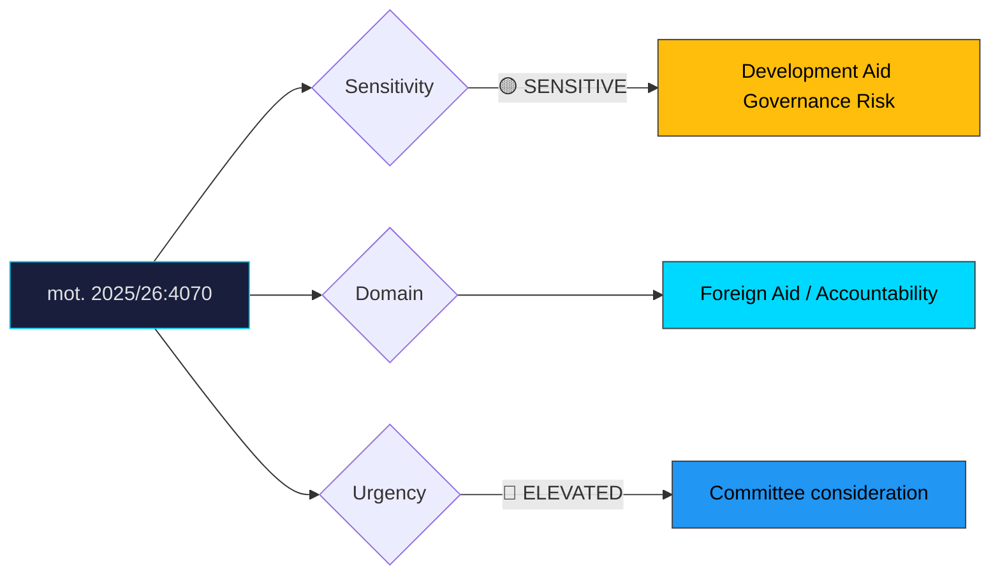

# Document Analysis: med anledning av skr. 2025/26:226 Riksrevisionens rapport om Sidas arbete med det humanitära biståndet

**Generated**: 2026-04-10 17:42 UTC
**dok_id**: HD024070
**Document Type**: motion
**Committee**: UU
**Date**: 2026-04-08
**Author**: Anna Lasses and Kerstin Lundgren (C)
**Party**: C
**Riksmöte**: 2025/26
**Significance**: 🟠 Elevated (7/10)
**Confidence**: HIGH (75%)

---

## Executive Summary

Centerpartiet demands government action on deficiencies in Sida's humanitarian aid work identified by Riksrevisionen (Swedish National Audit Office). This motion is part of a remarkable three-party cluster — C, V (HD024071), and MP (HD024072) all file separate motions on the same government communication (skr. 2025/26:226), each with distinct angles. C takes the accountability and governance angle, demanding the government address structural gaps in Sida's oversight and effectiveness. The cross-party convergence on Sida critique is significant: it creates a potential UU committee majority for demanding concrete government action, as even government-adjacent C joins the criticism. Kerstin Lundgren's involvement (experienced foreign affairs spokesperson) adds institutional weight. This audit-based approach is C's signature — pragmatic, evidence-driven, and difficult for the government to dismiss as ideological opposition.

## Political Classification

## SWOT Analysis

### Strengths (Government Position)
| # | Statement | Evidence | Confidence | Impact |
|---|-----------|----------|------------|--------|
| 1 | Government has communicated the Riksrevision report proactively via skr. 226 | skr. 2025/26:226 | HIGH | M |
| 2 | Can claim ongoing reforms at Sida address identified deficiencies | Government communication | MEDIUM | M |
| 3 | Humanitarian aid budget reductions may be framed as efficiency-driven | Budget policy alignment | MEDIUM | L |

### Weaknesses (Government Position)
| # | Statement | Evidence | Confidence | Impact |
|---|-----------|----------|------------|--------|
| 1 | Three separate opposition motions (C+V+MP) create overwhelming committee pressure | mot. 2025/26:4070, HD024071, HD024072 | HIGH | H |
| 2 | Riksrevisionen findings provide objective, non-partisan evidence of failures | skr. 2025/26:226 | HIGH | H |
| 3 | C's involvement makes this cross-bloc — not just left-wing opposition | mot. 2025/26:4070 | HIGH | H |
| 4 | Government's own aid budget cuts weaken credibility on Sida effectiveness claims | Budget context | HIGH | M |

### Opportunities (Opposition)
| # | Statement | Evidence | Confidence | Impact |
|---|-----------|----------|------------|--------|
| 1 | Audit-based critique is procedurally powerful and media-credible | mot. 2025/26:4070 | HIGH | H |
| 2 | C+V+MP convergence may force tillkännagivande (parliamentary directive) to government | Committee arithmetic | HIGH | H |
| 3 | Positions C as constructive opposition on foreign policy — coalition credential | mot. 2025/26:4070 | HIGH | M |

### Threats (Opposition)
| # | Statement | Evidence | Confidence | Impact |
|---|-----------|----------|------------|--------|
| 1 | Government may pre-empt with Sida reform announcement, neutralising critique | Tactical governance | MEDIUM | M |
| 2 | Low public salience of development aid issues limits electoral payoff | Issue salience data | HIGH | M |
| 3 | Three separate motions may dilute into competing demands rather than unified pressure | Coordination risk | MEDIUM | L |

## Stakeholder Impact Matrix

| Stakeholder | Impact | Direction | Evidence |
|-------------|--------|-----------|----------|
| Citizens | Improved aid effectiveness if accountability gaps addressed | + | mot. 2025/26:4070 |
| Government Coalition | Cross-bloc pressure on aid governance; difficult to ignore audit findings | − | skr. 2025/26:226 |
| Opposition Bloc | Unusual C+V+MP alignment on foreign aid — cross-ideological accountability | + | mot. 2025/26:4070, HD024071, HD024072 |
| Business/Industry | Limited direct impact | Neutral | — |
| Civil Society | Aid organisations benefit from improved Sida effectiveness | + | mot. 2025/26:4070 |
| International/EU | Sweden's development aid reputation at stake | − if unaddressed | skr. 2025/26:226 |

## Risk Assessment

| Risk | Likelihood (1-5) | Impact (1-5) | L×I | Mitigation |
|------|-------------------|--------------|-----|------------|
| UU committee tillkännagivande forcing government action | 4 | 3 | 12 | Proactive Sida reform announcement |
| International credibility damage to Swedish aid programme | 3 | 4 | 12 | Transparent reform implementation plan |
| Aid effectiveness decline during Sida reorganisation | 3 | 4 | 12 | Transition safeguards per HD024072 |
| Opposition coordination across C+V+MP on broader foreign policy | 2 | 4 | 8 | Engage C bilaterally on pragmatic solutions |

## Forward Indicators

| Indicator | Trigger | Timeline | Probability |
|-----------|---------|----------|-------------|
| UU committee deliberation on skr. 226 | Committee schedule | April–May 2026 | HIGH |
| C+V+MP coordination on committee reservation | Joint or parallel texts | May 2026 | HIGH |
| Sida reform announcement by government | Pre-emptive action | April–May 2026 | MEDIUM |
| Riksrevisionen follow-up report | Audit cycle | 2027 | MEDIUM |
| Media coverage of Sida deficiencies | Investigative journalism | Ongoing | MEDIUM |

## Cross-Document References

- **HD024071**: V motion on same skr. 226 — demands no migration conditions on aid (ideological angle)
- **HD024072**: MP motion on same skr. 226 — focuses on maintaining aid quality during reforms (pragmatic angle)
- **skr. 2025/26:226**: Government communication transmitting Riksrevisionen audit findings

## Election 2026 Implications

- **Electoral Impact**: Low-moderate — foreign aid accountability is a niche issue but C's involvement signals broader governance competence positioning **LOW**
- **Coalition Scenarios**: C's foreign policy independence from government is a coalition flexibility signal; demonstrates C can work with both blocs **MEDIUM**
- **Voter Salience**: Low general salience, but resonates with internationally-oriented voters and aid professionals **LOW**
- **Campaign Vulnerability**: Government vulnerable to "ignoring audit findings" narrative; opposition limited by low public interest **LOW**
