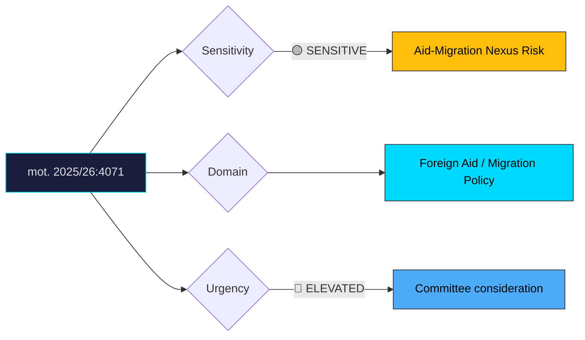

# Document Analysis: med anledning av skr. 2025/26:226 Riksrevisionens rapport om Sidas arbete med det humanitära biståndet

**Generated**: 2026-04-10 17:42 UTC
**dok_id**: HD024071
**Document Type**: motion
**Committee**: UU
**Date**: 2026-04-08
**Author**: Lotta Johnsson Fornarve m.fl. (V)
**Party**: V
**Riksmöte**: 2025/26
**Significance**: 🟡 Moderate (6/10)
**Confidence**: HIGH (75%)

---

## Executive Summary

Vänsterpartiet takes the most ideologically distinct position of the three opposition motions on Riksrevisionen's Sida audit (skr. 2025/26:226), demanding that Sweden decouple humanitarian aid from migration policy conditions. While C (HD024070) focuses on governance accountability and MP (HD024072) on reform quality assurance, V plants a flag on the principle of unconditional aid — directly challenging the government's policy of leveraging development assistance as a migration management tool. This reflects V's broader critique of the Tidöavtal framework, where migration policy has been allowed to permeate previously distinct policy areas. The motion is ideologically coherent but electorally narrow, primarily energising V's base and international solidarity organisations rather than broadening the party's appeal.

## Political Classification

## SWOT Analysis

### Strengths (Government Position)
| # | Statement | Evidence | Confidence | Impact |
|---|-----------|----------|------------|--------|
| 1 | Conditionality of aid to migration cooperation has public support in current climate | Polling trends | MEDIUM | H |
| 2 | Aligns with EU-wide trend of migration-development nexus policy | EU policy direction | HIGH | M |
| 3 | SD base strongly supports using aid as migration leverage | Tidöavtal framework | HIGH | H |

### Weaknesses (Government Position)
| # | Statement | Evidence | Confidence | Impact |
|---|-----------|----------|------------|--------|
| 1 | Conditionality may violate humanitarian principles and international aid norms | mot. 2025/26:4071 | HIGH | H |
| 2 | Riksrevisionen findings already undermine government's Sida management credibility | skr. 2025/26:226 | HIGH | M |
| 3 | Conflating migration and aid policy risks ineffectiveness in both domains | mot. 2025/26:4071 | MEDIUM | M |

### Opportunities (Opposition)
| # | Statement | Evidence | Confidence | Impact |
|---|-----------|----------|------------|--------|
| 1 | V establishes clear ideological marker on unconditional humanitarian aid | mot. 2025/26:4071 | HIGH | M |
| 2 | International solidarity organisations and aid workers rally behind V position | Civil society alignment | HIGH | M |
| 3 | Principled stance differentiates V from C and MP's more pragmatic approaches | mot. 2025/26:4071 vs. HD024070, HD024072 | HIGH | M |

### Threats (Opposition)
| # | Statement | Evidence | Confidence | Impact |
|---|-----------|----------|------------|--------|
| 1 | "Unconditional aid" framing vulnerable to "naïve" or "open borders" attack | Political communication risk | HIGH | H |
| 2 | Position may complicate red-green cooperation if S maintains conditionality stance | Coalition alignment risk | MEDIUM | M |
| 3 | Low public support for unconditional aid in current migration-sceptical climate | Polling context | HIGH | M |

## Stakeholder Impact Matrix

| Stakeholder | Impact | Direction | Evidence |
|-------------|--------|-----------|----------|
| Citizens | Principled debate on Sweden's international role | Mixed | mot. 2025/26:4071 |
| Government Coalition | Attack line from left on aid-migration nexus; base supportive | Mixed | Tidöavtal context |
| Opposition Bloc | V establishes distinct position; may not align with S/C/MP | Mixed | mot. 2025/26:4071 |
| Business/Industry | Limited direct impact | Neutral | — |
| Civil Society | International solidarity orgs strongly support; migration-sceptic orgs oppose | Split | mot. 2025/26:4071 |
| International/EU | UN humanitarian agencies support unconditional aid principle | + for V position | International humanitarian law |

## Risk Assessment

| Risk | Likelihood (1-5) | Impact (1-5) | L×I | Mitigation |
|------|-------------------|--------------|-----|------------|
| Aid conditionality harms humanitarian outcomes in receiving countries | 3 | 5 | 15 | Decouple as V proposes |
| V isolation from S+MP on aid conditionality issue | 3 | 3 | 9 | Find common ground on specific conditionality limits |
| Government uses V position to frame opposition as "soft on migration" | 4 | 3 | 12 | Frame as international legal obligation, not ideology |
| Sweden's humanitarian reputation decline | 3 | 4 | 12 | Riksrevisionen recommendations implementation |

## Forward Indicators

| Indicator | Trigger | Timeline | Probability |
|-----------|---------|----------|-------------|
| UU committee vote on conditionality question | Committee deliberation | May 2026 | HIGH |
| S position on aid-migration conditionality | Party statement or committee vote | May 2026 | HIGH |
| UN/OECD DAC commentary on Sweden's conditional aid | International review | 2026 | MEDIUM |
| Civil society campaign on unconditional humanitarian aid | NGO mobilisation | Spring 2026 | HIGH |
| Government bilateral agreements with conditionality clauses | Policy implementation | Ongoing | HIGH |

## Cross-Document References

- **HD024070**: C motion on same skr. 226 — governance accountability angle (audit compliance)
- **HD024072**: MP motion on same skr. 226 — pragmatic reform quality angle (aid effectiveness)
- **skr. 2025/26:226**: Government communication on Riksrevisionen's Sida audit

## Election 2026 Implications

- **Electoral Impact**: Low — unconditional aid is a base-mobilisation position, not a swing-voter issue **LOW**
- **Coalition Scenarios**: May create friction with S if S maintains conditional aid stance; V risks isolation on this issue in red-green framework **MEDIUM**
- **Voter Salience**: Very low general salience; high salience for V's core international solidarity voter segment **LOW**
- **Campaign Vulnerability**: V vulnerable to "soft on migration" attacks; government vulnerable to humanitarian credibility critique from international community **MEDIUM**
