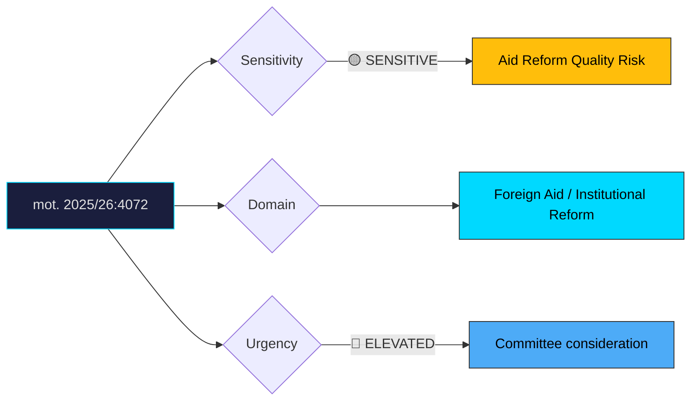

# Document Analysis: med anledning av skr. 2025/26:226 Riksrevisionens rapport om Sidas arbete med det humanitära biståndet

**Generated**: 2026-04-10 17:42 UTC
**dok_id**: HD024072
**Document Type**: motion
**Committee**: UU
**Date**: 2026-04-08
**Author**: Janine Alm Ericson m.fl. (MP)
**Party**: MP
**Riksmöte**: 2025/26
**Significance**: 🟡 Moderate (6/10)
**Confidence**: HIGH (75%)

---

## Executive Summary

Miljöpartiet takes the most pragmatic of the three opposition positions on Riksrevisionen's Sida audit, focusing on ensuring that efficiency reforms and reorganisation do not degrade the quality and effectiveness of Sweden's humanitarian aid programmes. Where C (HD024070) demands accountability and V (HD024071) rejects migration conditionality, MP occupies the practical centre — accepting the need for reform while insisting on quality safeguards during transition. This positioning is strategically significant: MP signals governance maturity and reformist pragmatism, contrasting with V's ideological purity and complementing C's audit-focused approach. The motion reflects MP's broader 2026 positioning as a constructive, coalition-ready party that can engage with complex policy implementation rather than just opposition rhetoric.

## Political Classification

## SWOT Analysis

### Strengths (Government Position)
| # | Statement | Evidence | Confidence | Impact |
|---|-----------|----------|------------|--------|
| 1 | Sida reform initiative demonstrates commitment to aid effectiveness | skr. 2025/26:226 | MEDIUM | M |
| 2 | Efficiency-driven reforms align with fiscal responsibility narrative | Budget policy | HIGH | M |
| 3 | MP's constructive tone suggests reform direction has cross-party legitimacy | mot. 2025/26:4072 | MEDIUM | M |

### Weaknesses (Government Position)
| # | Statement | Evidence | Confidence | Impact |
|---|-----------|----------|------------|--------|
| 1 | Riksrevisionen identified concrete deficiencies government has not yet addressed | skr. 2025/26:226 | HIGH | H |
| 2 | Reform implementation risks harming ongoing aid programmes during transition | mot. 2025/26:4072 | HIGH | H |
| 3 | Three-party opposition pressure (C+V+MP) on same communication is unprecedented | HD024070, HD024071, mot. 2025/26:4072 | HIGH | M |
| 4 | Aid budget cuts concurrent with reform create compounding risk to programme quality | Budget context | HIGH | M |

### Opportunities (Opposition)
| # | Statement | Evidence | Confidence | Impact |
|---|-----------|----------|------------|--------|
| 1 | MP demonstrates governance maturity with pragmatic reform-quality focus | mot. 2025/26:4072 | HIGH | H |
| 2 | Quality safeguard demand is difficult for government to oppose without appearing reckless | mot. 2025/26:4072 | HIGH | M |
| 3 | Positions MP as natural bridge between C's governance focus and V's principled stance | Three-motion cluster analysis | HIGH | M |

### Threats (Opposition)
| # | Statement | Evidence | Confidence | Impact |
|---|-----------|----------|------------|--------|
| 1 | Pragmatic positioning may lack the sharp political edge needed for media visibility | Communication risk | MEDIUM | M |
| 2 | Government may co-opt quality safeguard language while continuing problematic reforms | Policy absorption risk | MEDIUM | M |
| 3 | Three different opposition angles may fail to coalesce into unified committee position | Coordination challenge | MEDIUM | L |

## Stakeholder Impact Matrix

| Stakeholder | Impact | Direction | Evidence |
|-------------|--------|-----------|----------|
| Citizens | Better aid effectiveness if quality safeguards implemented | + | mot. 2025/26:4072 |
| Government Coalition | Constructive opposition harder to dismiss; quality demands are reasonable | − | mot. 2025/26:4072 |
| Opposition Bloc | MP bridges C and V positions; potential for unified committee reservation | + | HD024070, HD024071, mot. 2025/26:4072 |
| Business/Industry | Development consultancy sector affected by Sida reorganisation | Mixed | skr. 2025/26:226 |
| Civil Society | Aid implementing organisations benefit from quality-first reform approach | + | mot. 2025/26:4072 |
| International/EU | Partner countries benefit from maintained programme quality | + | mot. 2025/26:4072 |

## Risk Assessment

| Risk | Likelihood (1-5) | Impact (1-5) | L×I | Mitigation |
|------|-------------------|--------------|-----|------------|
| Aid programme quality degradation during Sida reform | 4 | 4 | 16 | Quality safeguards as MP proposes |
| Loss of institutional knowledge during reorganisation | 3 | 4 | 12 | Staff retention and knowledge transfer protocols |
| Partner country confidence erosion | 3 | 3 | 9 | Transparent communication of reform timeline |
| Three-party Sida critique failing to produce unified committee recommendation | 3 | 2 | 6 | Informal C+V+MP coordination on key demands |

## Forward Indicators

| Indicator | Trigger | Timeline | Probability |
|-----------|---------|----------|-------------|
| UU committee joint or parallel reservations from C+V+MP | Committee deliberation | May 2026 | HIGH |
| Sida staff and union response to reform implementation | Organisational communication | Ongoing | HIGH |
| Aid implementing organisations' testimony to UU committee | Committee hearings | April–May 2026 | MEDIUM |
| Government response to committee demands (tillkännagivande) | Parliamentary process | June 2026 | MEDIUM |
| Swedish aid effectiveness metrics post-reform | OECD DAC peer review | 2026–2027 | MEDIUM |

## Cross-Document References

- **HD024070**: C motion on same skr. 226 — governance accountability focus (audit compliance demands)
- **HD024071**: V motion on same skr. 226 — ideological position (unconditional aid, no migration linkage)
- **HD024064**: MP motion on housing (CU) — demonstrates MP's consistent constructive-critical pattern across committees
- **HD024069**: MP motion on food preparedness (MJU) — similar constructive stance supporting direction but demanding more
- **skr. 2025/26:226**: Government communication on Riksrevisionen's Sida audit

## Election 2026 Implications

- **Electoral Impact**: Low-moderate — demonstrates MP's governance readiness which is relevant to coalition credibility, not direct voter mobilisation **LOW**
- **Coalition Scenarios**: MP's pragmatic reformist approach on foreign aid strengthens its positioning as a responsible coalition partner for S; contrasts favourably with V's more confrontational stance **MEDIUM**
- **Voter Salience**: Low general salience, but MP's consistent pattern of constructive engagement across policy areas builds a cumulative credibility narrative **LOW**
- **Campaign Vulnerability**: Minimal — pragmatic quality-safeguard position offers almost no attack surface **LOW**
