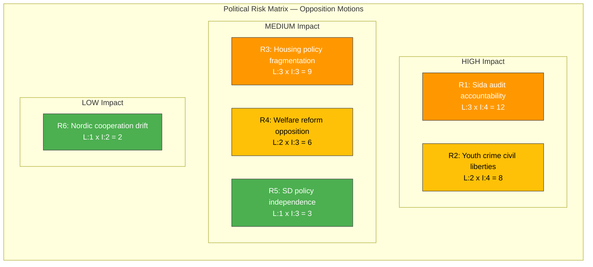

# Political Risk Assessment — 2026-04-10

**Generated**: 2026-04-10 07:16 UTC  
**Data Sources**: get_motioner (riksdag-regering-mcp)  
**Documents Analyzed**: 19  
**Confidence**: MEDIUM  
**Produced By**: news-motions agentic workflow (AI-enriched)  
**Riksmöte**: 2025/26

---

## Risk Matrix

## Summary

Coalition risk is LOW overall but with sector-specific vulnerabilities. The Sida audit response (skr. 226) is the highest-risk item with cross-party opposition (C+V+MP) and public accountability angle on 4.7B SEK. Housing policy faces multi-vector challenge across three motions. SD's copyright motion (mot. 4007) is an early indicator of potential Tidö policy divergence but currently isolated.

## Risk Assessment Table

| # | Risk | Likelihood (1-5) | Impact (1-5) | Score (LxI) | Affected Actors | Evidence |
|---|------|-------------------|--------------|-------------|-----------------|----------|
| R1 | Sida humanitarian aid accountability gap exposed | 3 | 4 | 12 | Government, UU committee, Sida, international partners | HD024070 (C), HD024071 (V), HD024072 (MP) |
| R2 | Youth crime reform blocked on civil liberties grounds | 2 | 4 | 8 | Government, JuU committee, youth justice system | HD024073 (V), HD024074 (MP) |
| R3 | Housing policy becomes major opposition campaign theme | 3 | 3 | 9 | CU committee, housing market, municipal governments | HD024012 (S), HD024064 (MP), HD024067 (MP) |
| R4 | Welfare activity requirements face dual opposition challenge | 2 | 3 | 6 | SoU committee, municipal welfare offices, recipients | HD024016 (S), HD024032 (C) |
| R5 | SD copyright independence signals broader Tidö divergence | 1 | 3 | 3 | NU committee, tech/media industry, Tidö coalition discipline | HD024007 (SD) |
| R6 | Nordic cooperation agenda stalls | 1 | 2 | 2 | UU committee, Nordic Council, bilateral relations | HD024039 (C) |

## Key Findings

1. Coalition stability: **LOW risk** overall (score 4/100) — government maintains majority on most propositions
2. Sector risk: **MEDIUM** on foreign aid (Sida audit) and housing — these could escalate to media/public attention
3. SD discipline: **INTACT** — only 1 independent motion is within normal bounds for support party
4. Opposition lacks formal coordination but shows emergent cross-party patterns on Sida and welfare

## Forward Risk Indicators

- **Watch**: UU committee scheduling of Sida audit debate — earliest trigger for risk R1 escalation
- **Watch**: Media coverage of youth crime investigation reform — V and MP may amplify civil liberties angle
- **Monitor**: Whether S joins Sida criticism (currently absent) — would elevate risk R1 significantly

## Data Quality Notes

Risk assessment based on 19 motions from riksdag-regering-mcp. Coalition risk metrics from CIA CSV context. Individual risk scores are AI assessments based on historical patterns and current political dynamics [MEDIUM confidence].