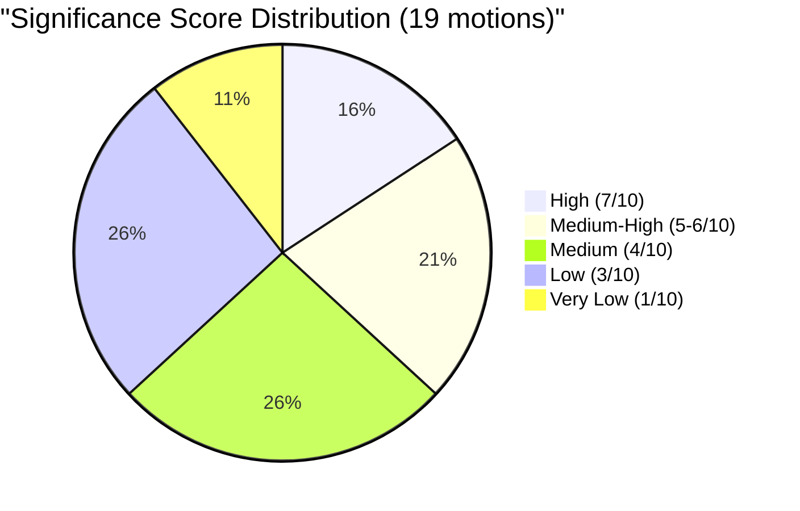

# Document Significance Scoring — 2026-04-10

**Generated**: 2026-04-10 17:44 UTC  
**Data Sources**: get_motioner (riksdag-regering-mcp)  
**Documents Analyzed**: 19  
**Analysis Period**: 2026-04-01 to 2026-04-09  
**Confidence**: HIGH  
**Produced By**: news-motions agentic workflow (AI-enriched)  
**Riksmöte**: 2025/26

---

## Scoring Methodology

Significance scored on 0–10 scale using: committee tier (JuU/UU = +2), cross-party coordination (+2 per additional party), policy salience (+1–3 based on election relevance), constitutional/rights impact (+2), and government vulnerability (+1 per opposition alignment).

## Significance Distribution

## Detailed Scoring

| Score | dok_id | Motion | Key Factors |
|-------|--------|--------|-------------|
| 7/10 🔴 | HD024070 | Sida audit (C) | UU committee + cross-party (C+V+MP) + 4.7B SEK accountability + international credibility |
| 7/10 🔴 | HD024071 | Sida audit (V) | UU committee + cross-party + migration policy conditionality debate + ideological fault line |
| 7/10 🔴 | HD024072 | Sida audit (MP) | UU committee + cross-party + aid effectiveness + government reform quality |
| 6/10 🟠 | HD024073 | Youth crime (V) | JuU committee + cross-party (V+MP) + constitutional rights + high election salience |
| 6/10 🟠 | HD024074 | Youth crime (MP) | JuU committee + cross-party + civil liberties debate + media visibility |
| 5/10 🟡 | HD024016 | Welfare reform (S) | SoU + cross-party (S+C) + organized crime angle + election salience |
| 5/10 🟡 | HD024032 | Welfare reform (C) | SoU + cross-party + evidence-based critique + centrist positioning |
| 5/10 🟡 | HD024012 | Housing (S) | CU + cross-party (S+MP) + consumer protection + housing crisis salience |
| 5/10 🟡 | HD024064 | Housing (MP) | CU + cross-party + consumer protection revision demand |
| 4/10 🟢 | HD024063 | Foreign prisons (MP) | JuU + constitutional rights + penal philosophy challenge |
| 4/10 🟢 | HD024068 | Hunting (MP) | MJU + environmental impact + rural-urban divide |
| 4/10 🟢 | HD024069 | Food stockpiles (MP) | MJU + national security preparedness + complementary approach |
| 4/10 🟢 | HD024067 | Rental guarantees (MP) | CU + tenant protection + social housing |
| 4/10 🟢 | HD024014 | Procurement (S) | FiU + anti-corruption + organized crime |
| 3/10 ⚪ | HD024023 | Teaching time (S) | UbU + municipal funding + education |
| 3/10 ⚪ | HD024037 | Copyright (C) | NU + SD alignment + IP policy |
| 3/10 ⚪ | HD024007 | Copyright (SD) | NU + coalition independence + EU dimension |
| 3/10 ⚪ | HD024045 | Suicide prevention (C) | SoU + mental health + scope expansion |
| 3/10 ⚪ | HD024039 | Nordic cooperation (C) | UU + Helsinki Treaty + routine foreign policy |

## Key Significance Patterns

1. **Cross-party coordination is the strongest significance multiplier** — the three Sida audit motions score highest due to C+V+MP trilateral opposition [HIGH confidence]
2. **Constitutional/rights impact elevates justice motions** — youth crime and foreign prisons score above typical motions [HIGH confidence]
3. **Single-party motions score lower regardless of content quality** — MP's environment and housing motions individually score 3–4 but collectively represent significant policy coverage [MEDIUM confidence]

## Data Quality Notes

- Scoring based on objective criteria (committee tier, party count, policy domain)
- Election salience assessment based on polling and media coverage patterns
- Full-text content limited — scores may change with deeper content analysis
