# Stakeholder Perspective Analysis — 2026-04-10

**Generated**: 2026-04-10 17:43 UTC  
**Data Sources**: get_motioner (riksdag-regering-mcp)  
**Documents Analyzed**: 19  
**Analysis Period**: 2026-04-01 to 2026-04-09  
**Confidence**: HIGH  
**Produced By**: news-motions agentic workflow (AI-enriched)  
**Riksmöte**: 2025/26

---

## Stakeholder Impact Overview

```mermaid
graph TD
    subgraph "Stakeholder Impact Matrix"
        CIT["👥 Citizens"]
        GOV["🏛️ Government Coalition"]
        OPP["⚔️ Opposition Bloc"]
        BIZ["💼 Business/Industry"]
        CIV["🤝 Civil Society"]
        INT["🌍 International/EU"]
        JUD["⚖️ Judiciary/Constitutional"]
        MED["📰 Media/Public Opinion"]
    end
    CIT -->|"Housing consumer protection"| H["prop. 188, 212"]
    CIT -->|"Welfare activity requirements"| W["prop. 207"]
    CIT -->|"Education funding"| E["prop. 196"]
    GOV -->|"Legislative agenda pressure"| L["13 propositions challenged"]
    OPP -->|"Coordinated challenges"| CC["5 cross-party clusters"]
    BIZ -->|"Procurement, copyright"| B["prop. 177, 184"]
    CIV -->|"Suicide prevention, aid"| C["prop. 190, skr. 226"]
    INT -->|"Humanitarian aid, Nordic"| I["skr. 226, 90"]
    style CIT fill:#28a745,stroke:#333,color:#fff
    style GOV fill:#dc3545,stroke:#333,color:#fff
    style OPP fill:#fd7e14,stroke:#333,color:#fff
    style BIZ fill:#ffc107,stroke:#333,color:#000
    style CIV fill:#6f42c1,stroke:#333,color:#fff
    style INT fill:#0d6efd,stroke:#333,color:#fff
    style JUD fill:#6c757d,stroke:#333,color:#fff
    style MED fill:#20c997,stroke:#333,color:#fff
```

## Detailed Stakeholder Analysis

### 1. Citizens

| # | Impact | Evidence | Direction | Confidence |
|---|--------|----------|-----------|------------|
| 1 | Housing consumer protection demands from S (mot. 4012) and MP (mot. 4064, 4067) target rent-to-own and rental guarantee reforms | prop. 188, 212 | **Positive** — opposition seeks stronger protections | HIGH |
| 2 | Welfare activity requirements challenged by S (mot. 4016) and C (mot. 4032) — citizens receiving försörjningsstöd affected | prop. 207 | **Mixed** — S wants organized crime safeguards, C wants evaluation | HIGH |
| 3 | Suicide prevention expansion demanded by C (mot. 4045) for outpatient care settings | prop. 190 | **Positive** — broader safety net | MEDIUM |
| 4 | Education funding concerns raised by S (mot. 4023) — municipalities may face unfunded mandates | prop. 196 | **Negative risk** — underfunded reform harms schools | MEDIUM |
| 5 | Youth criminal justice rights defended by V (mot. 4073) and MP (mot. 4074) | prop. 227 | **Mixed** — civil liberties vs. crime prevention | HIGH |

### 2. Government Coalition (M, KD, L + SD support)

| # | Impact | Evidence | Direction | Confidence |
|---|--------|----------|-----------|------------|
| 1 | 13 government propositions face formal opposition — signals legislative friction | 19 motions total | **Negative** — agenda under broad challenge | HIGH |
| 2 | SD independence on copyright (mot. 4007) breaks Tidö alignment on IP policy | prop. 184 | **Negative** — coalition discipline gap | MEDIUM |
| 3 | Cross-party opposition clusters on 5 propositions demonstrate coordinated resistance | props. 227, 207, 188; skr. 226, 184 | **Negative** — multiplied pressure | HIGH |
| 4 | Justice reform (prop. 227) and foreign prison sentences (prop. 185) face principled opposition on rights grounds | mot. 4073, 4074, 4063 | **Moderate risk** — public debate on civil liberties | MEDIUM |

### 3. Opposition Bloc (S, MP, V, C)

| # | Impact | Evidence | Direction | Confidence |
|---|--------|----------|-----------|------------|
| 1 | MP most active (7/19 motions = 37%) — establishing broad environmental, social, and justice profile ahead of 2026 election | Multiple motions | **Positive** — visibility and issue ownership | HIGH |
| 2 | S files targeted motions on high-salience issues (welfare, housing, education, procurement) — 4 strategically placed motions | mot. 4012, 4014, 4016, 4023 | **Positive** — campaign platform building | HIGH |
| 3 | C bridges government-opposition divide on welfare (mot. 4032), copyright (mot. 4037), Sida audit (mot. 4070) | Multiple motions | **Positive** — centrist positioning | MEDIUM |
| 4 | V maintains ideological purity on humanitarian aid (mot. 4071) and youth crime (mot. 4073) | skr. 226, prop. 227 | **Positive** — base mobilization | MEDIUM |
| 5 | Cross-party coordination on Sida audit (C+V+MP) shows potential opposition unity | skr. 226: mot. 4070, 4071, 4072 | **Positive** — coordination capacity | HIGH |

### 4. Business/Industry

| # | Impact | Evidence | Direction | Confidence |
|---|--------|----------|-----------|------------|
| 1 | Copyright industry faces potential elimination of privatkopieringsersättning if SD+C succeed | prop. 184: mot. 4007, 4037 | **Negative** — revenue threat | MEDIUM |
| 2 | Procurement regulations may be tightened if S succeeds on supplier controls | prop. 177: mot. 4014 | **Mixed** — compliance costs vs. fair competition | MEDIUM |
| 3 | Housing sector affected by hire-purchase and rental guarantee debates | prop. 188, 212: mot. 4012, 4064, 4067 | **Mixed** — regulatory uncertainty | MEDIUM |

### 5. Civil Society

| # | Impact | Evidence | Direction | Confidence |
|---|--------|----------|-----------|------------|
| 1 | Mental health organizations gain traction with suicide prevention expansion (C, mot. 4045) | prop. 190 | **Positive** — policy influence | MEDIUM |
| 2 | Humanitarian aid organizations benefit from cross-party Sida scrutiny | skr. 226: mot. 4070, 4071, 4072 | **Positive** — accountability improvement | HIGH |
| 3 | Environmental groups gain MP advocacy on hunting restrictions and food preparedness | prop. 211, 205: mot. 4068, 4069 | **Positive** — environmental protection | MEDIUM |
| 4 | Tenant rights organizations empowered by MP housing motions | prop. 188, 212 | **Positive** — consumer advocacy | MEDIUM |

### 6. International/EU

| # | Impact | Evidence | Direction | Confidence |
|---|--------|----------|-----------|------------|
| 1 | Nordic cooperation strengthened by C motion to revise Helsinki Treaty | skr. 90: mot. 4039 | **Positive** — regional integration | LOW |
| 2 | Humanitarian aid governance improved through cross-party Sida audit response | skr. 226: mot. 4070, 4071, 4072 | **Positive** — aid effectiveness | HIGH |
| 3 | EU copyright harmonization complicated if SD+C succeed in blocking prop. 184 | prop. 184: mot. 4007, 4037 | **Negative risk** — EU alignment gap | LOW |
| 4 | V's demand to delink aid from migration policy (mot. 4071) challenges government's conditionality approach | skr. 226 | **Mixed** — policy direction debate | MEDIUM |

### 7. Judiciary/Constitutional

| # | Impact | Evidence | Direction | Confidence |
|---|--------|----------|-----------|------------|
| 1 | Youth criminal justice powers expansion (prop. 227) challenged on constitutional rights grounds by V+MP | mot. 4073, 4074 | **Significant** — civil liberties debate | HIGH |
| 2 | Foreign prison sentences (prop. 185) raise constitutional questions about penal philosophy | mot. 4063 | **Significant** — prisoners' rights | MEDIUM |
| 3 | Procurement supplier control scope (prop. 177) has rule-of-law implications | mot. 4014 | **Moderate** — due process balance | LOW |

### 8. Media/Public Opinion

| # | Impact | Evidence | Direction | Confidence |
|---|--------|----------|-----------|------------|
| 1 | Youth crime debate generates significant media coverage — V+MP vs. government on prop. 227 | mot. 4073, 4074 | **High salience** — election issue | HIGH |
| 2 | Sida audit findings create accountability narrative — 3-party opposition coordination newsworthy | skr. 226: mot. 4070, 4071, 4072 | **High salience** — fiscal accountability | HIGH |
| 3 | Housing reform disputes resonate with voters — S+MP consumer protection messaging | prop. 188: mot. 4012, 4064 | **Medium salience** — housing crisis | MEDIUM |
| 4 | SD copyright independence from Tidö alignment generates political intrigue narrative | mot. 4007 | **Medium salience** — coalition dynamics | LOW |

## Key Findings

1. **Citizens are primary beneficiaries** of opposition motions across housing, welfare, education, suicide prevention, and youth justice — opposition frames itself as protector of citizen interests. [HIGH confidence]
2. **Government coalition faces multi-front pressure** with 13 propositions challenged and SD wavering on copyright policy. [HIGH confidence]
3. **Cross-party coordination is highest on foreign aid** (Sida audit: C+V+MP) and crime policy (youth justice: V+MP), signaling potential opposition cooperation ahead of 2026 election. [HIGH confidence]
4. **Business/industry faces mixed signals** — copyright industry threatened by SD+C alignment, procurement companies face S demands for stricter controls. [MEDIUM confidence]
5. **International/EU dimension significant** on humanitarian aid (skr. 226) and Nordic cooperation (skr. 90) — Sweden's development policy credibility at stake. [MEDIUM confidence]

## Data Quality Notes

- **Analysis confidence**: HIGH
- **Data sources**: 19 motion documents via get_motioner MCP tool
- **Analysis method**: 8-lens stakeholder framework with evidence citation
- **Limitation**: Metadata-only for most documents (full-text unavailable via MCP)
