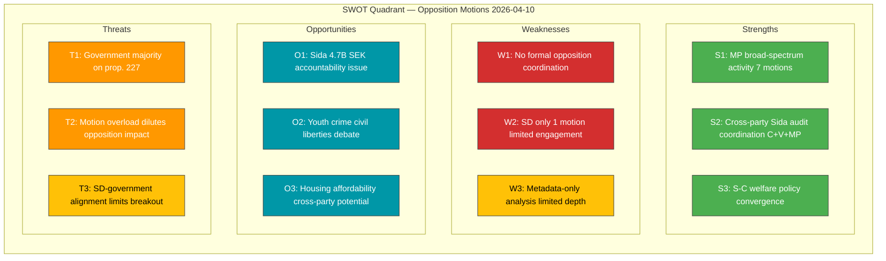

# Political SWOT Analysis — 2026-04-10

**Generated**: 2026-04-10 07:16 UTC  
**Data Sources**: get_motioner (riksdag-regering-mcp)  
**Documents Analyzed**: 19  
**Confidence**: MEDIUM  
**Produced By**: news-motions agentic workflow (AI-enriched)  
**Riksmöte**: 2025/26  
**SWOT ID**: SWT-2026-04-10-MOT  
**Temporal Window**: 2026-04-01 to 2026-04-09

---

## SWOT Quadrant Mapping

## Government Coalition SWOT

### Strengths — Government Coalition

| # | Statement | Evidence (dok_id) | Confidence | Impact | Entry Date |
|---|-----------|-------------------|------------|--------|------------|
| GS1 | Government legislative agenda advancing with 13 propositions reaching motion stage | prop. 177, 184, 185, 188, 190, 196, 205, 207, 211, 212, 227 + skr. 90, 226 | HIGH | HIGH | 2026-04-10 |
| GS2 | Opposition fragmented across 13 different bills — no unified counter-strategy | All 19 motions target different propositions | MEDIUM | MEDIUM | 2026-04-10 |
| GS3 | SD largely disciplined with only 1 independent motion (copyright) | HD024007 sole SD motion | HIGH | LOW | 2026-04-10 |

### Weaknesses — Government Coalition

| # | Statement | Evidence (dok_id) | Confidence | Impact | Entry Date |
|---|-----------|-------------------|------------|--------|------------|
| GW1 | Sida audit response draws tripartite opposition (C+V+MP) exposing aid policy vulnerability | HD024070, HD024071, HD024072 | HIGH | HIGH | 2026-04-10 |
| GW2 | Youth crime proposal generates civil liberties backlash from V and MP | HD024073, HD024074 | MEDIUM | MEDIUM | 2026-04-10 |
| GW3 | Housing policy attacked from multiple angles (rent guarantees + hire-purchase) | HD024067, HD024012, HD024064 | MEDIUM | MEDIUM | 2026-04-10 |

## Opposition Bloc SWOT

### Strengths — Opposition

| # | Statement | Evidence (dok_id) | Confidence | Impact | Entry Date |
|---|-----------|-------------------|------------|--------|------------|
| OS1 | MP demonstrates broad policy engagement across 7 committees | HD024074, HD024072, HD024068, HD024067, HD024069, HD024063, HD024064 | HIGH | HIGH | 2026-04-10 |
| OS2 | Three parties (C, V, MP) coordinate Sida audit challenge | HD024070, HD024071, HD024072 | HIGH | HIGH | 2026-04-10 |
| OS3 | S and C converge on welfare activity requirements | HD024016, HD024032 | MEDIUM | MEDIUM | 2026-04-10 |
| OS4 | S targets key economic policies (procurement, housing, education, welfare) | HD024014, HD024012, HD024023, HD024016 | HIGH | MEDIUM | 2026-04-10 |

### Weaknesses — Opposition

| # | Statement | Evidence (dok_id) | Confidence | Impact | Entry Date |
|---|-----------|-------------------|------------|--------|------------|
| OW1 | No evidence of formal opposition coordination mechanism — motions filed independently | Pattern across all 19 motions | MEDIUM | MEDIUM | 2026-04-10 |
| OW2 | S absent from Sida audit challenge despite foreign policy profile | No S motion on skr. 226 | MEDIUM | LOW | 2026-04-10 |
| OW3 | Most motions likely to be rejected given government majority | Parliamentary arithmetic | HIGH | HIGH | 2026-04-10 |

## Stakeholder Groups Analysis

| Stakeholder Group | Impact Assessment | Key Motions | Confidence |
|-------------------|-------------------|-------------|------------|
| **Citizens** | Welfare reform (prop. 207), housing affordability (prop. 188, 212), education (prop. 196) directly affect daily lives | HD024016, HD024032, HD024012, HD024064, HD024067, HD024023 | MEDIUM |
| **Government Coalition** | Must defend 13 propositions against opposition scrutiny; Sida audit is most politically sensitive | All 19 motions challenge coalition agenda | HIGH |
| **Opposition Bloc** | MP dominates activity; cross-party coordination on Sida and welfare signals strategic maturation | HD024070-72 (Sida), HD024016+HD024032 (welfare) | MEDIUM |
| **Business/Industry** | Procurement reform (prop. 177), copyright (prop. 184) have direct industry impact | HD024014, HD024037, HD024007 | MEDIUM |
| **Civil Society** | Youth crime rights (prop. 227), suicide prevention (prop. 190), humanitarian aid (skr. 226) | HD024073, HD024074, HD024045, HD024070-72 | MEDIUM |
| **International/EU** | Sida audit has international development implications; Nordic cooperation (skr. 90) | HD024070-72, HD024039 | MEDIUM |
| **Judiciary/Constitutional** | Youth investigation powers (prop. 227), foreign prison execution (prop. 185) raise rule-of-law questions | HD024073, HD024074, HD024063 | MEDIUM |
| **Media/Public Opinion** | Sida 4.7B SEK gap and youth crime debate are high-profile media stories | HD024070-72, HD024073-74 | HIGH |

## TOWS Strategic Options

| Option | SWOT Combination | Description |
|--------|-----------------|-------------|
| SO1: Sida audit press offensive | OS2 x O1 | Opposition leverages cross-party coordination on Sida to maximize media pressure on government aid policy |
| ST1: Selective motion targeting | OS1 x T2 | MP focuses media on 2-3 highest-impact motions rather than all 7 to avoid dilution |
| WO1: S joins Sida challenge | OW2 x O1 | S could amplify opposition impact by adding its voice to Sida audit criticism |
| WT1: Opposition coordination reform | OW1 x T1 | Establish formal opposition caucus on key policy areas to concentrate bargaining power |

## Data Quality Notes

SWOT confidence: **MEDIUM**. Analysis based on 19 motions with metadata and summaries from riksdag-regering-mcp. Full-text not available for all documents.