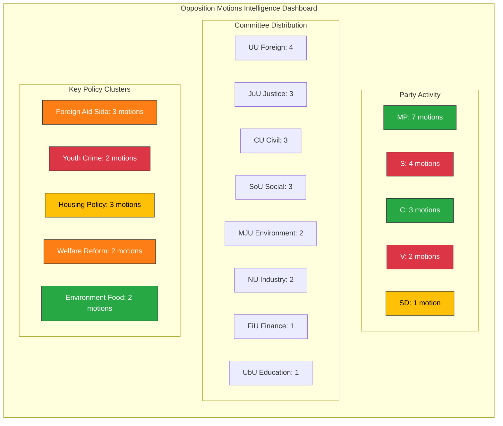
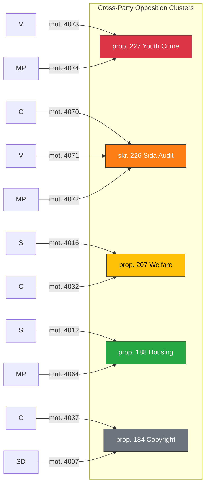

# Analysis Synthesis Summary — 2026-04-10

**Generated**: 2026-04-10 07:15 UTC  
**Data Sources**: get_motioner (riksdag-regering-mcp)  
**Documents Analyzed**: 19  
**Analysis Period**: 2026-04-01 to 2026-04-09  
**Confidence**: MEDIUM  
**Produced By**: news-motions agentic workflow (AI-enriched)  
**Riksmöte**: 2025/26

---

## Intelligence Dashboard

## Summary

19 opposition motions filed between April 1-9, 2026 challenge 13 government propositions and reports across 8 Riksdag committees. Miljöpartiet (MP) leads opposition activity with 7 motions spanning justice, environment, housing, foreign aid, and food security. Socialdemokraterna (S) targets procurement, education, housing, and welfare reforms. Centerpartiet (C) focuses on Nordic cooperation, copyright, and social policy. This represents a broad-spectrum opposition offensive against the Tidö coalition's legislative agenda in the final stretch of the 2025/26 riksmöte.

## Key Findings

1. **MP is the most active opposition party** with 7 of 19 motions (37%), challenging government on hunting law (prop. 211), housing guarantees (prop. 212), food stockpiles (prop. 205), foreign prison sentences (prop. 185), hire-purchase law (prop. 188), Sida audit response (skr. 226), and youth crime (prop. 227) [HIGH confidence]
2. **Sida humanitarian aid audit (skr. 226)** attracts cross-opposition attention: C (mot. 2025/26:4070), V (mot. 2025/26:4071), and MP (mot. 2025/26:4072) all challenge government's response to Riksrevisionen findings on 4.7B SEK accountability gap [HIGH confidence]
3. **Youth criminal justice reform (prop. 227)** sparks V (mot. 2025/26:4073) and MP (mot. 2025/26:4074) motions opposing expanded investigation powers for young offenders — signals civil liberties fault line [MEDIUM confidence]
4. **Welfare activity requirements (prop. 207)** face dual opposition from S (mot. 2025/26:4016) and C (mot. 2025/26:4032) — rare S-C alignment on social policy [MEDIUM confidence]
5. **Housing policy contested on two fronts**: hire-purchase law (prop. 188) challenged by both S (mot. 2025/26:4012) and MP (mot. 2025/26:4064); municipal rent guarantees (prop. 212) by MP (mot. 2025/26:4067) [MEDIUM confidence]
6. **SD breaks from usual Tidö alignment** with motion on private copying compensation (mot. 2025/26:4007) — tests intellectual property policy independence [LOW confidence]

## Top Documents by Significance

| Score | Committee | dok_id | Title | Party |
|-------|-----------|--------|-------|-------|
| 7/10 | UU | HD024070 | Sida humanitarian aid audit (skr. 226) | C |
| 7/10 | UU | HD024071 | Sida humanitarian aid audit (skr. 226) | V |
| 7/10 | UU | HD024072 | Sida humanitarian aid audit (skr. 226) | MP |
| 6/10 | JuU | HD024073 | Youth crime investigation reform (prop. 227) | V |
| 6/10 | JuU | HD024074 | Youth crime investigation reform (prop. 227) | MP |
| 5/10 | SoU | HD024016 | Welfare activity requirements (prop. 207) | S |
| 5/10 | SoU | HD024032 | Welfare activity requirements (prop. 207) | C |
| 5/10 | CU | HD024012 | Hire-purchase housing law (prop. 188) | S |
| 5/10 | CU | HD024064 | Hire-purchase housing law (prop. 188) | MP |
| 4/10 | MJU | HD024068 | Hunting law simplification (prop. 211) | MP |
| 4/10 | MJU | HD024069 | Food supply stockpiles (prop. 205) | MP |
| 4/10 | CU | HD024067 | Municipal rent guarantees (prop. 212) | MP |
| 4/10 | FiU | HD024014 | Simplified supplier control (prop. 177) | S |
| 4/10 | JuU | HD024063 | Foreign prison sentences (prop. 185) | MP |
| 3/10 | UbU | HD024023 | Teaching time (prop. 196) | S |
| 3/10 | NU | HD024037 | Private copying compensation (prop. 184) | C |
| 3/10 | NU | HD024007 | Private copying compensation (prop. 184) | SD |
| 3/10 | SoU | HD024045 | Suicide prevention function (prop. 190) | C |
| 3/10 | UU | HD024039 | Nordic cooperation 2025 (skr. 90) | C |

## Opposition Coordination Pattern

## AI-Recommended Article Metadata

- **Recommended Title (EN)**: "MP Leads Opposition Offensive with 7 Motions as Sida Audit and Youth Crime Divide Riksdag"
- **Recommended Title (SV)**: "MP leder oppositionsoffensiv med 7 motioner medan Sida-granskning och ungdomsbrottslighet delar riksdagen"
- **Meta Description (EN)**: "Miljöpartiet dominates with 7 of 19 opposition motions challenging government on Sida aid audit, youth crime reform, housing, and welfare as 2025/26 riksmöte enters final stretch."
- **Meta Description (SV)**: "Miljöpartiet dominerar med 7 av 19 oppositionsmotioner som utmanar regeringen om Sida-biståndsrevision, ungdomsbrottslighet, bostäder och välfärd."
- **Key Highlights**: Cross-party Sida audit challenge (C+V+MP), MP most active party, S-C welfare alignment, SD copyright independence
- **Article Decision**: PUBLISH
- **Article Priority**: MEDIUM-HIGH

## Forward Indicators

1. **UU committee hearing on skr. 226** — watch for scheduling of Sida audit debate (expected April-May 2026) [HIGH confidence]
2. **JuU committee vote on prop. 227** — V and MP motions signal floor debate on civil liberties vs. crime prevention [MEDIUM confidence]
3. **SoU handling of prop. 207** — S and C convergence may produce alternative majority proposal [LOW confidence]
4. **CU committee on prop. 188** — S and MP dual challenge to hire-purchase law tests housing policy alternatives [MEDIUM confidence]

## Data Quality Notes

Overall confidence: **MEDIUM**. 19 documents analyzed with metadata and summaries. Full-text not available for all documents. Analysis based on motion summaries and structural metadata from riksdag-regering-mcp.