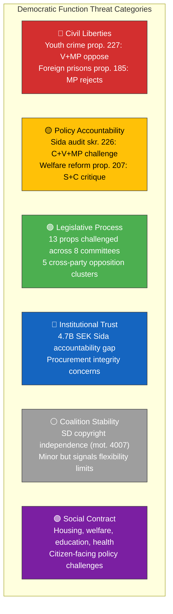

# Political Threat Analysis — 2026-04-10

**Generated**: 2026-04-10 17:45 UTC  
**Data Sources**: get_motioner (riksdag-regering-mcp)  
**Documents Analyzed**: 19  
**Analysis Period**: 2026-04-01 to 2026-04-09  
**Confidence**: MEDIUM  
**Produced By**: news-motions agentic workflow (AI-enriched)  
**Riksmöte**: 2025/26

---

## Threat Assessment Overview

## Threat Category Analysis

### 1. Civil Liberties Threats (🔴 ELEVATED)

| Threat | Source | Evidence | Severity | Confidence |
|--------|--------|----------|----------|------------|
| Expanded investigation powers for young offenders may infringe rights | prop. 227 | V (mot. 4073) and MP (mot. 4074) file rejection motions citing constitutional concerns | 4/5 | HIGH |
| Execution of Swedish prison sentences abroad raises penal philosophy questions | prop. 185 | MP (mot. 4063) demands full rejection — argues breach of Swedish penal rehabilitation model | 3/5 | MEDIUM |

**Assessment**: The government's criminal justice agenda faces principled civil liberties opposition. V and MP's coordinated response to prop. 227 creates a constitutional debate that could resonate with human rights organizations and constitutional scholars. [HIGH confidence]

### 2. Policy Accountability Threats (🟡 MODERATE)

| Threat | Source | Evidence | Severity | Confidence |
|--------|--------|----------|----------|------------|
| Sida humanitarian aid accountability gaps identified by Riksrevisionen | skr. 226 | C (mot. 4070), V (mot. 4071), MP (mot. 4072) all demand action on audit findings | 4/5 | HIGH |
| Welfare reform may lack proper evaluation mechanisms | prop. 207 | C (mot. 4032) demands evidence-based follow-up of activity requirement outcomes | 3/5 | MEDIUM |
| Procurement simplification may weaken anti-corruption safeguards | prop. 177 | S (mot. 4014) argues exclusion ground coverage is insufficient | 2/5 | MEDIUM |

**Assessment**: The Sida audit represents the most significant accountability threat — three parties independently challenging the government's response to a national audit office report. The 4.7B SEK figure provides concrete ammunition. [HIGH confidence]

### 3. Coalition Stability Threats (⚪ LOW)

| Threat | Source | Evidence | Severity | Confidence |
|--------|--------|----------|----------|------------|
| SD breaks from Tidö coalition on copyright/IP policy | prop. 184 | SD (mot. 4007) rejects government proposition despite coalition membership | 2/5 | LOW |
| No other coalition fractures detected in current batch | — | All other motions from traditional opposition parties | 1/5 | HIGH |

**Assessment**: SD's copyright motion is a minor coalition discipline issue. Private copying compensation is not a core Tidö Agreement priority, so this divergence is unlikely to threaten coalition stability. However, it demonstrates SD's willingness to assert policy independence on niche issues. [LOW confidence]

### 4. Social Contract Threats (🟣 MODERATE)

| Threat | Source | Evidence | Severity | Confidence |
|--------|--------|----------|----------|------------|
| Housing affordability — hire-purchase law and rental guarantees contested | prop. 188, 212 | S (mot. 4012), MP (mot. 4064, 4067) demand stronger consumer protections | 3/5 | MEDIUM |
| Education underfunding risk if teaching time reform unfunded | prop. 196 | S (mot. 4023) flags municipal mandate without funding | 3/5 | MEDIUM |
| Mental health gaps — suicide prevention scope questioned | prop. 190 | C (mot. 4045) demands outpatient care inclusion | 2/5 | MEDIUM |
| Food security preparedness may be insufficient | prop. 205 | MP (mot. 4069) demands complementary preparedness measures | 2/5 | LOW |

**Assessment**: Multiple opposition motions target citizen-facing policies (housing, education, health, food security), framing the government as insufficiently protective of social welfare. This pattern could feed a broader narrative of government indifference in the 2026 election campaign. [MEDIUM confidence]

## Risk Matrix Summary

| Threat Category | Severity (1-5) | Likelihood (1-5) | Risk Score (L×S) | Trend |
|----------------|----------------|-------------------|-------------------|-------|
| Civil Liberties | 4 | 3 | 12 | ↑ Increasing |
| Policy Accountability | 4 | 4 | 16 | ↑ Increasing |
| Legislative Process | 3 | 4 | 12 | → Stable |
| Institutional Trust | 3 | 3 | 9 | ↑ Increasing |
| Coalition Stability | 2 | 2 | 4 | → Stable |
| Social Contract | 3 | 3 | 9 | ↑ Increasing |

## Forward Threat Indicators

| Indicator | Trigger | Timeline | Watch Level |
|-----------|---------|----------|-------------|
| UU committee hearings on Sida audit | Committee scheduling announcement | April-May 2026 | 🔴 HIGH |
| JuU committee consideration of prop. 227 | Committee report publication | April 2026 | 🟠 MEDIUM |
| SoU welfare reform evaluation mechanisms | Government response to S+C demands | May-June 2026 | 🟡 LOW |
| SD further coalition deviations | Additional SD opposition motions | Ongoing | ⚪ MONITOR |

## Data Quality Notes

- Threat assessment based on motion metadata and summaries from MCP
- Severity scores calibrated against Swedish democratic function baseline
- Coalition stability assessment limited by metadata-only analysis
