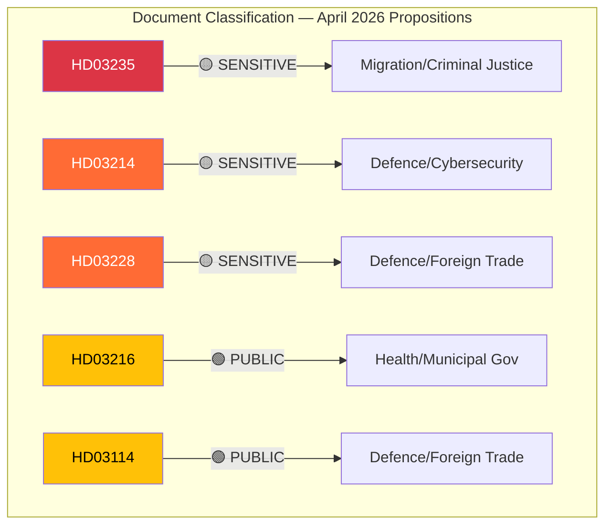

# Political Classification Results — 2026-04-10

| **Field** | **Value** |
|-----------|-----------|
| **Classification ID** | CLASS-2026-04-10-PROP-001 |
| **Analysis Date** | 2026-04-10 17:15 UTC |
| **Documents Classified** | 5 |
| **Produced By** | news-propositions workflow (AI-enriched) |
| **Confidence** | MEDIUM |

---

## Classification Overview

## Detailed Classification

| dok_id | Sensitivity | Domain | Urgency | Significance |
|--------|-----------|--------|---------|-------------|
| HD03235 | 🟡 SENSITIVE | Migration, Criminal Justice, Human Rights | 🔴 CRITICAL | 9/10 |
| HD03214 | 🟡 SENSITIVE | Defence, Cybersecurity, Digital Infrastructure | 🟠 URGENT | 8/10 |
| HD03228 | 🟡 SENSITIVE | Defence, Foreign Trade, International Law | 🟠 URGENT | 8/10 |
| HD03216 | 🟢 PUBLIC | Health, Municipal Governance, Welfare | 🔵 ELEVATED | 6/10 |
| HD03114 | 🟢 PUBLIC | Defence, Foreign Trade, Transparency | ⚪ ROUTINE | 6/10 |

## Domain Distribution

- **Defence & Security**: 3 documents (HD03214, HD03228, HD03114)
- **Migration & Justice**: 1 document (HD03235)
- **Health & Welfare**: 1 document (HD03216)

## Key Findings

The batch is security-dominated (60% defence-related), reflecting the government's post-NATO legislative agenda. The deportation proposition stands alone in the migration domain but carries the highest political significance. The health proposition provides domestic policy balance.
