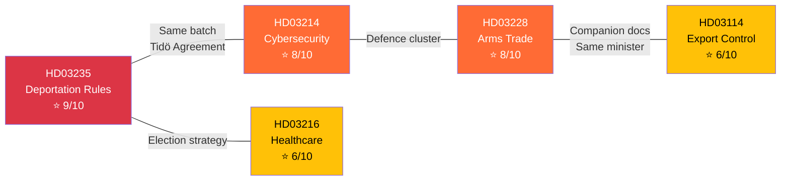

# Cross-Reference Map — Government Propositions — 2026-04-10

| **Field** | **Value** |
|-----------|-----------|
| **Map ID** | XREF-2026-04-10-PROP-001 |
| **Analysis Date** | 2026-04-10 17:15 UTC |
| **Documents Mapped** | 5 |
| **Cross-References Found** | 4 |
| **Produced By** | news-propositions workflow (AI-enriched) |

---

## Cross-Reference Network

## Cross-References

| Source | Target | Relationship | Strength |
|--------|--------|-------------|----------|
| HD03228 | HD03114 | Companion documents — same minister (Dousa), same policy domain (arms trade) | Strong |
| HD03214 | HD03228 | Defence cluster — both address national security post-NATO | Medium |
| HD03235 | Tidöavtalet | Policy origin — core Tidö Agreement commitment on migration | Strong |
| All 5 | Election 2026 | Strategic timing — coordinated pre-election legislative offensive | Strong |
