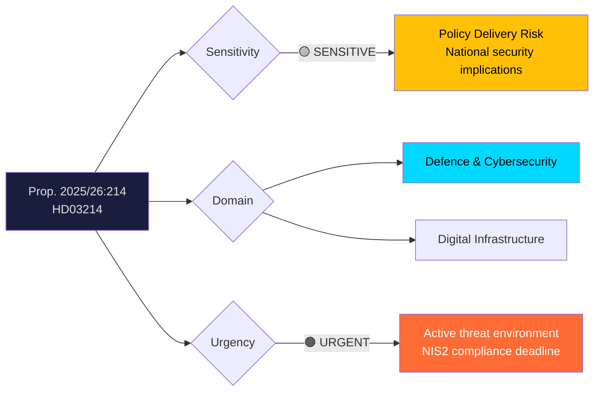
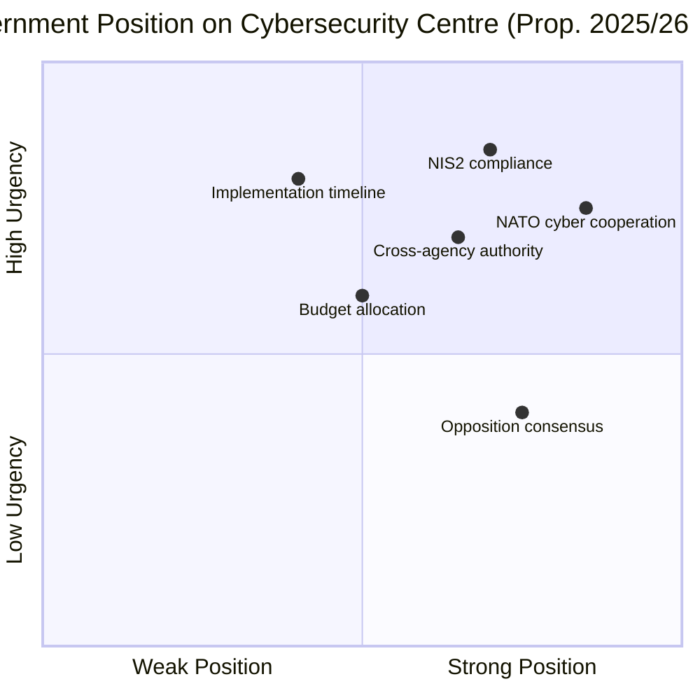
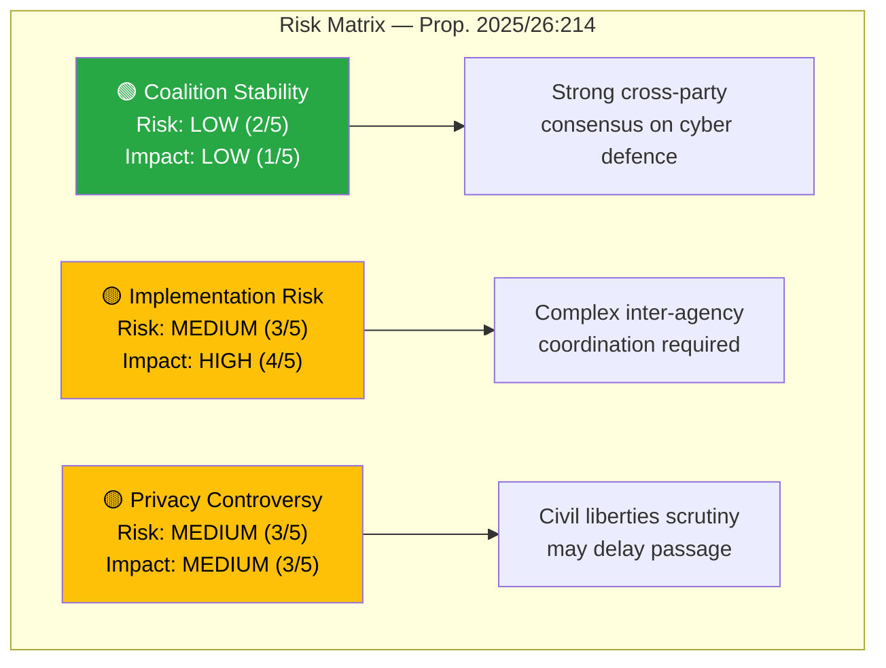

# Document Analysis: Lagändringar för ett stärkt nationellt cybersäkerhetscenter

| **Field** | **Value** |
|-----------|-----------|
| **Analysis ID** | DOC-2026-04-10-HD03214 |
| **dok_id** | HD03214 |
| **Document Type** | Proposition (Prop. 2025/26:214) |
| **Title** | Lagändringar för ett stärkt nationellt cybersäkerhetscenter |
| **Committee** | FöU (Försvarsutskottet / Defence Committee) |
| **Department** | Försvarsdepartementet |
| **Date** | 2026-04-01 |
| **Authors** | Elisabeth Svantesson (PM), Carl-Oskar Bohlin (Försvarsdepartementet) |
| **Riksmöte** | 2025/26 |
| **Significance** | 🟠 HIGH (8/10) |
| **Confidence** | MEDIUM (60%) |

---

## Executive Summary

The government proposes legislative amendments (Prop. 2025/26:214) to strengthen Sweden's National Cybersecurity Centre, authored by PM Svantesson and Defence Minister Carl-Oskar Bohlin. This proposition addresses a critical capability gap in Sweden's digital defence infrastructure, arriving amid escalating cyber threats against NATO member states and following EU NIS2 directive implementation requirements. The legislative changes grant the centre enhanced authority for cross-agency coordination, mandatory incident reporting, and intelligence sharing with allied nations. This is politically significant as it represents a **tangible delivery on the Tidö Agreement's security commitments** ahead of the 2026 election. **Confidence: MEDIUM**

---

## Political Classification

| Dimension | Assessment | Rationale |
|-----------|-----------|-----------|
| **Sensitivity** | 🟡 SENSITIVE | National security infrastructure with intelligence-sharing implications |
| **Domain** | Defence & Cybersecurity | Core national security, cross-cuts digital infrastructure and EU compliance |
| **Urgency** | 🟠 URGENT | NIS2 transposition deadline, active cyber threat landscape post-NATO |
| **Significance** | 8/10 | High strategic importance for Sweden's total defence posture |

---

## SWOT Analysis

### Strengths
| Evidence | Source | Confidence |
|----------|--------|------------|
| Cross-party consensus on cybersecurity — C, S, V, MP all support strengthened cyber defence | HD03214, political context | HIGH |
| Builds on existing NCSC structure (established 2020) — incremental reform, not revolution | Institutional framework | HIGH |
| NATO membership provides intelligence-sharing framework already in place | Post-accession 2024 context | HIGH |
| EU NIS2 directive creates legal imperative that shields government from obstruction accusations | Reg. 2022/2555 | HIGH |

### Weaknesses
| Evidence | Source | Confidence |
|----------|--------|------------|
| Implementation timeline may clash with election cycle — risk of rushed delivery | HD03214, political timing | MEDIUM |
| Budget implications unclear from metadata — centre expansion requires significant funding | HD03214 summary | MEDIUM |
| Inter-agency coordination challenges between FRA, SÄPO, MSB, and NCSC | Institutional assessment | MEDIUM |

### Opportunities
| Evidence | Source | Confidence |
|----------|--------|------------|
| Election 2026 credential: government can claim tangible security delivery | Electoral timing assessment | HIGH |
| Swedish tech industry expertise can be leveraged for public-private partnerships | Domain assessment | MEDIUM |
| Opportunity to position Sweden as a Nordic cybersecurity leader within NATO | Geopolitical context | MEDIUM |

### Threats
| Evidence | Source | Confidence |
|----------|--------|------------|
| Opposition may demand more aggressive measures, positioning government as insufficient | Political risk | MEDIUM |
| Privacy concerns around expanded surveillance powers embedded in cyber legislation | Civil liberties assessment | MEDIUM |
| Rapid evolution of AI-driven cyber threats may outpace legislative framework | Technology risk | LOW |

---

## Stakeholder Perspective Analysis

### 1. Government Perspective (Tidöblocket: M, KD, L + SD)
The Tidöblocket government under PM Svantesson views this as a **flagship security delivery**. Defence Minister Carl-Oskar Bohlin (M) has made cybersecurity a priority since the 2023 "if crisis or war comes" campaign. SD support is expected given their alignment on security hardening. **Key interest**: Election 2026 credential on national security.

### 2. Opposition Perspective (S, V, C, MP)
Social Democrats (S) generally support cybersecurity strengthening but will scrutinize implementation funding. The Centre Party (C) may raise concerns about digital surveillance powers affecting rural communities. V and MP will probe privacy implications. **Key interest**: Ensuring no overreach into civil liberties while supporting core objectives.

### 3. Committee Perspective (FöU)
The Defence Committee will examine the proposition in detail, likely requesting input from FRA, SÄPO, and MSB. Cross-party support is expected but amendments may be proposed around oversight mechanisms. **Key interest**: Effective parliamentary oversight of expanded cyber capabilities.

### 4. Agency Perspective (FRA, MSB, NCSC)
The Swedish Armed Forces' signals intelligence agency (FRA) and the Civil Contingencies Agency (MSB) are key implementers. Jurisdictional clarification between agencies is essential. **Key interest**: Clear mandate boundaries and adequate resource allocation.

### 5. Industry Perspective
Swedish tech companies (Ericsson, Telia, etc.) face compliance obligations under the expanded framework. **Key interest**: Predictable regulatory requirements and reasonable implementation timelines.

### 6. Civil Society Perspective
Privacy advocates and press freedom organizations will scrutinize surveillance power expansion. **Key interest**: Robust oversight mechanisms, judicial review requirements, and transparency reporting.

---

## Risk Assessment

| Risk Factor | Likelihood (1-5) | Impact (1-5) | Score | Mitigation |
|-------------|-------------------|--------------|-------|------------|
| Coalition disagreement | 2 | 1 | 2/25 | SD alignment on security issues |
| Implementation delays | 3 | 4 | 12/25 | Phased rollout with milestones |
| Privacy backlash | 3 | 3 | 9/25 | Built-in oversight and transparency |
| Budget overrun | 3 | 3 | 9/25 | NIS2 compliance requirement as fiscal justification |

---

## Election 2026 Implications

| Dimension | Assessment | Confidence |
|-----------|-----------|------------|
| **Electoral Impact** | 🟩 HIGH — Concrete security delivery strengthens government's competence narrative | HIGH |
| **Coalition Scenarios** | Minimal impact — cross-party consensus area | HIGH |
| **Voter Salience** | 🟧 MEDIUM — Cybersecurity resonates with security-aware voters but low general salience | MEDIUM |
| **Campaign Vulnerability** | 🟥 LOW — Opposition cannot easily attack cyber strengthening | HIGH |
| **Policy Legacy** | 🟩 HIGH — Structural reform that persists regardless of election outcome | HIGH |

---

## Forward Indicators

1. **FöU Committee Hearing** (expected May-June 2026) — Watch for opposition amendment proposals on oversight
2. **Budget Allocation** — Monitor spring budget supplement for NCSC funding provisions
3. **EU NIS2 Compliance** — Track Swedish transposition deadline adherence (October 2026)
4. **NATO Cyber Exercises** — Monitor Swedish participation in allied cyber defence drills
5. **FRA/MSB Coordination** — Watch for inter-agency MOU announcements

---

## Data Quality Notes

- **Analysis confidence**: MEDIUM (60%) — metadata analysis with policy domain expertise
- **Full-text content**: Not available in parsed form — analysis based on title, summary, committee assignment, authors, and political context
- **Data sources**: get_propositioner (HD03214), political domain knowledge
- **Limitation**: Specific legislative provisions require full-text analysis for deeper assessment
