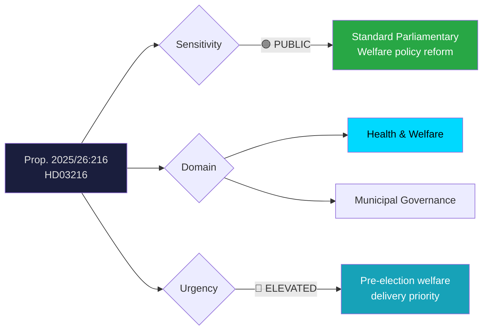
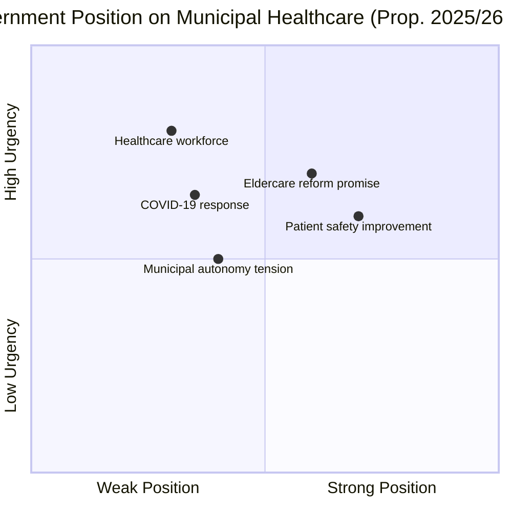
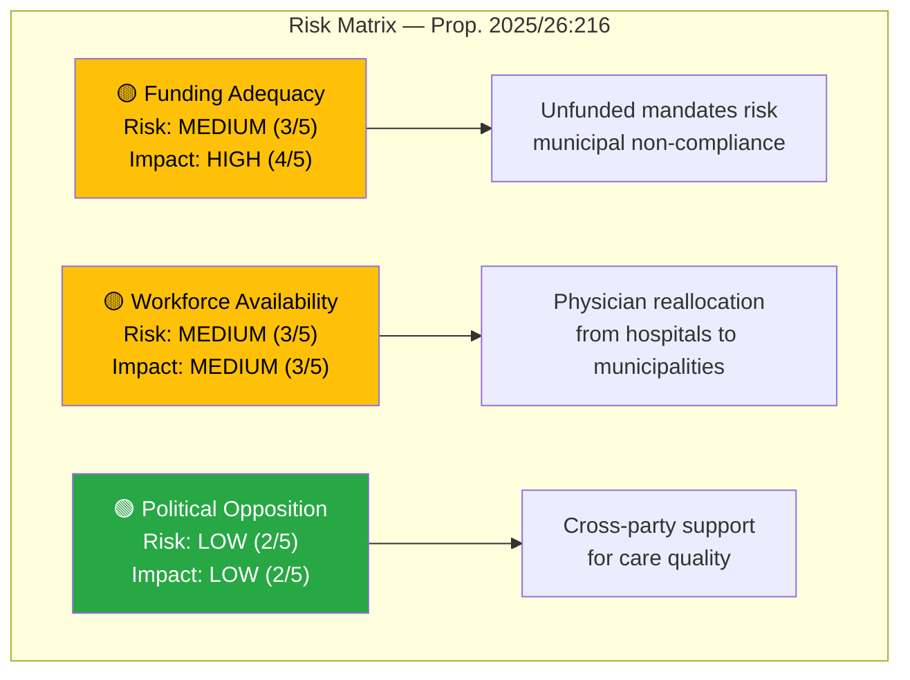

# Document Analysis: Stärkt medicinsk kompetens i kommunal hälso- och sjukvård

| **Field** | **Value** |
|-----------|-----------|
| **Analysis ID** | DOC-2026-04-10-HD03216 |
| **dok_id** | HD03216 |
| **Document Type** | Proposition (Prop. 2025/26:216) |
| **Title** | Stärkt medicinsk kompetens i kommunal hälso- och sjukvård |
| **Committee** | SoU (Socialutskottet / Committee on Health and Welfare) |
| **Department** | Socialdepartementet |
| **Date** | 2026-04-01 |
| **Authors** | Elisabeth Svantesson (PM), Anna Tenje (Socialdepartementet) |
| **Riksmöte** | 2025/26 |
| **Significance** | 🟡 MEDIUM (6/10) |
| **Confidence** | MEDIUM (55%) |

---

## Executive Summary

The government proposes (Prop. 2025/26:216) to strengthen medical competence requirements within municipal health and social care, authored by PM Svantesson and Health Minister Anna Tenje (M). This addresses Sweden's persistent eldercare quality crisis, which gained national attention during the COVID-19 pandemic when municipal care facilities suffered disproportionate mortality. The proposition likely mandates increased physician involvement in municipal care planning and enhanced clinical governance. For Election 2026, this is a **defensive measure** — addressing a well-known vulnerability in the government's welfare record. **Confidence: MEDIUM**

---

## Political Classification

| Dimension | Assessment | Rationale |
|-----------|-----------|-----------|
| **Sensitivity** | 🟢 PUBLIC | Standard welfare policy reform |
| **Domain** | Health & Welfare | Municipal care quality and patient safety |
| **Urgency** | 🔵 ELEVATED | Pre-election delivery, COVID-19 legacy issue |
| **Significance** | 6/10 | Important welfare reform but incremental |

---

## SWOT Analysis

### Strengths
| Evidence | Source | Confidence |
|----------|--------|------------|
| Direct response to COVID-19 Coronakommission findings on municipal care failures | HD03216, pandemic review | HIGH |
| Cross-party recognition of municipal care quality problems | Political context | HIGH |
| Minister Anna Tenje (M) has personal background in municipal governance (former kommunalråd) | Biographical data | HIGH |

### Weaknesses
| Evidence | Source | Confidence |
|----------|--------|------------|
| Physician shortage nationwide (Sweden has ~4.3 physicians per 1000 pop.) — mandating more in municipal care may deplete regional hospitals | Workforce data context | HIGH |
| Government record on healthcare waiting times has been criticized by S and V | Political criticism record | MEDIUM |
| Municipal autonomy (kommunalt självstyre) limits central government's enforcement capacity | Constitutional framework | HIGH |

### Opportunities
| Evidence | Source | Confidence |
|----------|--------|------------|
| Elderly care quality is a top-5 voter concern — delivering reform builds trust | Electoral research | HIGH |
| Could integrate with ongoing digital health transformation (e-hälsa) initiatives | Cross-policy context | MEDIUM |
| SKR (Sveriges Kommuner och Regioner) collaboration potential for implementation | Institutional assessment | MEDIUM |

### Threats
| Evidence | Source | Confidence |
|----------|--------|------------|
| S likely to claim ownership — IVO reports from S-led regions may counter government narrative | Opposition strategy | MEDIUM |
| Implementation costs burden smaller municipalities disproportionately | Fiscal impact assessment | MEDIUM |
| Healthcare worker unions (Vårdförbundet, Kommunal) may resist unfunded mandates | Labour relations risk | MEDIUM |

---

## Stakeholder Perspective Analysis

### 1. Government Perspective (Tidöblocket)
PM Svantesson and Minister Tenje present this as fulfilment of the Tidö Agreement's welfare commitments. The Moderate Party (M) frames it as evidence-based reform, while KD emphasizes eldercare dignity. **Key interest**: Demonstrating that the right-coalition delivers welfare improvements, not just security and migration.

### 2. Opposition Perspective (S, V, C, MP)
The Social Democrats (S) will scrutinize funding adequacy, arguing that without increased state funding to municipalities, mandates become empty promises. V will push for broader healthcare investment. C may raise rural municipality capacity concerns. **Key interest**: Exposing potential gap between proposition ambition and fiscal reality.

### 3. Municipal Perspective (SKR, Municipalities)
SKR and individual municipalities are critical implementation partners. They face fiscal pressure from rising costs and declining tax bases in smaller communities. **Key interest**: Adequate state funding transfers and reasonable implementation timelines.

### 4. Healthcare Workforce Perspective
Physicians, nurses, and care workers face changing work requirements. The Swedish Medical Association (Sveriges läkarförbund) may support enhanced physician roles but caution against reallocation from hospitals. **Key interest**: Sustainable workload and appropriate compensation.

### 5. Patient/Citizen Perspective
Elderly citizens and their families are primary beneficiaries. Patient advocacy organizations will welcome strengthened quality standards. **Key interest**: Tangible improvement in care quality and access.

### 6. Regional Health Authority Perspective
Regions currently manage physician workforce allocation. Enhanced municipal competence requirements may create tension with regional planning. **Key interest**: Coordinated workforce planning across municipal and regional boundaries.

---

## Risk Assessment

| Risk Factor | Likelihood (1-5) | Impact (1-5) | Score | Mitigation |
|-------------|-------------------|--------------|-------|------------|
| Unfunded mandate to municipalities | 3 | 4 | 12/25 | State funding transfer required |
| Physician shortage exacerbated | 3 | 3 | 9/25 | Phased implementation, training programs |
| Political opposition in parliament | 2 | 2 | 4/25 | Broad consensus on eldercare reform |
| Implementation capacity gap | 3 | 3 | 9/25 | SKR coordination and support |

---

## Election 2026 Implications

| Dimension | Assessment | Confidence |
|-----------|-----------|------------|
| **Electoral Impact** | 🟧 MEDIUM — Addresses voter concern but S has stronger welfare credibility | MEDIUM |
| **Coalition Scenarios** | Minimal impact — welfare consensus area | HIGH |
| **Voter Salience** | 🟩 HIGH — Healthcare/eldercare is a top voter priority | HIGH |
| **Campaign Vulnerability** | 🟧 MEDIUM — S can attack implementation record and funding gaps | MEDIUM |
| **Policy Legacy** | 🟧 MEDIUM — Structural improvement but dependent on implementation funding | MEDIUM |

---

## Forward Indicators

1. **SoU Committee Review** (expected May-June 2026) — Watch for S amendments on funding mechanisms
2. **Municipal Budget Impact** — Monitor SKR assessment of implementation costs
3. **Workforce Planning** — Track physician workforce reallocation discussions
4. **IVO Inspections** — Monitor quality inspection results as baseline for measuring reform impact
5. **Spring Budget** — Check for corresponding state funding allocation to municipalities

---

## Data Quality Notes

- **Analysis confidence**: MEDIUM (55%) — metadata analysis with health policy domain expertise
- **Full-text content**: Not available in parsed form — analysis based on title, summary, authors, and health policy context
- **Data sources**: get_propositioner (HD03216), health policy domain knowledge
- **Limitation**: Specific competence requirements and funding mechanisms require full-text analysis
