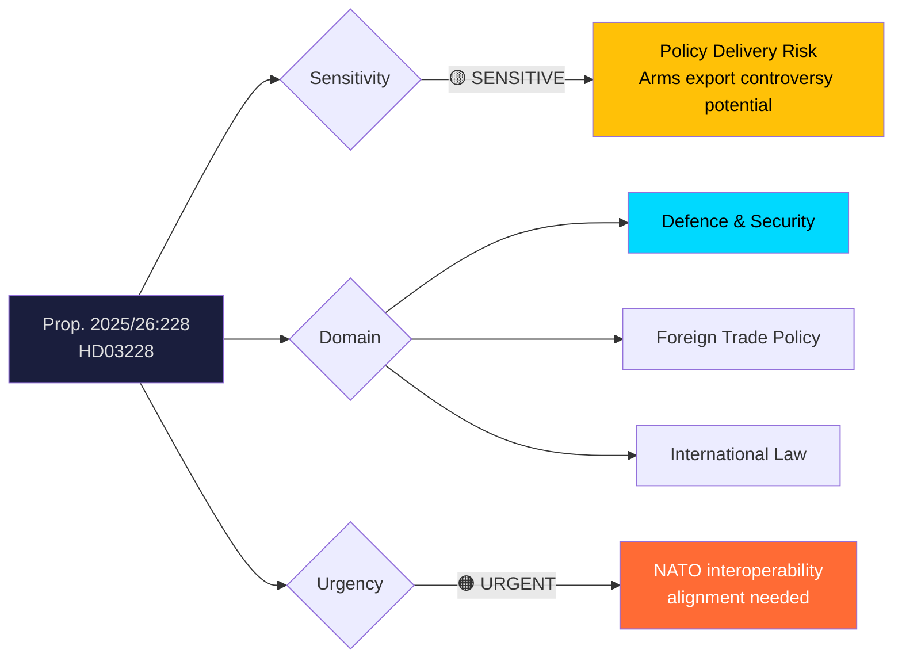
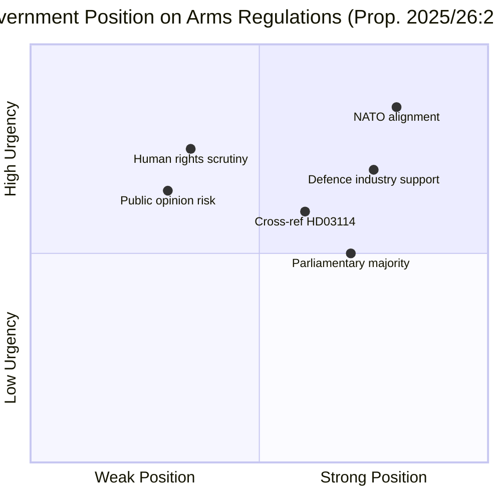
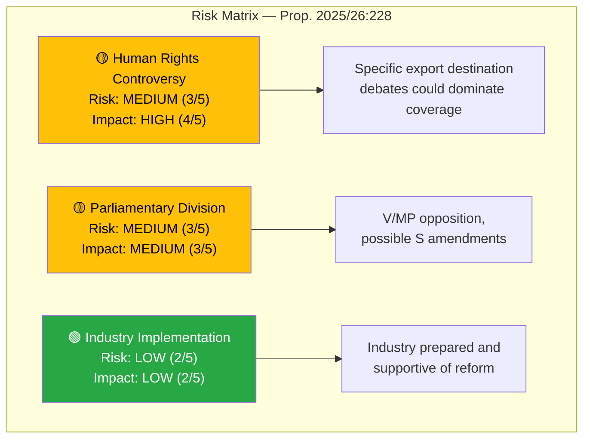

# Document Analysis: Ett modernt och anpassat regelverk för krigsmateriel

| **Field** | **Value** |
|-----------|-----------|
| **Analysis ID** | DOC-2026-04-10-HD03228 |
| **dok_id** | HD03228 |
| **Document Type** | Proposition (Prop. 2025/26:228) |
| **Title** | Ett modernt och anpassat regelverk för krigsmateriel |
| **Committee** | UU (Utrikesutskottet / Foreign Affairs Committee) |
| **Department** | Utrikesdepartementet |
| **Date** | 2026-04-01 |
| **Authors** | Elisabeth Svantesson (PM), Benjamin Dousa (Utrikesdepartementet) |
| **Riksmöte** | 2025/26 |
| **Significance** | 🟠 HIGH (8/10) |
| **Confidence** | MEDIUM (60%) |

---

## Executive Summary

The government proposes (Prop. 2025/26:228) a modernised regulatory framework for military materiel, authored by PM Svantesson and Foreign Trade Minister Benjamin Dousa. This is Sweden's most significant reform of arms export legislation since NATO accession in March 2024, addressing the need to align national export controls with alliance interoperability requirements while maintaining Sweden's historically restrictive arms export policy. The proposition arrives alongside the annual export control report (Skr. 2025/26:114, HD03114) and must be read as part of a **coordinated government legislative offensive on defence trade policy**. Politically, this is contentious — it will test the limits of cross-party consensus on Sweden's new security posture. **Confidence: MEDIUM**

---

## Political Classification

| Dimension | Assessment | Rationale |
|-----------|-----------|-----------|
| **Sensitivity** | 🟡 SENSITIVE | Arms export regulation with human rights implications |
| **Domain** | Defence/Foreign Trade | Core national security and international trade policy |
| **Urgency** | 🟠 URGENT | NATO interoperability requirements, industry needs |
| **Significance** | 8/10 | Major regulatory reform in sensitive policy area |

---

## SWOT Analysis

### Strengths
| Evidence | Source | Confidence |
|----------|--------|------------|
| NATO membership provides strategic rationale for modernisation — allied interoperability is a treaty obligation | Post-accession context | HIGH |
| Swedish defence industry (Saab, BAE Hägglunds) generates export revenue and jobs — economic argument supports reform | Industry context | HIGH |
| Coordinated with annual export report (HD03114) — government presents comprehensive policy package | HD03228 + HD03114 cross-reference | HIGH |
| Minister Dousa (M) has built bipartisan relationships on trade policy | Political context | MEDIUM |

### Weaknesses
| Evidence | Source | Confidence |
|----------|--------|------------|
| "Modernised and adapted" language may signal relaxation of historically strict export criteria | HD03228 title analysis | MEDIUM |
| Opposition scrutiny on arms exports to NATO allies with questionable democratic records (e.g., Turkey) | Political risk assessment | MEDIUM |
| Balancing alliance obligations with Swedish values-based foreign policy tradition is inherently contradictory | Policy tension analysis | HIGH |

### Opportunities
| Evidence | Source | Confidence |
|----------|--------|------------|
| NATO joint procurement programs create new market access for Swedish firms | Geopolitical context | HIGH |
| EU defence industrial strategy alignment — EDIS and EDIRPA frameworks | EU policy context | MEDIUM |
| Opportunity to strengthen ISP (Inspektionen för strategiska produkter) oversight while liberalising rules | Institutional reform | MEDIUM |

### Threats
| Evidence | Source | Confidence |
|----------|--------|------------|
| V and MP will oppose any perceived weakening of arms export restrictions | Parliamentary dynamics | HIGH |
| Media investigations into specific export destinations could create political crisis | Political risk | MEDIUM |
| Civil society (Svenska Freds) will campaign against regulatory relaxation | Advocacy landscape | HIGH |
| International scrutiny from human rights organisations (Amnesty, HRW) | International context | MEDIUM |

---

## Stakeholder Perspective Analysis

### 1. Government Perspective (Tidöblocket)
The government frames this as responsible modernisation — not liberalisation — of arms export rules to meet NATO obligations. Minister Dousa emphasises that Swedish export controls remain among the world's strictest. **Key interest**: Enabling defence industry growth while maintaining democratic legitimacy.

### 2. Opposition Perspective
S will carefully balance support for NATO alignment with scrutiny of specific provisions. V and MP will firmly oppose any relaxation. C may raise ISP oversight concerns. **Key interest**: S — appearing pro-defence while protecting values. V/MP — principled opposition to arms trade expansion.

### 3. Defence Industry Perspective
Saab, BAE Systems Hägglunds, and the Swedish Defence Industry Association (SOFF) strongly support modernisation for NATO-compatible export processes. **Key interest**: Faster licensing, broader market access, regulatory predictability.

### 4. ISP (Inspektionen för strategiska produkter)
ISP manages export licensing and will need updated operational frameworks. **Key interest**: Clear regulatory criteria, adequate staffing, maintained independence.

### 5. Civil Society / Peace Movement
Svenska Freds-och Skiljedomsföreningen, Amnesty Sweden, and faith-based peace organisations will actively oppose perceived liberalisation. **Key interest**: Maintaining strict end-user certificates, human rights criteria, and post-delivery controls.

### 6. International / NATO Allies
NATO allies expect Sweden to participate fully in joint defence procurement. Turkey, in particular, watches Swedish arms policy after the accession negotiations. **Key interest**: Alliance solidarity and equitable burden-sharing.

---

## Risk Assessment

| Risk Factor | Likelihood (1-5) | Impact (1-5) | Score | Mitigation |
|-------------|-------------------|--------------|-------|------------|
| Human rights controversy on exports | 3 | 4 | 12/25 | Enhanced transparency and ISP oversight |
| V/MP parliamentary opposition | 4 | 2 | 8/25 | Government majority sufficient without V/MP |
| S demands amendments | 3 | 3 | 9/25 | Pre-negotiation to secure S support |
| Media-driven export scandal | 2 | 4 | 8/25 | Proactive transparency via HD03114 report |

---

## Election 2026 Implications

| Dimension | Assessment | Confidence |
|-----------|-----------|------------|
| **Electoral Impact** | 🟧 MEDIUM — Arms policy is niche but energises both defence hawks and peace movement | MEDIUM |
| **Coalition Scenarios** | 🟥 LOW risk — Arms policy unlikely to break coalitions | HIGH |
| **Voter Salience** | 🟥 LOW — Most voters are not engaged on arms export specifics | HIGH |
| **Campaign Vulnerability** | 🟧 MEDIUM — Could be exploited if a specific controversial export surfaces | MEDIUM |
| **Policy Legacy** | 🟩 HIGH — Regulatory framework reform persists across election cycles | HIGH |

---

## Cross-Document References

| Related Document | Relationship | Significance |
|-----------------|-------------|--------------|
| **HD03114** (Skr. 2025/26:114) | Companion — annual export control report released same period | High — coordinated legislative package |
| **HD03214** (Prop. 2025/26:214) | Thematic — cybersecurity centre also addresses defence modernisation | Medium — same defence policy agenda |

---

## Forward Indicators

1. **UU Committee Review** (expected May-June 2026) — Watch for V/MP motions and S negotiation stance
2. **ISP Annual Report** — Monitor for implementation guidance and export volume data
3. **NATO Defence Planning Process** — Track Swedish commitments to joint procurement
4. **Media Coverage** — Monitor investigative journalism on specific export destinations
5. **Civil Society Campaigns** — Watch for Svenska Freds advocacy intensity

---

## Data Quality Notes

- **Analysis confidence**: MEDIUM (60%) — metadata analysis with defence trade domain expertise
- **Full-text content**: Not available — analysis based on title, summary, authors, and policy context
- **Data sources**: get_propositioner (HD03228), cross-reference with HD03114
- **Limitation**: Specific regulatory provisions and export criteria changes require full-text analysis
