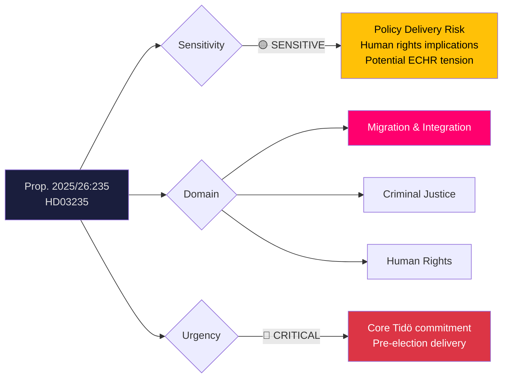
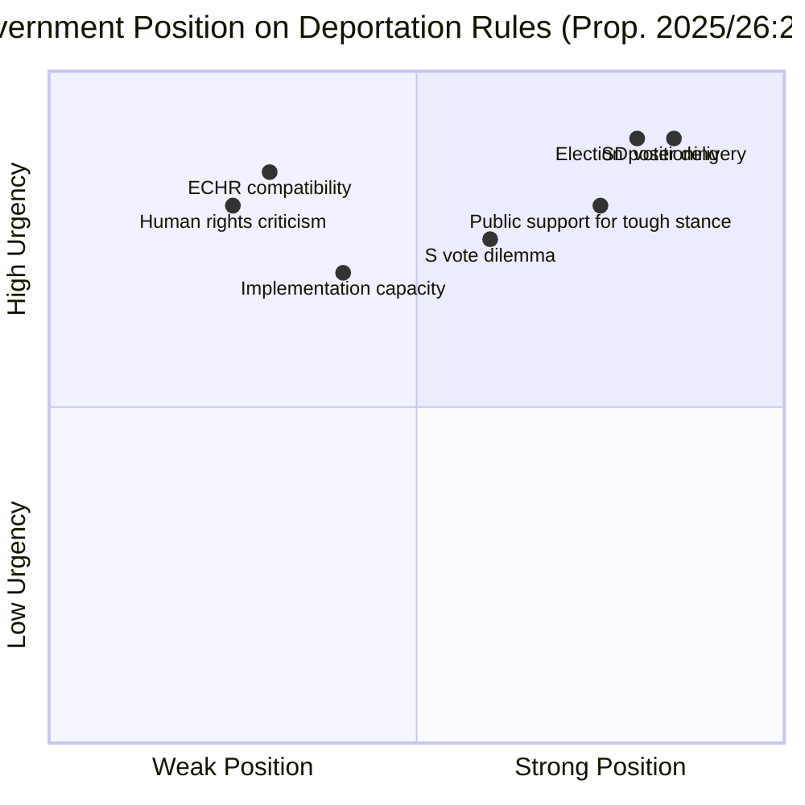
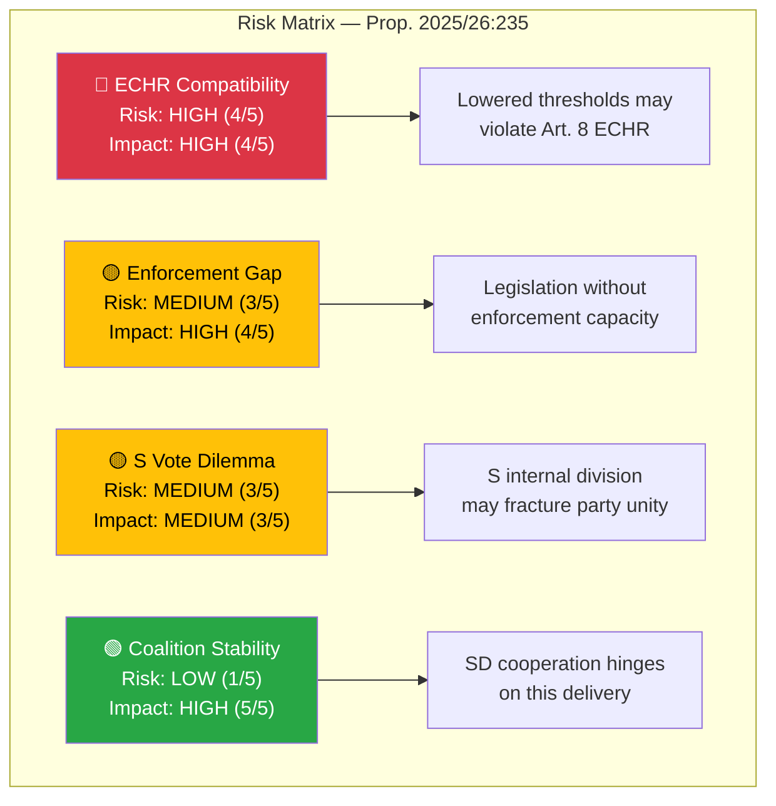

# Document Analysis: Skärpta regler om utvisning på grund av brott

| **Field** | **Value** |
|-----------|-----------|
| **Analysis ID** | DOC-2026-04-10-HD03235 |
| **dok_id** | HD03235 |
| **Document Type** | Proposition (Prop. 2025/26:235) |
| **Title** | Skärpta regler om utvisning på grund av brott |
| **Committee** | JuU (Justitieutskottet / Committee on Justice) |
| **Department** | Justitiedepartementet |
| **Date** | 2026-04-01 |
| **Authors** | Elisabeth Svantesson (PM), Johan Forssell (Justitiedepartementet) |
| **Riksmöte** | 2025/26 |
| **Significance** | 🔴 VERY HIGH (9/10) |
| **Confidence** | MEDIUM (65%) |

---

## Executive Summary

The government proposes (Prop. 2025/26:235) stricter rules for deportation on grounds of criminal conviction, authored by PM Svantesson and Justice Minister Johan Forssell (M). This is the **most politically significant proposition in this legislative batch** — it is a flagship Tidö Agreement deliverable on migration enforcement, SD's highest-priority policy demand, and a core pre-election pledge. The proposition likely lowers thresholds for deportation, limits court discretion in weighing ties to Sweden, and targets repeat offenders. This will face fierce opposition from V and MP on human rights grounds, while S must navigate between its tough-on-crime pivot and progressive base. For Election 2026, this is a **defining vote** that will sharpen migration as a campaign axis. **Confidence: MEDIUM**

---

## Political Classification

| Dimension | Assessment | Rationale |
|-----------|-----------|-----------|
| **Sensitivity** | 🟡 SENSITIVE | Human rights implications, ECHR compatibility questions |
| **Domain** | Migration/Criminal Justice | Core Tidö Agreement deliverable, politically divisive |
| **Urgency** | 🔴 CRITICAL | Pre-election delivery imperative for governing coalition |
| **Significance** | 9/10 | Highest political stakes in the legislative batch |

---

## SWOT Analysis

### Strengths
| Evidence | Source | Confidence |
|----------|--------|------------|
| Strong public support — polling consistently shows majority favour stricter deportation rules | Swedish opinion data | HIGH |
| Core Tidö Agreement commitment — SD cooperation depends on delivery | HD03235, Tidöavtalet | HIGH |
| Justice Minister Forssell (M) has built credibility on migration enforcement | Political positioning | HIGH |
| S has shifted toward tougher migration stance — reduces effective opposition | Political dynamics | MEDIUM |

### Weaknesses
| Evidence | Source | Confidence |
|----------|--------|------------|
| ECHR compatibility risk — lowered thresholds may violate Article 8 (right to family life) | Legal assessment | HIGH |
| Implementation depends on Migrationsverket capacity and receiving country cooperation | Institutional constraint | HIGH |
| Previous deportation orders have low enforcement rate — legislation alone may not change outcomes | Enforcement data | HIGH |
| Risk of Lagrådet criticism if proportionality assessment is deemed insufficient | Legislative process | MEDIUM |

### Opportunities
| Evidence | Source | Confidence |
|----------|--------|------------|
| Election 2026 positioning — "tough on crime" narrative resonates with swing voters | Electoral strategy | HIGH |
| SD satisfied as key policy demand is delivered — stabilises governing cooperation | Coalition dynamics | HIGH |
| Potential to integrate with broader criminal justice reform package | Cross-policy context | MEDIUM |

### Threats
| Evidence | Source | Confidence |
|----------|--------|------------|
| V and MP will frame as authoritarian — mobilises progressive base against government | Parliamentary dynamics | HIGH |
| International criticism from UNHCR, CoE Human Rights Commissioner | International scrutiny | HIGH |
| Individual deportation cases may generate sympathetic media coverage | Media risk | MEDIUM |
| Court challenges may result in European Court of Human Rights adverse ruling | Legal risk | MEDIUM |
| S internal division — progressive wing may revolt against supporting tougher rules | Opposition dynamics | MEDIUM |

---

## Stakeholder Perspective Analysis

### 1. Government Perspective (Tidöblocket: M, KD, L + SD)
This is the **single most important proposition for SD** in this riksmöte. Jimmie Åkesson and SD migration policy spokesperson Ludvig Aspling have made deportation reform a non-negotiable condition for continued Tidö cooperation. For M's Forssell, it demonstrates governing competence on the #1 public concern (crime/migration). KD and L support with varying degrees of enthusiasm. **Key interest**: Delivering on the flagship Tidö commitment before the election.

### 2. Opposition Perspective
**S**: Internal tension — the party has moved right on migration under Magdalena Andersson's leadership but faces pressure from progressive members. The vote on this proposition will define S's migration positioning for 2026. **V**: Firm opposition on human rights and solidarity grounds. Nooshi Dadgostar will use this as evidence of "SD governance by proxy." **MP**: Principled opposition, will invoke ECHR and UNHCR standards. **C**: Mixed — generally supportive of deportation for serious crime but may seek amendments on proportionality.

### 3. Judicial Perspective
The Swedish courts and Lagrådet (Council on Legislation) will examine ECHR compatibility, particularly Article 8 balancing. Migrationsdomstolarna (migration courts) may face increased caseload. **Key interest**: Maintaining rule of law and proportionality principles.

### 4. Law Enforcement Perspective
Police and prosecutors support stronger deportation tools but note enforcement challenges — actual deportation depends on receiving country cooperation and travel documents. **Key interest**: Practical enforceability, not just legislative symbolism.

### 5. Civil Society / Human Rights
Asylrättscentrum, Amnesty Sweden, Red Cross, Swedish Bar Association will actively oppose. Swedish churches may invoke sanctuary principles. **Key interest**: Protecting fundamental rights, particularly for families and long-term residents.

### 6. International Perspective
EU partners monitor Sweden's migration policy evolution. UNHCR and CoE will assess compatibility with international obligations. Receiving countries must cooperate with deportation enforcement. **Key interest**: International norms compliance and bilateral return agreements.

---

## Risk Assessment

| Risk Factor | Likelihood (1-5) | Impact (1-5) | Score | Mitigation |
|-------------|-------------------|--------------|-------|------------|
| ECHR adverse ruling | 4 | 4 | 16/25 | Lagrådet review, proportionality safeguards |
| Deportation enforcement failure | 3 | 4 | 12/25 | Bilateral return agreements, EU cooperation |
| S opposition or abstention | 3 | 3 | 9/25 | Pre-negotiation, amendment offers |
| International criticism | 4 | 2 | 8/25 | Proactive engagement with CoE, UNHCR |
| Coalition crisis if blocked | 1 | 5 | 5/25 | Government majority ensures passage |

---

## Election 2026 Implications

| Dimension | Assessment | Confidence |
|-----------|-----------|------------|
| **Electoral Impact** | 🟦 VERY HIGH — Defines the migration debate for the 2026 campaign | HIGH |
| **Coalition Scenarios** | 🟩 HIGH — SD satisfaction strengthens Tidö renewal prospects | HIGH |
| **Voter Salience** | 🟦 VERY HIGH — Migration/crime is the #1 voter concern in Sweden | HIGH |
| **Campaign Vulnerability** | 🟩 HIGH — Government can claim delivery; opposition must articulate alternative | HIGH |
| **Policy Legacy** | 🟩 HIGH — Structural legal change that shifts the baseline for future governments | HIGH |

---

## Cross-Document References

| Related Document | Relationship | Significance |
|-----------------|-------------|--------------|
| **Tidöavtalet (2022)** | Policy origin — deportation reform is a core Tidö commitment | Critical |
| **Prop. 2025/26:214** (HD03214) | Same legislative batch — coordinated government offensive | Context |
| **Prop. 2025/26:228** (HD03228) | Same batch — government showing multi-domain legislative activity | Context |

---

## Forward Indicators

1. **Lagrådet Opinion** — Watch for proportionality and ECHR compatibility assessment
2. **JuU Committee Hearings** (expected May-June 2026) — S positioning will be definitive
3. **S Party Stance** — Monitor internal debate, Magdalena Andersson statements
4. **SD Response** — Gauge satisfaction level from Åkesson/Aspling statements
5. **Civil Society Mobilisation** — Watch for protest and advocacy campaign intensity
6. **Migrationsverket Capacity Assessment** — Track enforcement resource analysis
7. **ECHR Case Watch** — Monitor for fast-tracked challenge proceedings

---

## Data Quality Notes

- **Analysis confidence**: MEDIUM (65%) — metadata analysis with migration policy domain expertise
- **Full-text content**: Not available — analysis based on title, summary, authors, and policy context
- **Data sources**: get_propositioner (HD03235), political context, Tidöavtalet
- **Limitation**: Specific threshold changes, proportionality criteria, and Lagrådet opinion require full-text analysis
