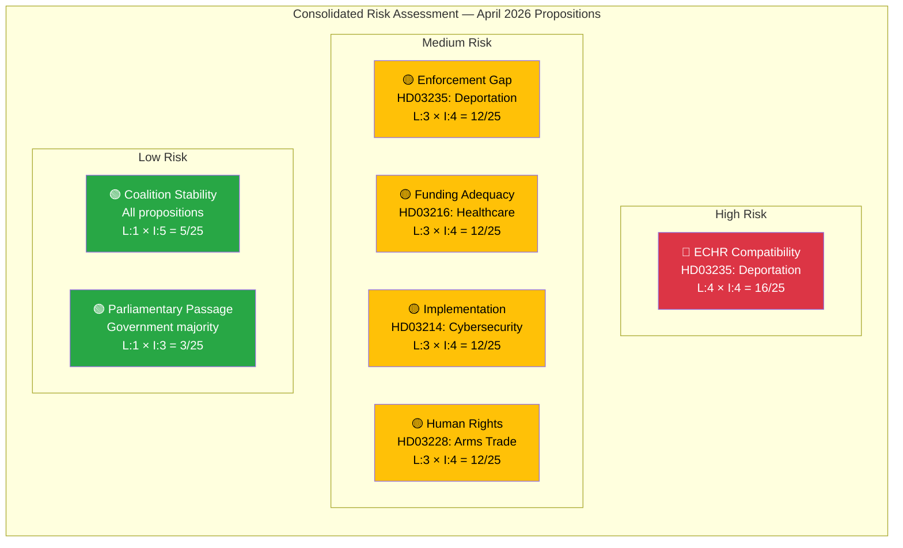

# Political Risk Assessment — Government Propositions — 2026-04-10

| **Field** | **Value** |
|-----------|-----------|
| **Assessment ID** | RISK-2026-04-10-PROP-001 |
| **Analysis Date** | 2026-04-10 17:15 UTC |
| **Documents Analyzed** | 5 |
| **Produced By** | news-propositions workflow (AI-enriched) |
| **Overall Risk Level** | MEDIUM |
| **Overall Confidence** | MEDIUM |

---

## Risk Dashboard

## Consolidated Risk Matrix

| Risk Factor | Proposition | Likelihood (1-5) | Impact (1-5) | Score | Priority |
|-------------|------------|-------------------|--------------|-------|----------|
| ECHR adverse ruling on deportation | HD03235 | 4 | 4 | **16/25** | 🔴 HIGH |
| Deportation enforcement failure | HD03235 | 3 | 4 | **12/25** | 🟡 MEDIUM |
| Healthcare unfunded mandates | HD03216 | 3 | 4 | **12/25** | 🟡 MEDIUM |
| Cybersecurity inter-agency coordination | HD03214 | 3 | 4 | **12/25** | 🟡 MEDIUM |
| Arms export human rights controversy | HD03228 | 3 | 4 | **12/25** | 🟡 MEDIUM |
| S vote dilemma on deportation | HD03235 | 3 | 3 | **9/25** | 🟡 MEDIUM |
| International criticism (UNHCR/CoE) | HD03235 | 4 | 2 | **8/25** | 🟡 LOW-MED |
| V/MP parliamentary opposition | HD03228/235 | 4 | 2 | **8/25** | 🟡 LOW-MED |
| Coalition stability threat | All | 1 | 5 | **5/25** | 🟢 LOW |
| Parliamentary passage blocked | All | 1 | 3 | **3/25** | 🟢 LOW |

## Key Risk Assessment

**Overall risk level: MEDIUM** — The government faces moderate political risk across this legislative batch. The primary risk vector is the deportation proposition (HD03235) where ECHR compatibility challenges could undermine the government's flagship policy achievement. However, coalition stability risk is LOW and parliamentary passage is virtually certain given the government's majority.

**Risk concentration**: 4 of the top 5 risks relate to HD03235 (deportation), making it the single highest-risk proposition in the batch. The arms trade reform (HD03228) carries moderate reputational risk if specific export decisions attract media scrutiny.

**Mitigation**: The government has structured the batch strategically — the less controversial cybersecurity and healthcare propositions provide positive narrative balance against the contentious deportation and arms trade reforms.
