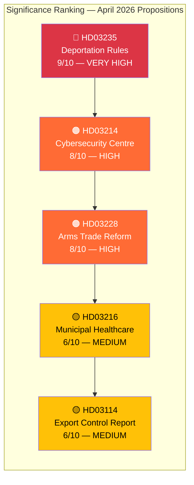

# Significance Scoring — Government Propositions — 2026-04-10

| **Field** | **Value** |
|-----------|-----------|
| **Scoring ID** | SIG-2026-04-10-PROP-001 |
| **Analysis Date** | 2026-04-10 17:15 UTC |
| **Documents Scored** | 5 |
| **Produced By** | news-propositions workflow (AI-enriched) |
| **Average Significance** | 7.4/10 |
| **Confidence** | MEDIUM |

---

## Significance Rankings

## Detailed Scoring

| dok_id | Title | Score | Level | Domain | Electoral Impact | Factors |
|--------|-------|-------|-------|--------|-----------------|---------|
| HD03235 | Skärpta regler om utvisning på grund av brott | **9/10** | 🔴 VERY HIGH | Migration/Justice | 🟦 VERY HIGH | Tidö flagship; #1 voter concern; ECHR risk; S vote dilemma |
| HD03214 | Lagändringar för ett stärkt nationellt cybersäkerhetscenter | **8/10** | 🟠 HIGH | Defence/Cyber | 🟩 HIGH | NIS2 compliance; NATO alignment; cross-party support |
| HD03228 | Ett modernt och anpassat regelverk för krigsmateriel | **8/10** | 🟠 HIGH | Defence/Trade | 🟧 MEDIUM | NATO era reform; ISP oversight; civil society opposition |
| HD03216 | Stärkt medicinsk kompetens i kommunal hälso- och sjukvård | **6/10** | 🟡 MEDIUM | Health/Welfare | 🟧 MEDIUM | COVID legacy; eldercare quality; municipal capacity |
| HD03114 | Strategisk exportkontroll 2025 | **6/10** | 🟡 MEDIUM | Defence/Trade | 🟥 LOW | Annual transparency; companion to HD03228 |

## Scoring Methodology

Each document scored on 5 dimensions (2 points each, max 10):
1. **Policy Impact** — Breadth and depth of policy change
2. **Political Contestation** — Level of partisan disagreement
3. **Electoral Relevance** — Connection to 2026 election themes
4. **Implementation Complexity** — Risk of delivery failure
5. **International Dimension** — Cross-border implications

## Key Insights

- **Average significance: 7.4/10** — This is an above-average legislative batch, reflecting the government's pre-election push
- **Dominant theme: Security** — 3 of 5 documents relate to national security, defence, or arms trade
- **Political centrepiece: HD03235** — Deportation reform defines the batch's political narrative
- **Coordinated messaging**: The security cluster (HD03214 + HD03228 + HD03114) represents a deliberate government communication strategy
