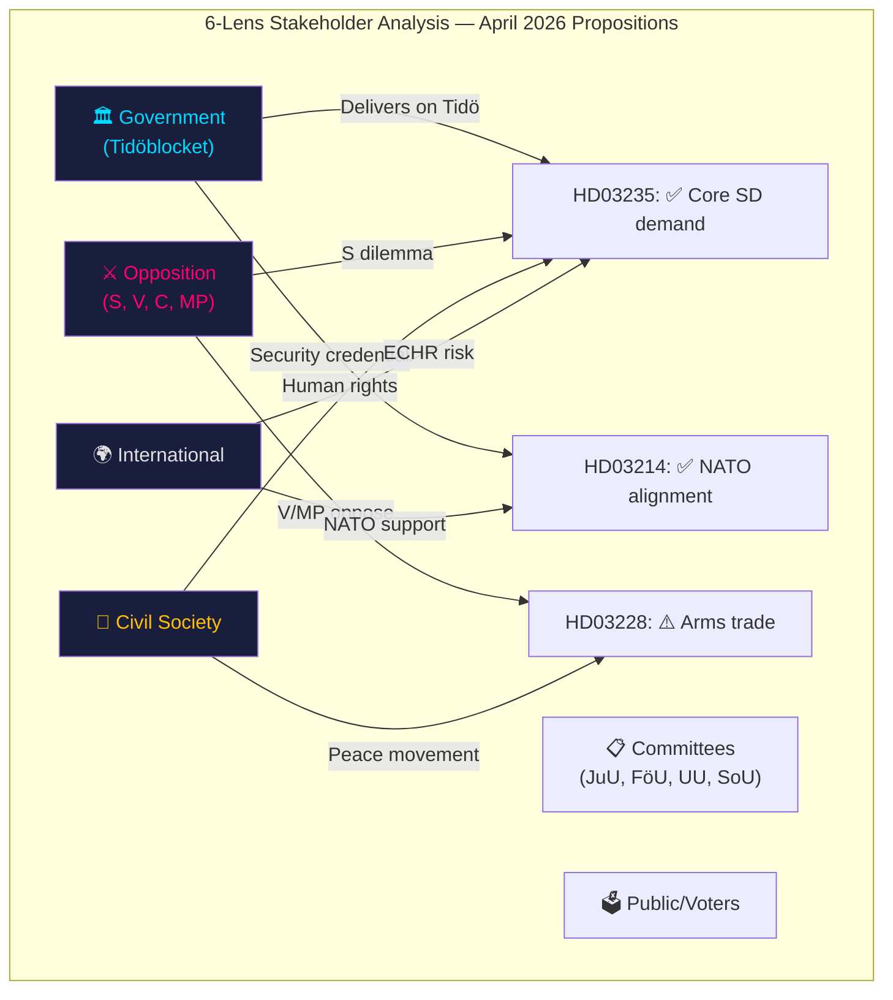

# Stakeholder Perspectives — Government Propositions — 2026-04-10

| **Field** | **Value** |
|-----------|-----------|
| **Analysis ID** | STAKE-2026-04-10-PROP-001 |
| **Analysis Date** | 2026-04-10 17:15 UTC |
| **Documents Analyzed** | 5 |
| **Stakeholder Perspectives** | 6 |
| **Produced By** | news-propositions workflow (AI-enriched) |
| **Confidence** | MEDIUM |

---

## Stakeholder Impact Matrix

---

## Perspective 1: Government (Tidöblocket: M, KD, L + SD)

**Overall Assessment**: The April 2026 batch represents the government's most significant pre-election legislative push. PM Svantesson presents a coalition delivering across security, migration, welfare, and defence — the four pillars of the Tidö Agreement.

| Proposition | Government Stake | Minister | Assessment |
|------------|------------------|----------|-----------|
| HD03235 | SD cooperation lifeline | Johan Forssell (M) | Critical — non-delivery risks coalition collapse |
| HD03214 | Security competence credential | Carl-Oskar Bohlin (M) | Strong — cross-party support expected |
| HD03228 | NATO alliance alignment | Benjamin Dousa (M) | Important — defence industry support |
| HD03216 | Welfare delivery proof | Anna Tenje (M) | Defensive — counters S welfare narrative |
| HD03114 | Transparency compliance | Benjamin Dousa (M) | Routine — annual requirement fulfilled |

## Perspective 2: Opposition Parties

**S (Social Democrats)**: Faces the sharpest dilemma on HD03235 — Magdalena Andersson has shifted right on migration but the party base resists further tightening. S will likely propose amendments rather than outright opposition. On HD03214 and HD03228, S will provide measured support while scrutinising implementation.

**V (Vänsterpartiet)**: Firm opposition to HD03235 (deportation) and HD03228 (arms trade). Nooshi Dadgostar will frame these as evidence of SD-driven authoritarian drift. V supports HD03214 (cybersecurity) and HD03216 (healthcare).

**C (Centerpartiet)**: Moderate support for most propositions. May raise proportionality concerns on HD03235 and rural municipality capacity on HD03216. Generally supportive of defence reforms.

**MP (Miljöpartiet)**: Principled opposition to HD03235 and HD03228 on human rights grounds. Will invoke ECHR and environmental/peace perspectives. Supports HD03214 and HD03216.

## Perspective 3: Parliamentary Committees

| Committee | Proposition | Expected Action |
|-----------|------------|-----------------|
| JuU (Justice) | HD03235 | Most contentious — expect hearings, S amendments, V/MP reservations |
| FöU (Defence) | HD03214 | Broad support — technical amendments possible |
| UU (Foreign Affairs) | HD03228, HD03114 | Moderate scrutiny — ISP oversight amendments |
| SoU (Health) | HD03216 | Cross-party support — funding amendments from S |

## Perspective 4: Civil Society

**Human rights organisations** (Amnesty, Asylrättscentrum, Red Cross): Strong opposition to HD03235. Will campaign for proportionality safeguards and judicial review provisions.

**Peace movement** (Svenska Freds): Active opposition to HD03228. Will scrutinise any relaxation of arms export criteria, particularly regarding end-user certificates.

**Healthcare advocates** (PRO, SPF Seniorerna): Support for HD03216 but will push for adequate funding and rapid implementation.

**Privacy advocates**: Monitoring HD03214 for surveillance power expansion within cybersecurity framework.

## Perspective 5: International

**NATO allies**: Positive reception of HD03214 (cybersecurity) and HD03228 (arms trade). Sweden's post-accession alignment demonstrates alliance commitment.

**EU institutions**: Monitor NIS2 compliance (HD03214) and dual-use export controls (HD03228). ECHR compatibility of HD03235 will attract Council of Europe scrutiny.

**UNHCR / Human Rights Commissioner**: Concern about HD03235 deportation provisions, particularly regarding non-refoulement obligations and family unity.

## Perspective 6: Public/Voters

| Issue | Voter Priority | Government Position |
|-------|---------------|-------------------|
| Migration/Crime | #1 | Strong — HD03235 delivers on top concern |
| Healthcare | #2-3 | Moderate — HD03216 addresses but may underwhelm |
| National Security | #4-5 | Strong — HD03214 cybersecurity resonates post-Ukraine |
| Arms Trade | Low | Niche — HD03228 matters to engaged voters only |
