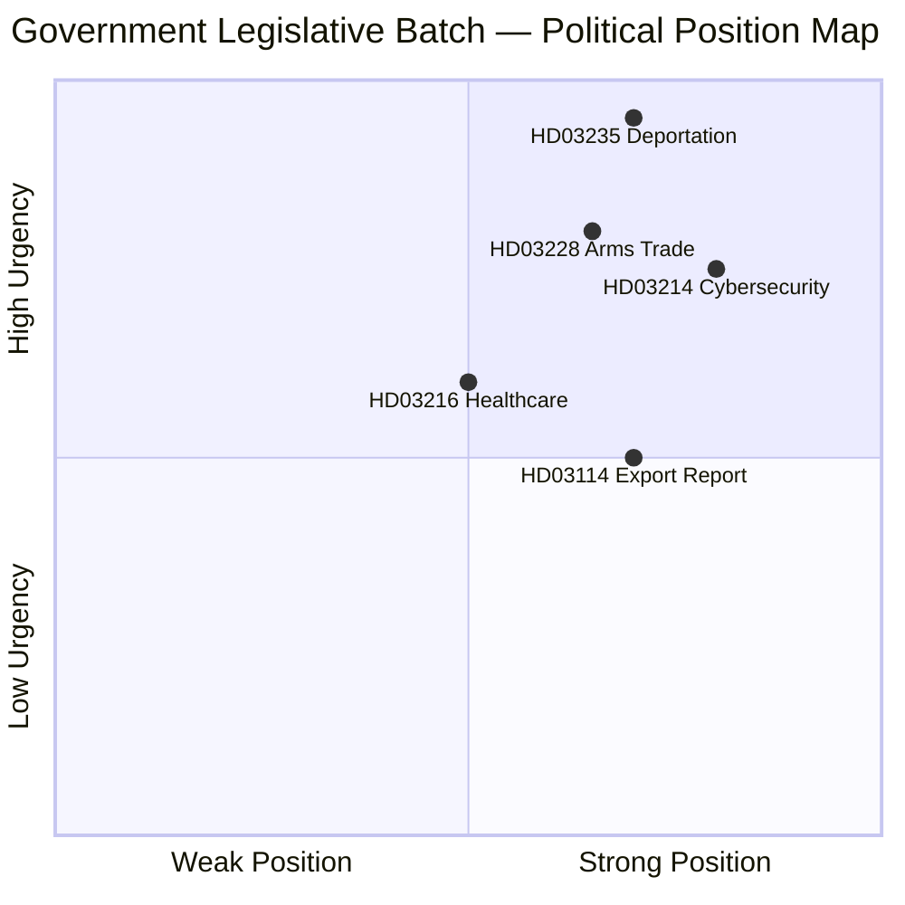

# SWOT Analysis — Government Propositions — 2026-04-10

| **Field** | **Value** |
|-----------|-----------|
| **Analysis ID** | SWOT-2026-04-10-PROP-001 |
| **Analysis Date** | 2026-04-10 17:15 UTC |
| **Documents Analyzed** | 5 |
| **Produced By** | news-propositions workflow (AI-enriched) |
| **Overall Confidence** | MEDIUM |

---

## SWOT Overview

---

## Consolidated Strengths

| # | Strength | Evidence | Source | Confidence |
|---|----------|----------|--------|------------|
| S1 | Coordinated pre-election legislative offensive across 4 policy domains | 5 propositions tabled simultaneously on 2026-04-01 | HD03214-HD03235 batch | HIGH |
| S2 | SD's core policy demand (deportation) being delivered — secures coalition stability | Prop. 2025/26:235, Tidöavtalet | HD03235 | HIGH |
| S3 | Cross-party consensus on cybersecurity and defence strengthening | Broad support for HD03214 | HD03214, political context | HIGH |
| S4 | NATO membership provides strategic rationale for defence trade reforms | Post-accession alignment | HD03228, HD03114 | HIGH |
| S5 | Public opinion supports stricter deportation rules — strong democratic mandate | Swedish polling data | HD03235 context | HIGH |

## Consolidated Weaknesses

| # | Weakness | Evidence | Source | Confidence |
|---|----------|----------|--------|------------|
| W1 | ECHR compatibility risk on deportation proposition (Art. 8 proportionality) | Lowered thresholds for deportation | HD03235 legal analysis | HIGH |
| W2 | Deportation enforcement gap — low actual deportation execution rate | Historical enforcement data | HD03235 implementation | HIGH |
| W3 | Healthcare proposition may be underfunded — unfunded municipal mandates | Municipal fiscal pressure | HD03216 fiscal analysis | MEDIUM |
| W4 | "Modernised" arms trade language may signal relaxation of strict export criteria | Title analysis of Prop. 228 | HD03228 | MEDIUM |
| W5 | Physician shortage limits healthcare reform implementation capacity | Workforce data | HD03216 | HIGH |

## Consolidated Opportunities

| # | Opportunity | Evidence | Source | Confidence |
|---|------------|----------|--------|------------|
| O1 | Election 2026 credential — government delivers on multiple Tidö commitments | 5 propositions in single batch | Batch analysis | HIGH |
| O2 | NATO joint defence procurement opens new markets for Swedish industry | Geopolitical context | HD03228 | HIGH |
| O3 | Cybersecurity positioning as Nordic leader within NATO | Strategic assessment | HD03214 | MEDIUM |
| O4 | Healthcare reform addresses top voter concern (eldercare quality) | Electoral research | HD03216 | HIGH |
| O5 | S internal division on migration may fracture opposition effectiveness | Political dynamics | HD03235 | MEDIUM |

## Consolidated Threats

| # | Threat | Evidence | Source | Confidence |
|---|--------|----------|--------|------------|
| T1 | ECHR adverse ruling could invalidate deportation provisions | Legal risk assessment | HD03235 | HIGH |
| T2 | V and MP will frame government as authoritarian on migration | Parliamentary dynamics | HD03235 | HIGH |
| T3 | Arms export controversy — media investigations into specific destinations | Political risk | HD03228, HD03114 | MEDIUM |
| T4 | Civil society mobilisation against deportation reform | Advocacy landscape | HD03235 | HIGH |
| T5 | International criticism from UNHCR, CoE on deportation rules | International context | HD03235 | HIGH |

---

## Stakeholder Impact Summary (5 Perspectives)

| Stakeholder | HD03235 Impact | HD03214 Impact | HD03228 Impact | HD03216 Impact | HD03114 Impact |
|-------------|---------------|---------------|---------------|---------------|---------------|
| **Government** | ✅ Core delivery | ✅ Security credential | ✅ NATO alignment | ✅ Welfare credential | ✅ Transparency |
| **Opposition (S)** | ⚠️ Vote dilemma | ✅ Support likely | ⚠️ Scrutiny | ⚠️ Funding attack | ✅ Normal scrutiny |
| **Opposition (V/MP)** | ❌ Firm opposition | ✅ Support likely | ❌ Opposition | ✅ Support w/ amendments | ⚠️ Export scrutiny |
| **Civil Society** | ❌ Strong opposition | ⚠️ Privacy concerns | ❌ Peace movement | ✅ Patient advocacy | ⚠️ Transparency demand |
| **International** | ⚠️ ECHR/UNHCR concern | ✅ NATO approval | ⚠️ Human rights scrutiny | Neutral | ⚠️ Export monitoring |
