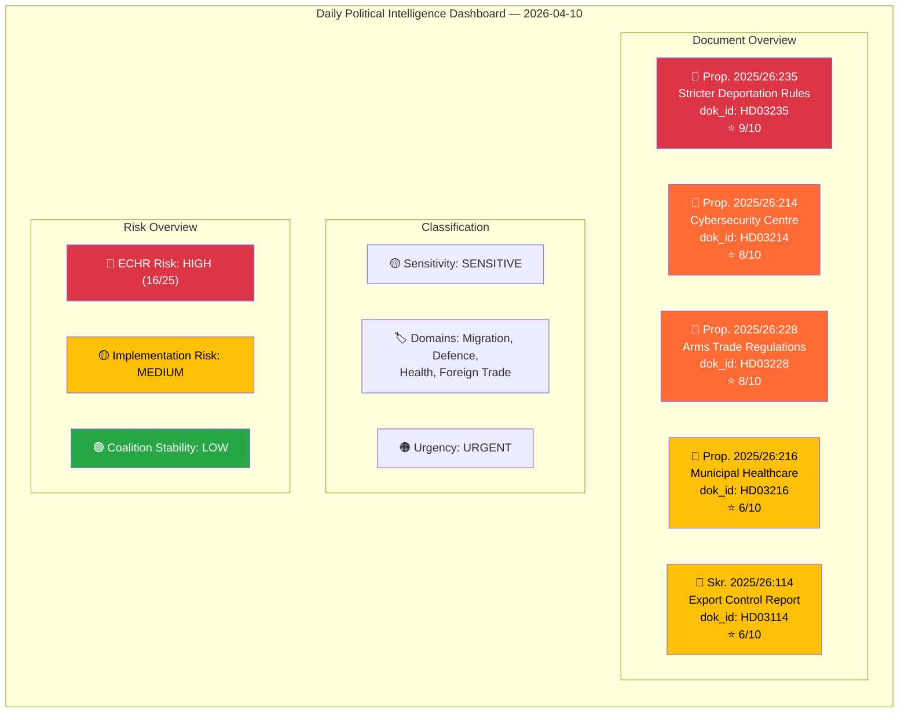

# Analysis Synthesis Summary — 2026-04-10

| **Field** | **Value** |
|-----------|-----------|
| **Synthesis ID** | SYN-2026-04-10-PROP-001 |
| **Analysis Date** | 2026-04-10 17:15 UTC |
| **Documents Analyzed** | 5 |
| **Analysis Period** | 2026-04-01 — 2026-04-10 |
| **Produced By** | news-propositions workflow (AI-enriched) |
| **Overall Confidence** | MEDIUM |

---

## Intelligence Dashboard

## Summary

Analyzed **5 government propositions** from the April 2026 legislative batch (riksmöte 2025/26). This represents a **coordinated pre-election legislative offensive** by the Tidöblocket government (M, KD, L + SD), spanning four major policy domains: migration enforcement, national security/cybersecurity, defence trade modernisation, and healthcare reform. The batch demonstrates the government's strategy to deliver on flagship Tidö Agreement commitments before the September 2026 election.

**Lead story**: Prop. 2025/26:235 (Stricter deportation rules) — the highest-stakes proposition with direct implications for SD cooperation, coalition stability, and the dominant election issue (migration/crime). Overall political risk is **MEDIUM** with the ECHR compatibility question on deportation rules being the primary risk factor.

## Key Findings

1. **Prop. 2025/26:235** (HD03235) — Stricter deportation rules. Significance: **9/10**. Core Tidö delivery for SD. ECHR risk score: 16/25.
2. **Prop. 2025/26:214** (HD03214) — Cybersecurity centre legislation. Significance: **8/10**. Cross-party consensus area with strong election credential.
3. **Prop. 2025/26:228** (HD03228) — Modernised arms trade regulations. Significance: **8/10**. First major arms export reform since NATO accession.
4. **Prop. 2025/26:216** (HD03216) — Municipal healthcare competence. Significance: **6/10**. Defensive welfare measure addressing COVID-era criticism.
5. **Skr. 2025/26:114** (HD03114) — Strategic export control annual report. Significance: **6/10**. Transparency document complementing Prop. 228.

## Top Documents by Significance

| Score | Type | dok_id | Title | Department |
|-------|------|--------|-------|------------|
| 9/10 | Proposition | HD03235 | Skärpta regler om utvisning på grund av brott | Justitiedepartementet |
| 8/10 | Proposition | HD03214 | Lagändringar för ett stärkt nationellt cybersäkerhetscenter | Försvarsdepartementet |
| 8/10 | Proposition | HD03228 | Ett modernt och anpassat regelverk för krigsmateriel | Utrikesdepartementet |
| 6/10 | Proposition | HD03216 | Stärkt medicinsk kompetens i kommunal hälso- och sjukvård | Socialdepartementet |
| 6/10 | Skrivelse | HD03114 | Strategisk exportkontroll 2025 | Utrikesdepartementet |

## AI-Recommended Article Metadata

| Field | EN | SV |
|-------|-----|-----|
| **Recommended Title** | Tidöblocket Delivers Pre-Election Legislative Blitz: Deportation, Cyber Defence, and Arms Trade Reform | Tidöblocket levererar lagstiftningsoffensiv inför valet: utvisning, cyberförsvar och vapenhandel |
| **Meta Description** | Sweden's governing coalition tables five propositions covering stricter deportation rules, cybersecurity centre expansion, modernised arms regulations, and healthcare reform ahead of the 2026 election | Sveriges regeringskoalition lägger fem propositioner om skärpt utvisning, cybersäkerhetscenter, moderniserade vapenregler och sjukvårdsreform inför valet 2026 |
| **Key Highlights** | Deportation reform (HD03235) as SD flagship delivery; NATO-era arms trade modernisation (HD03228); Cybersecurity centre strengthening (HD03214) | Utvisningsreform (HD03235) som SD:s flaggskeppsleverans; NATO-era vapenhandelsmodernisering (HD03228); Stärkt cybersäkerhetscenter (HD03214) |
| **Article Decision** | PUBLISH — 5 significant propositions with clear political narrative | PUBLICERA — 5 betydande propositioner med tydlig politisk berättelse |
| **Article Priority** | HIGH | HÖG |

## Implications

The April 2026 legislative batch reveals a government operating in **pre-election delivery mode**. The security cluster (HD03214, HD03228, HD03114) demonstrates coordinated messaging on Sweden's post-NATO defence posture. The migration proposition (HD03235) is the political centrepiece — its fate in the JuU committee and the riksdag vote will shape the election campaign narrative. The healthcare proposition (HD03216) serves as evidence that the right-coalition can deliver on welfare, countering the Social Democrats' traditional ownership of the policy area.

**Overall political risk: MEDIUM** — The government has sufficient votes to pass all propositions, but ECHR compatibility challenges on HD03235 and arms export controversy on HD03228 represent reputational risks that the opposition will exploit during the campaign.
